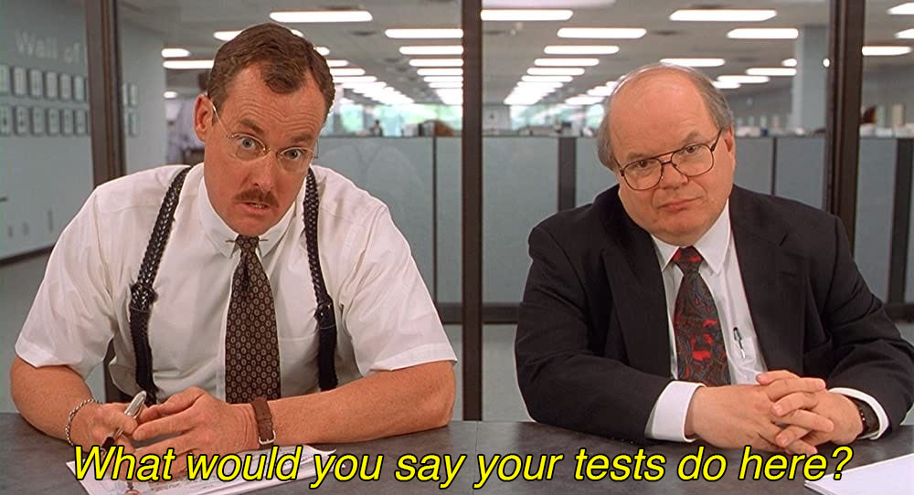

# SLOBAC - The Suite Life of Bobs and Code

An agentic skill toolkit for cleaning up software test suites.

## Read the Manifesto

See if you "buy" what we're "selling" (don't worry,it's actually Free/Libre):

1. [Test Qualities](https://texarkanine.github.io/slobac/principles/test-qualities/) - what a test *should* be
2. [Taxonomy](https://texarkanine.github.io/slobac/taxonomy/) - a catalog of ways tests and test suites can go wrong

## Apply It with AI

[Install the `/slobac-audit` Agent Skill](https://texarkanine.github.io/slobac/using-slobac/) and have your favorite AI agent audit your test suite for common test smells.

### Required: a subagent-capable harness

`slobac-audit` runs as an **orchestrator that dispatches readonly subagents** (one scout, one or more batch assessors in parallel, and one cross-suite assessor). The orchestrator's correctness depends on those subagents producing isolated, structured output that it then assembles. **Use a harness that supports subagent launches:**

- ✅ [Cursor](https://cursor.com) (the `Task` tool)
- ✅ [Claude Code](https://www.anthropic.com/claude-code) (the `Task` tool)
- ❌ Composer-class chat harnesses without subagent capability (e.g. composer-2)

Running the skill in a harness without subagent dispatch will silently degrade to inline single-context execution: counts get miscalibrated, the cross-suite pass loses signal, and the resulting report misrepresents the orchestration shape it claims to have used. Don't.

## License

Multiple; see [REUSE.toml](REUSE.toml) for details ([what's REUSE?](https://reuse.software/)).