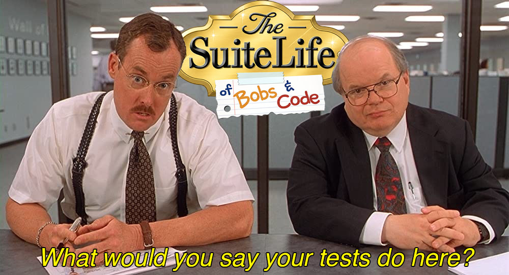
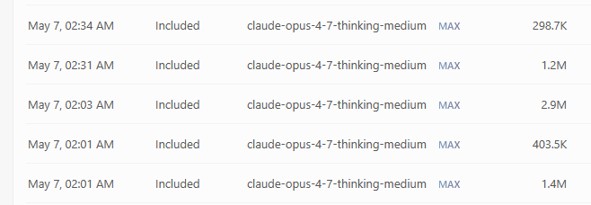
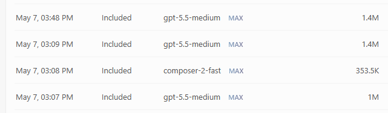

# SLOBAC - The Suite Life of Bobs and Code



An agentic skill toolkit for cleaning up software test suites.

## Read the Manifesto

See if you "buy" what we're "selling" (don't worry,it's actually Free/Libre):

1. [Test Qualities](https://texarkanine.github.io/slobac/principles/test-qualities/) - what a test *should* be
2. [Taxonomy](https://texarkanine.github.io/slobac/taxonomy/) - a catalog of ways tests and test suites can go wrong

## Apply It with AI

[Install the `/slobac-audit` Agent Skill](https://texarkanine.github.io/slobac/using-slobac/) and have your favorite AI agent audit your test suite for common test smells.

```bash
npx skills add Texarkanine/slobac --skill slobac-audit
```

    /slobac-audit all smells, 1M context window, src/__tests__/**

### Harness Requirements

#### Beefy, smart models

There's a lot in the taxonomy, and you're asking AI to reason about it. You need the frontier reasoning capability. Cheaper, faster, lighter models will give you bad results and turn your audit into a [rotten green](https://texarkanine.github.io/slobac/taxonomy/rotten-green/).

As of May 2026, models on the level of the following are recommended:

- Claude Opus 4.6
- GPT 5.5
- Grok 3.5

*"Buy once, cry once."*

#### Big Context Window

Go for the biggest context window you can. In May 2026, that's probably a 1M context window - Claude Code's default, but if you're in Cursor, toggle MAX mode.

The taxonomy is a lot of text. Your test suite is probably an order of magnitude larger, at least. Your agent **must actually read it all** in order to perform an effective audit. Some smells require cross-referencing or at least awareness of other tests. 

If your context gets compacted, you lose real information and your audit will be at best incomplete, at worst actually wrong.

The audit skill will attempt to shard down to the context window you have available but you can give it the best chance of success by embiggening the window.

*"Buy once, cry once."*

#### Sub-Agent Launch Capability

`slobac-audit` runs as an **orchestrator that dispatches subagents**. The orchestrator's correctness depends on those subagents producing isolated, structured output that it then assembles.

Running the skill in a harness without subagent dispatch will silently degrade to inline single-context execution: counts get miscalibrated, the cross-suite pass loses signal, context may get compacted, and the resulting report misrepresents the orchestration shape it claims to have used. Don't.

#### Benchmarks

As monitored through Cursor's usage tracking, a repository with this test profile:

```
Total files: 33
Total tests: 379
Total lines: 9,581
Total chars: 388,842
```

A full audit of all 15 (at the time) smells took around 30 minutes and had the following token usage profile:

**Claude Opus 4.7 (1M)**



**GPT 5.5 (1M)**



(the `composer` invocation was the [scout](skills/slobac-audit/references/subagents/scout.md))

## License

Multiple; see [REUSE.toml](REUSE.toml) for details ([what's REUSE?](https://reuse.software/)).
