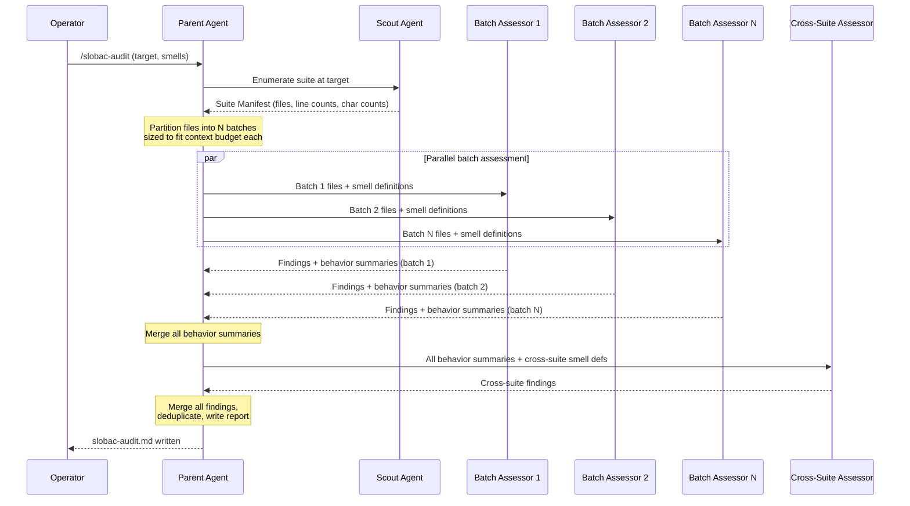
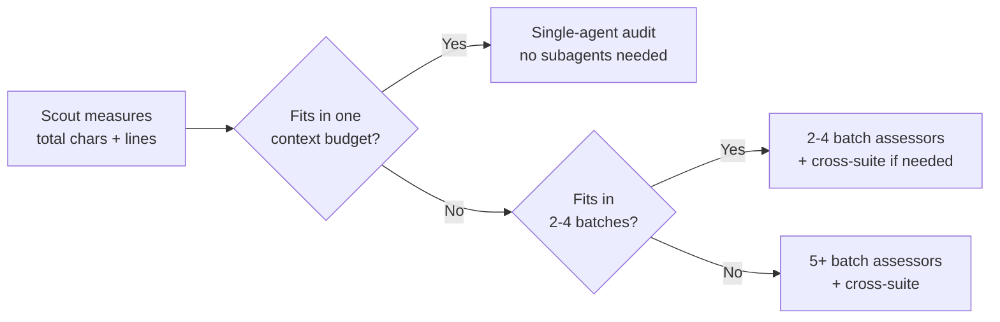

# Architecture Decision: Audit Orchestration at Scale

## Requirements & Constraints

### The Problem

SLOBAC's audit reads test suites deeply — every test name, every assertion, every grouping decision — and renders semantic judgment. This is the product's core value proposition and cannot be compromised. But a mature test suite (the target user) can contain 200–2000+ tests across 50–500+ files. A typical test averages ~50 lines; a 2000-test suite is ~100K lines of source. The exact token cost is unknowable at design time (tokenizers differ between models and evolve between versions, and source code tokenizes differently than prose), but as a rough proxy: source code averages 3–5 characters per token depending on the tokenizer, putting a 100K-line suite in the hundreds-of-thousands-of-tokens range — well beyond what a single context window can hold with room for reasoning.

A single agent cannot hold an entire large suite + 15 smell definitions + the full audit reasoning in one context window. Even if it could fit, context utilization degrades with length (the "lost in the middle" effect), and cost scales linearly with prompt size × number of reasoning steps.

**Measurement note**: Throughout this document, size estimates use **character count** and **line count** as the measurable proxies. These are deterministic filesystem properties. References to "tokens" are approximate and model-dependent — the architecture must not depend on any specific tokenizer or token-to-character ratio. The scout measures characters and lines; the orchestrator applies a configurable conversion factor when mapping to context budgets.

### Quality Attributes (Ranked)

1. **Audit quality** — Findings must be semantically correct. False positives erode trust. This is non-negotiable.
2. **Completeness** — Every test in scope must be evaluated. Silent omissions are worse than false positives.
3. **Scalability** — Must handle suites from 10 tests to 2000+ without architectural changes.
4. **Cost efficiency** — Don't re-read the same content across agents. Don't load content that won't be used.
5. **Simplicity** — Fewer moving parts, less coordination overhead, fewer failure modes.
6. **Portability** — Must work across harnesses (Cursor subagents today, Claude Code sub-agents tomorrow, any future Task-like primitive).

### Technical Constraints

- **Harness primitive**: Cursor `Task` tool (subagent launch with prompt, returns result). Claude Code has analogous `dispatch_agent`. Both support parallel launch, context isolation, and readonly mode.
- **No shared memory between subagents**: Each starts fresh. Communication is via prompt (input) and final message (output). No streaming intermediates.
- **Smell definitions are the manifesto**: Each smell's canonical entry (~50-100 lines) must be available to the agent doing detection. Can't abbreviate without risking detection quality.
- **The skill is the orchestrator**: The parent agent running the SKILL.md workflow has Task access and can launch subagents dynamically.
- **Report shape is fixed**: All findings must merge into one `slobac-audit.md` per the existing report template.

### Boundaries

- **In scope**: How to distribute audit work for the detection phase (Steps 3-4 of current SKILL.md).
- **Out of scope**: The apply layer (Phase 3+), the report format itself, the smell definitions themselves, the skill's invocation UX.

## Smell Scope Classification

Analysis of all 15 taxonomy entries reveals three detection scopes:

### Per-Test (11 smells)

These can be evaluated by reading a single test's name + body + grouping context. No cross-test comparison needed for detection.

| Smell | Key Signal |
|-------|-----------|
| `deliverable-fossils` (Phase A) | Name vs body semantic mismatch |
| `naming-lies` | Title claims vs body verifies |
| `vacuous-assertion` | Weak/missing oracle |
| `tautology-theatre` | Mock tautology, no SUT call |
| `pseudo-tested` | No-op mutant survives |
| `over-specified-mock` | Excessive mock assertions |
| `implementation-coupled` | Tests private/internal API |
| `presentation-coupled` | Asserts formatting, not semantics |
| `conditional-logic` | Branching in test body |
| `mystery-guest` | External fixture without inline context |
| `rotten-green` | Empty/dead scaffold |

### Per-File (2 smells)

These require seeing the full file — all tests, their shared setup, and the file's overall structure — but don't need cross-file comparison for detection.

| Smell | Key Signal |
|-------|-----------|
| `shared-state` | Mutable bindings leaked across tests in a file |
| `monolithic-test-file` | Mixed behavior domains, >50 tests, section headers |

### Cross-Suite (2-3 smells)

These require comparing tests across files or understanding suite-wide conventions. Cannot be detected from any single file in isolation.

| Smell | Key Signal |
|-------|-----------|
| `semantic-redundancy` | Same observable behavior tested N times across files |
| `wrong-level` | Test classified as wrong tier relative to repo conventions |
| `deliverable-fossils` (Phase B) | Regrouping requires knowledge of all behavior clusters |

## The Intermediate Representation: Behavior Summaries

A critical insight: the manifesto's own [describe-before-edit](../../../skills/slobac-audit/references/docs/principles.md#behavior-articulation-before-change) principle already prescribes the exact intermediate representation we need. Every test gets a one-sentence behavior statement: "what this test actually verifies."

This is the **compression layer** between file-reading agents and cross-suite agents. Instead of passing full test content between phases, pass only the structured behavior summaries:

```
path/to/file.test.ts:42 | test_name | "rejects trailing JSON garbage after valid payload"
path/to/file.test.ts:58 | test_name | "returns 401 when auth header is missing"
```

A behavior summary is roughly one sentence (~15-20 words, ~80-120 characters). For 2000 tests, the full summary set is ~160K-240K characters — compact enough to fit in a single agent's context alongside instructions and room for targeted source reads.

## Components & Interaction Flow

```mermaid
flowchart TD
    subgraph "Parent Agent (Orchestrator)"
        A[Skill Invocation] --> B[Scout]
        B --> C{Suite fits in<br/>one context?}
        C -->|Yes| D[Single-Agent Audit<br/>current behavior]
        C -->|No| E[Partition into batches]
        E --> F[Launch Batch Assessors<br/>in parallel]
        F --> G[Collect results]
        G --> H{Cross-suite smells<br/>in scope?}
        H -->|Yes| I[Launch Cross-Suite Assessor]
        H -->|No| J[Synthesize Report]
        I --> J
        D --> J
    end

    subgraph "Scout (readonly, fast model)"
        B1[Enumerate test files] --> B2[Count tests per file]
        B2 --> B3[Measure total chars/lines]
        B3 --> B4[Emit Suite Manifest]
    end

    subgraph "Batch Assessor N (readonly, parallel)"
        F1[Read assigned files fully] --> F2[Assess per-test smells]
        F2 --> F3[Assess per-file smells]
        F3 --> F4[Emit findings +<br/>behavior summaries]
    end

    subgraph "Cross-Suite Assessor (readonly)"
        I1[Receive all behavior summaries] --> I2[Cluster by similarity]
        I2 --> I3[Identify candidate groups]
        I3 --> I4[Read source of candidates<br/>targeted, not full suite]
        I4 --> I5[Confirm findings +<br/>prescribe concrete fixes]
        I5 --> I6[Emit cross-suite findings]
    end
```



### Sequence Diagram (Large Suite Path)



## Options Evaluated

### Option A: Flat File-Sharded Map-Reduce

Partition files into equal-sized batches. Each batch assessor gets a chunk. Aggregator merges.

- Simple partitioning (by file count or character count)
- All smells assessed in every batch (including cross-suite, best-effort)
- Single merge pass at the end

### Option B: Two-Pass Summary-Then-Deep

Pass 1 reads all files shallowly (signatures only). Pass 2 does deep assessment on partitions informed by Pass 1's structure map.

- Shallow scout produces a rich structural map
- Deep assessors use the map to understand their partition's context within the suite
- Cross-suite agent gets the full map + deep findings

### Option C: Smell-Family Sharding

Group smells into families by detection method. Each family gets its own subagent pool. Family 1 handles name-based smells, Family 2 handles body-based, etc.

- Each family reads the same files, optimized for its specific detection
- Files read multiple times by different families

### Option D: Hybrid Scout + Batch + Cross-Suite (Recommended)

Scout measures, batch assessors read deeply and emit behavior summaries, cross-suite assessor operates on summaries only.

- Scout decides whether sharding is even needed
- Batch assessors handle ALL per-test and per-file smells in one pass
- Cross-suite assessor gets only the compressed intermediate representation
- Gracefully degrades to single-agent for small suites

## Analysis

| Criterion | A: Flat Map-Reduce | B: Two-Pass | C: Smell-Family | D: Hybrid |
|-----------|-------------------|-------------|-----------------|-----------|
| Audit quality | Medium — cross-suite smells are best-effort per batch | High — deep pass has structural context | High — each family is specialized | **High** — deep read + dedicated cross-suite pass |
| Completeness | Weak for cross-suite | Strong | Strong per-family | **Strong** — explicit coverage of all scopes |
| Scalability | Good | Good | Good but N× file reads | **Good** — scales by adding batches |
| Cost efficiency | Good — one read per file | Medium — two reads per file | **Poor** — N reads per file | **Good** — one deep read + cheap summaries |
| Simplicity | **Best** — fewest phases | Medium — two coordinated passes | Poor — many agent types | Good — three agent types, clear roles |
| Portability | **Best** — just parallel tasks | Good | Medium — family definitions are complex | Good — just Task launches |

### Key Insights

1. **Option C is eliminated**: Reading files N times for N smell families is the exact anti-pattern the Zylos article warns about. The context cost multiplier is unacceptable at scale.

2. **Option A fails on cross-suite smells**: `semantic-redundancy` fundamentally cannot be detected within a single batch. A test in Batch 1 might be semantically identical to one in Batch 3 — neither batch assessor can see both. This is a correctness failure, not just a quality issue.

3. **Option B adds unnecessary overhead for most suites**: The shallow first pass is largely redundant if the batch assessors are going to read everything deeply anyway. The scout in Option D is much cheaper — it only counts files and measures characters/lines, it doesn't read content.

4. **Option D's behavior-summary intermediate is the key innovation**: It's the minimum-cost bridge between "deep per-test reading" and "cross-suite comparison." It's also not novel — it's literally what the manifesto's `describe-before-edit` principle prescribes. We're just making it a first-class architectural boundary.

5. **The graceful degradation in Option D is critical for portability**: Small suites (those fitting in one context budget) skip straight to single-agent mode — the current Phase 1 behavior, unchanged. The orchestration only activates when needed.

## Decision

**Selected**: Option D — Hybrid Scout + Batch Assessors + Cross-Suite Assessor

**Rationale**: It's the only option that correctly handles all three detection scopes (per-test, per-file, cross-suite) without reading files multiple times. The behavior-summary intermediate representation is cheap (~80-120 characters/test at minimum richness) and semantically rich enough for cross-suite candidate detection. The graceful degradation to single-agent for small suites means Phase 1's existing behavior is a special case of this architecture, not a separate code path.

**Tradeoff**: More coordination complexity than flat map-reduce (3 agent types vs 1). Mitigated by the clear, fixed pipeline — this is not a dynamic graph; the phases are always Scout → Batch → Cross-Suite → Report, with the decision being only "how many batches?"

## Implementation Notes

### Agent Roles

| Role | Count | Model | Mode | Input | Output |
|------|-------|-------|------|-------|--------|
| Scout | 1 | fast | readonly | Target directory path | Suite Manifest (JSON-ish) |
| Batch Assessor | 1–N | full | readonly | File paths + smell defs | Findings + behavior summaries |
| Cross-Suite Assessor | 0–1 | full | readonly | All behavior summaries + smell defs (+ targeted source reads) | Cross-suite findings |
| Parent (orchestrator) | 1 | full | — | Operator request | Final report |

### Partitioning Heuristic

The scout produces a **character count and line count** per file. The orchestrator partitions files into batches targeting a configurable content budget per batch (expressed in characters or lines — not tokens, since the tokenizer is unknowable at orchestration time).

**Context window assumptions:**

- **Default (idiot-proof):** 200K-token context window. This is standard Cursor without MAX mode. The architecture must work correctly at this floor.
- **Recommended:** 1M-token context window. Available via Cursor MAX mode or Claude Code natively. The skill's operator documentation should tell users to activate their largest available model and context window for best results — more context means fewer batches, richer summaries, and better cross-suite recall.
- **Budget allocation:** Target ~60% of the assumed context window for test content, reserve ~40% for smell definitions, instructions, and reasoning space. At the 200K default floor, that's ~120K tokens of content budget per batch — roughly 400K-600K characters of source code (using the conservative 3-5 chars/token range for source). At 1M, it's ~600K tokens of content budget — roughly 2-3M characters.

Over-sharding (assuming 200K when 1M is available) is wasteful but correct — it produces more batches than necessary but never overflows. Under-sharding (assuming 1M when only 200K is available) would overflow and fail. The safe direction is conservative.

**Scout context-window handshake:**

The operator can frontload the context window size in their invocation (natural language, not a flag — e.g., "slobac-audit my tests, 1M context window" or "audit tests/auth/ — using Gemini with 2M context"). If provided, the scout uses that as the budget and never asks.

- **Budget provided by operator + suite fits:** proceed silently.
- **Budget provided by operator + suite exceeds it:** warn that the suite is larger than the stated budget allows for effective cross-suite analysis, suggest scoping to a subtree or confirming a larger window.
- **No budget provided + suite fits under 200K (with safety margin):** proceed silently at the 200K floor. No interaction needed.
- **No budget provided + suite exceeds 200K:** the scout **asks once**: "This suite is large enough to require multi-agent sharding. What context window size should I plan against? We recommend the largest available (1M+ tokens) for best results." The operator's answer becomes the budget. Not a hard stop — just a one-time question that the operator can preempt by stating the budget upfront.

Partition algorithm: greedy bin-packing by character count, keeping files from the same directory together when possible (helps per-file smells like `shared-state` that benefit from seeing import patterns).

### Taxonomy Metadata Extension

Add a `detection_scope` field to each taxonomy entry's header table:

```markdown
| Slug | Severity | Protects | Detection Scope |
|---|---|---|---|
| `naming-lies` | Medium | ... | per-test |
| `shared-state` | Medium | ... | per-file |
| `semantic-redundancy` | High | ... | cross-suite |
```

This metadata enables:
- The orchestrator to automatically route smells to the right agent type
- The taxonomy README to group entries by scope (a navigation aid for the docs site)
- Future on-disk separation if desired (`taxonomy/per-test/`, `taxonomy/per-file/`, `taxonomy/cross-suite/`)

### Skill Structure (Projected)

The orchestrated audit would be a **new skill** or an evolution of the existing `slobac-audit` SKILL.md. Two options:

**Option I — Single skill with orchestration logic inline:**
The SKILL.md grows to include the scout/batch/cross-suite dispatch logic. Simple, one file, but the SKILL.md gets long.

**Option II — Skill + sub-skills:**
- `slobac-audit/SKILL.md` — orchestrator (unchanged public interface)
- `slobac-audit/references/prompts/scout.md` — prompt template for scout agent
- `slobac-audit/references/prompts/batch-assessor.md` — prompt template for batch assessors
- `slobac-audit/references/prompts/cross-suite-assessor.md` — prompt template for cross-suite assessor

Option II is cleaner — the SKILL.md stays focused on orchestration, and each agent role's instructions are isolated and testable. The prompt templates are not Skills in the Cursor sense (they don't have frontmatter, they aren't discoverable) — they're just markdown files the orchestrator reads and injects into Task prompts.

### Operator Guidance (README / Docs)

The skill's documentation must tell users upfront:

> **For best results, run SLOBAC with your largest available model and context window.** In Cursor, enable MAX mode. In Claude Code, use Opus or Sonnet with the 1M context window. Larger context means fewer batches, richer cross-suite analysis, and better recall on redundancy detection. SLOBAC will work at 200K context, but will shard more aggressively — trading recall on cross-suite smells for safety.

### Behavior Summary Format

Each batch assessor emits a structured block alongside its findings:

````markdown
## Behavior Summaries

| File | Line | Test ID | Behavior | Tier | Smells Found |
|------|------|---------|----------|------|--------------|
| tests/auth.test.ts | 12 | rejects_expired_token | Rejects request when JWT exp claim is in the past | unit | — |
| tests/auth.test.ts | 28 | test_after_auth_refactor | Returns user object from valid session cookie | unit | deliverable-fossils |
| tests/sync.test.ts | 45 | test_full_sync | Runs end-to-end sync and verifies DB state | integration | wrong-level? |
````

The `Tier` column enables `wrong-level` detection. The `Smells Found` column lets the cross-suite assessor skip tests already flagged (or note co-occurrence). The `Behavior` column is the embedding target for `semantic-redundancy` clustering.

**Important**: Summaries enable candidate *detection* (clustering), not full findings. The cross-suite assessor uses summaries as an index to identify candidate groups, then performs **targeted source reads** of just those candidates to confirm the finding and prescribe a concrete fix. For a 2000-test suite that clusters into ~20 candidate redundancy groups of 3-5 tests each, the assessor reads ~60-100 tests' source — a 20× reduction vs reading the full suite.

### Auto-Tuned Summary Richness

Summary richness is not fixed — it's auto-tuned by the scout based on suite size and the cross-suite assessor's context budget:

```
chars_per_summary = (cross_suite_char_budget - instructions - candidate_read_reserve) / test_count
```

The scout measures the suite in characters (a deterministic filesystem property). The cross-suite assessor's budget is expressed as a character limit (derived from the model's context window via a configurable chars-to-context ratio — conservative by default, since source code tokenizes less efficiently than prose). The formula yields a richness level:

| Suite Scale | Approx Tests | Chars/Summary | Fields Included |
|-------------|-------------|---------------|-----------------|
| Small | < ~500 | N/A — single agent, no summaries needed | — |
| Medium | ~500–1500 | ~400–600 | Behavior + SUT entry points + assertion targets + fixture shape |
| Large | ~1500–3500 | ~200–350 | Behavior + SUT entry points + assertion targets |
| Huge | 3500+ | ~80–120 | Behavior sentence only |

(Test count thresholds are approximate — they shift based on average test length in the specific suite being audited. The scout computes the actual budget from measured character counts, not from test-count heuristics.)

The scout computes the richness level and passes it to batch assessors as part of their prompt. Batch assessors use a single prompt template with a variable "summary fields" section. The operator doesn't need to know or configure this — but can effectively "crank up" richness by scoping to a subtree (smaller suite → scout sees fewer tests → richer summaries → better cross-suite recall).

**Known tradeoff**: At the "Huge" tier, cross-suite detection has lower recall because summaries are less discriminating. The report transparently notes: "Cross-suite analysis used [richness level] summaries based on suite size of [N] tests across [M] characters of source. For deeper cross-suite analysis, scope to a subtree." This is an inherent scalability-vs-recall tradeoff — some form of narrowing is mathematically unavoidable for suites that exceed a single context window, and the operator can compensate by providing module-scoped guarantees ("tests in `auth/` won't be redundant with tests in `billing/`").

### Graceful Degradation



For suites small enough to fit in one agent's context budget (the scout determines this from character count), the entire audit runs in one agent — identical to current Phase 1 behavior. The orchestration machinery is invisible for the common case.

## Open Sub-Questions (for future creative phases)

1. **Cross-suite assessor: embedding-based or LLM-based clustering?** The `semantic-redundancy` smell prescribes embedding similarity (τ ≥ 0.85). Should the cross-suite assessor call an embedding API, or should it use LLM judgment over behavior sentences? The former is more deterministic; the latter requires no external API.

2. **Failure handling**: What happens if a batch assessor times out or returns garbage? Retry? Skip and note in report? This matters for reliability at scale.

3. **Incremental audit**: For suites that have been audited before, can the scout diff against a prior report and only re-assess changed files? This would dramatically reduce cost for iterative use.

4. **The taxonomy docs restructuring**: Should `detection_scope` drive on-disk hierarchy (`taxonomy/per-test/`, etc.), or remain a metadata field in the header table? On-disk separation has navigation benefits but creates a breaking change to all existing cross-links.

## Prior Art References

- **Magistrate** (2026, ICLR submission): Delegator → parallel IssueDetectors (1-5 files/batch) → Aggregator. Validates the delegation + parallel detection + aggregation pattern.
- **Graph of Agents (GoA)** (Joo et al., ICLR 2026): Formalizes multi-agent long-context as compression. Agents summarize chunks; later agents reason over summaries. Confirms behavior-summary-as-intermediate is principled.
- **Coditect Map-Reduce ADR**: Stateless map workers + reduce synthesizer. Context budget allocation per worker. Confirms the partitioning heuristic approach.
- **RepoReviewer** (2026): Context synthesis → file-level analysis → prioritization → summary. Validates the staged decomposition.
- **Zylos "Long Context Windows" (2026)**: Anti-pattern: "Multi-agent chains passing full context." Fix: "pass only the compressed output — a structured summary, a tool result, a diff."
- **"Coding Agents in the Monorepo" (2026)**: Layered context (architectural steering → domain docs → on-demand file retrieval). Validates scout-as-navigation-layer.
