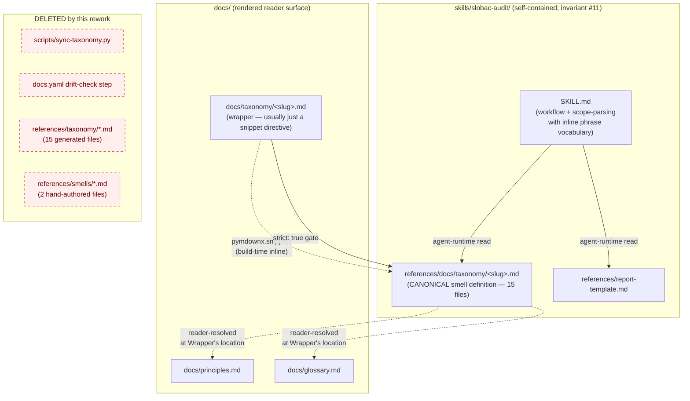

# Architecture Decision: Canonical taxonomy-entry shape under snippet-include inversion

## Context

Third OQ2 pass. The prior "OQ2-redux" decision (Option E: generator + drift-check CI gate, with generated `references/taxonomy/<slug>.md` copies committed alongside hand-authored `references/smells/<slug>.md` augmentation files) passed preflight, build, and the invariant-#11 spot-check — but the operator rejected it on reading the shipped artefacts.

Two rejections, both load-bearing:

1. **Committed generated code is architecturally a smell.** The generator + drift-check gate tolerates the `references/taxonomy/` copy only because a load-bearing constraint (skill-root self-containment) forces a copy to exist; the fact that it's `chore: regenerate` in the git log instead of hand-authored doesn't make it not-duplicated content. Every edit to the manifesto requires an out-of-band step a contributor won't remember, and the CI drift-check catches-but-does-not-prevent the mistake class.
2. **The `references/smells/<slug>.md` augmentation files are mostly-duplicate prose.** Ranges from ~35% (`naming-lies`) to ~60% (`deliverable-fossils`) of each augmentation file is restated content from the manifesto (Fix-phase labels, Related-modes cross-refs, ticket-as-provenance rule, semantic-redundancy overlap flag). This content drifts silently when the manifesto changes, because an editor touching `docs/taxonomy/deliverable-fossils.md` has no structural reason to open `skills/slobac-audit/references/smells/deliverable-fossils.md`.

Both rejections flow from the same underlying error: OQ2-redux tried to preserve the premise that `docs/taxonomy/*.md` is the authoring source of truth while also satisfying invariant #11 (skill-root self-containment). The only way to satisfy both at once is some flavor of copy-with-sync-discipline, which is what Option E was. The rework target flips the premise: the **skill bundle** holds the canonical taxonomy, and `docs/taxonomy/*.md` becomes a rendering surface that `pymdownx.snippets` composes at site-build time.

The operator's clarification — **"nobody reads `docs/*.md` directly; we render a properdocs site"** — eliminates the constraint that killed snippet-based options in the original OQ2 ("build-time only, incompatible with github.com rendering"). Snippets are on the table again.

This creative phase resolves the remaining open question: given the inversion, what is the shape of the canonical taxonomy entry inside the skill bundle, and what (if anything) lives in the `docs/taxonomy/*.md` wrapper?

## Requirements & Constraints

### Functional requirements

1. **Agent detection.** The audit skill reads the canonical entry at agent-runtime and uses its prose for per-smell detection, fix prescription, and report rationale. The agent needs Signals, Prescribed Fix, an Example, and enough disambiguation content (Related modes, false-positive guards) to avoid pattern-matching false positives.
2. **Reader comprehension.** The rendered site (`properdocs build`) must continue to produce per-smell pages equivalent to the current `docs/taxonomy/<slug>.md` pages in reader value. URL structure (`.../taxonomy/<slug>/`) is preserved for link stability.
3. **Uniform authoring surface.** Whatever shape the canonical takes, it must be the same across all 15 taxonomy entries (taxonomy-entry uniformity, primary invariant). One place to add or edit a smell.
4. **Minimal wrapper content.** The operator's explicit preference: `docs/taxonomy/<slug>.md` should usually be just a snippet-include directive. "There might not be ANY" wrapping content is the expected default, with exceptions accommodated (e.g., a reader-site page wants a language-specific preamble, an extra example, a pedagogical framing).

### Quality attributes (ranked)

1. **Knowledge-DRY.** One source of truth per smell, structurally. No generator-and-drift-gate, no "remember to also edit" maintainer discipline.
2. **Zero-drift by construction.** Manifesto-audit coherence is a property of the file system, not of CI.
3. **Authoring ergonomics.** Editing a smell is one file touch in one place. No step-2s.
4. **Agent detection quality.** The canonical carries enough context that the agent doesn't have to guess, paraphrase, or rely on augmentation-file restatement.
5. **Reader rendering fidelity.** Site pages remain useful reader documents; snippet composition doesn't degrade their prose.
6. **Phase-2 extensibility.** When Phase-2 adds 13 more smells to audit scope (the non-Phase-1 manifesto entries), the shape scales. No special cases for "in-scope vs out-of-scope" smells.

Explicitly de-prioritized:

- **Raw-markdown-file readability.** The operator confirmed readers go through the rendered site. The canonical's relative links (`../principles.md#...`) resolve at *wrapper-render location* (`docs/taxonomy/`), not canonical location (`skills/slobac-audit/references/docs/taxonomy/`). A contributor reading the raw canonical sees "wrong-looking" links; this is a conscious tradeoff and documented.

### Technical constraints

- `pymdownx.snippets` is already enabled in `properdocs.yml` with `base_path: [.]` and `check_paths: true`. No config changes expected.
- `strict: true` on properdocs will fail the build on any broken snippet path or unresolved internal link after the snippet is inlined.
- Invariant #11 (skill-root self-containment) holds. The skill reads only paths rooted at its own install directory. Under the inversion, this is trivially satisfied — the canonical is inside the skill's `references/` subtree.
- Phase 1 scope is two smells (`deliverable-fossils`, `naming-lies`). The inversion applies structurally to all 15 entries (they all move to the skill bundle and get wrappers in `docs/taxonomy/`), but content reshape (shape refinement per the decision below) is only for the two Phase-1 smells. The other 13 keep their current reader-shaped content at the canonical path; Phase-2 reshape is scheduled per-smell as each becomes audit-scope.

### Scope boundaries

**In scope for this decision:**

- What sections live in the canonical vs. the wrapper.
- Where invocation-phrase hints live (agent-UX concern not part of the smell's definition).
- What happens to `skills/slobac-audit/references/smells/*.md` (the hand-authored augmentation files).
- What happens to `scripts/sync-taxonomy.py` and the CI drift-check step.

**Out of scope:**

- Content reshape for the 13 non-Phase-1 manifesto entries (Phase-2 per-smell work).
- Any change to `docs/principles.md` or `docs/glossary.md`.
- Any change to the report template, fixtures, or expected-findings files.
- Harness-integration work (invariant and unchanged).

## Components

The snippet-include relationship is build-time only. At render time, the wrapper's content is the canonical inlined in place; relative-link resolution happens at the wrapper's file-system location. The skill's agent-runtime reads are strictly intra-skill.

## Options Evaluated

**Option α — Maximal canonical.** The canonical carries everything currently in `docs/taxonomy/<slug>.md`, plus a promoted false-positive guards section from the augmentation file. Wrapper is always just the snippet directive. No content lives outside the canonical.

**Option β — Minimal canonical ("tight description" taken literally).** The canonical carries only Signals + Prescribed Fix + Example + False-positive guards. Summary, Description, Related modes, Polyglot notes all migrate to the wrapper. Wrapper is substantial for every entry.

**Option γ — Definitional canonical, discursive wrapper.** The canonical carries every section of the current manifesto entry that's part of the smell's *definition*: Summary, Description, Signals, Prescribed Fix, Example, Related modes, Polyglot notes (the practical guidance), plus a first-class False-positive guards section promoted from the augmentation file. The wrapper carries *optional* reader-facing framing: extended narrative, ecosystem-specific polyglot expansions, additional language examples, pedagogical framing. Most wrappers are empty snippet-includes.

## Analysis

| Criterion (ranked) | Option α (maximal canonical) | Option β (minimal canonical) | Option γ (definitional canonical + discursive wrapper) |
|---|---|---|---|
| **Knowledge-DRY** | Strong. One file per smell, all content. | Strong *if* the split discipline holds; drift risk between canonical and wrapper narrative. | Strong. One file carries the definition; wrapper has no duplicated content by construction (it's either snippet-include or additional content, never restatement). |
| **Zero-drift** | Structural. | Structural for the split content but introduces a *new* drift surface (canonical Signals vs. wrapper Description might drift if the smell's essence shifts and only one side is updated). | Structural. No restatement between canonical and wrapper. |
| **Authoring ergonomics** | One-file edit. Ideal. | Two-file edit for almost any change. Adds friction; invites exactly the class of silent drift the rework is trying to eliminate. | One-file edit in the canonical for virtually all smell changes; wrapper touch only when an author consciously wants reader-facing framing. |
| **Agent detection quality** | Full context including narrative. May be slightly over-sized for token budgets at Phase-2 (15 smells × full entries in SKILL.md scope). | Weakest. Agent loses Description (smell-essence prose) and Related modes (disambiguation). These are definitional; β sacrifices detection quality for marginal token savings. | Full definitional context. Same as α for Phase-1 scope (two smells); same practical token cost. |
| **Reader rendering fidelity** | Perfect — wrapper is always a snippet-include; site-render identical to current. | Requires substantial wrapper content per smell to preserve current site quality; author burden + drift surface. | Perfect for Phase-1 smells; for later smells the optional wrapper framing is a *feature*, not a burden. |
| **Phase-2 extensibility** | Uniform. Every new smell follows the same canonical-only authoring. | Uniform but higher per-smell authoring burden (two files per smell). | Uniform. New smells default to empty wrappers; if an author wants language-specific content, the wrapper is there. |
| **Honors operator's "tight description" signal** | Partial. "Tight" in the current manifesto means "no reader-prose expansion beyond the smell's essence." The current manifesto entries are already tight by that reading. | Literal reading. Strips definitional content on the grounds that it's not "characteristics." | Correct reading. "Tight" distinguishes canonical content (definitional, discursive in service of bounding the smell) from wrapper content (reader-pedagogy beyond the smell's essence). |
| **Honors operator's "there might not be ANY [wrapping]" signal** | Perfect. | Violates — every wrapper needs Description content to render a useful site page. | Perfect. Empty-wrapper is the default; reader-framing is opt-in per entry. |
| **Risk / reversibility** | Low. Simplest structure; reversible if a specific entry needs wrapper framing later (just move content). | Medium. The canonical-vs-wrapper content split is a judgment call every time; high risk of author drift. | Low. Same structural simplicity as α for the 15 existing entries (wrappers are empty); reversibility is trivial. |

Key insights:

- **Options α and γ are functionally identical for the Phase-1 scope** (two smells whose current manifesto entries fit entirely within "definitional" content). They differ only in their stance toward future reader-framing content. γ's explicit affordance for discursive wrappers doesn't change Phase-1 delivery; it just means the architecture has a named place for "reader-site adds a Ruby example for this Go-idiomatic smell" without violating taxonomy-entry uniformity.
- **Option β fails the operator's two most explicit signals.** "There might not be ANY" wrapping is violated by every entry (all need Description content). "Tight description" was never a push for minimalism below the current manifesto content — the current entries are already tight by the manifesto's own standard.
- **False-positive guards must land in canonical under any option.** They're part of the smell's definition (what the smell *isn't*), they're agent-critical, and promoting them from the augmentation file is the rework's most substantive content change.
- **Invocation-phrase hints are not part of the smell's definition.** They're the audit's UX vocabulary ("fossils," "stale names," "titles that lie"). They belong with scope-parsing (SKILL.md), not with the smell's canonical entry. None of the options change this.
- **Augmentation files evaporate under γ and α.** Their content splits into: (a) false-positive guards → canonical; (b) invocation phrases → SKILL.md; (c) restated manifesto content → deleted; (d) Phase-1 polyglot notes → deleted; (e) detection priorities → deleted. The `references/smells/` directory is removed.

## Decision

**Selected:** Option γ — definitional canonical, discursive wrapper.

**Rationale:**

1. Honors both operator signals ("tight description" and "there might not be ANY" wrapping) in the reading that's coherent with current manifesto authoring.
2. Single-file editing ergonomics for all 15 current entries (wrappers are empty snippet-includes) plus a named affordance for reader-specific framing when authors want it.
3. Agent retains full definitional context — Signals, Description, Related modes, false-positive guards — without being forced to stitch fragments from two files.
4. Structural zero-drift: snippet-include replaces generator+CI-gate; the canonical is the single authoritative source; the site is a rendering derivative.
5. The false-positive guards promotion (from augmentation to canonical) is the rework's substantive content gain. Duplication assessment showed that ~40–65% of each augmentation file was restated manifesto prose; false-positive guards were the most valuable non-restated content. Promoting them into a named canonical section gives them first-class authoring weight.

**Tradeoff accepted:**

- **Raw-canonical link resolution is wrong-looking.** `[Understandable](../principles.md#understandable)` in `skills/slobac-audit/references/docs/taxonomy/<slug>.md` resolves relative to `docs/taxonomy/` (where the snippet is inlined), not relative to the canonical's own filesystem location. A contributor who opens the raw canonical file sees paths that look broken. Since the operator has confirmed nobody reads raw `docs/*.md` (or raw skill-bundle files) — and the agent treats these links as inert text — this is acceptable and documented in systemPatterns.md.
- **Invariant #3 (manifesto-independence) needs wording revision, not architectural change.** The invariant's spirit — one source of truth; audit doesn't fork — is stronger than ever (structurally impossible to fork). But the old wording implied the manifesto was authored *outside* the audit and consumed by it; under the inversion, the audit bundle *is* the authoring surface and the site is the consumer. systemPatterns.md and techContext.md both need this relationship clarified. No architectural rework for Phase-2; the diagram and prose just update.

## Implementation Notes

### Canonical shape (concrete)

`skills/slobac-audit/references/docs/taxonomy/<slug>.md`:

~~~markdown
# <Slug Title>

| Slug | Severity | Protects |
|---|---|---|
| `<slug>` | <Severity> | <principle links> |

## Summary

<One paragraph.>

## Description

<1-3 paragraphs establishing smell essence and semantic judgments.>

## Signals

- <detection cues>

## False-positive guards

- <common over-triggers + why they aren't the smell>

## Prescribed Fix

<step-by-step, phases if applicable>

## Example

<Before/After code + optional commentary>

## Related modes

<cross-links to other manifesto entries>

## Polyglot notes

<practical polyglot guidance>
~~~

The **False-positive guards** section is new. Every other section carries over from the current manifesto entry unchanged. For Phase-1 smells (`deliverable-fossils`, `naming-lies`), the guards section is populated by migrating content from the augmentation files (after dropping restatement pieces). For the 13 non-Phase-1 smells, the guards section is added as a *stub* with the text "No audit-specific guards yet; Phase-2 per-smell work will author these." This keeps shape uniform without claiming detection content that hasn't been thought through.

### Wrapper shape (concrete)

`docs/taxonomy/<slug>.md`:

~~~markdown
--8<-- "skills/slobac-audit/references/docs/taxonomy/<slug>.md"
~~~

All 15 wrappers start as bare snippet-includes. If a future author wants reader-framing for a specific entry, they add prose before or after the snippet line. No current entry requires this for Phase-1.

### Invocation-phrase hints

Move inline into `skills/slobac-audit/SKILL.md`'s scope-parsing section as a per-slug enumeration. Example:

~~~markdown
Map natural-language operator intent to slugs:

- `deliverable-fossils` — "fossils," "stale names," "checklist-shaped tests," "sprint-vocab tests," "tests named after tickets/refactors"
- `naming-lies` — "naming-lies," "titles that lie," "names that don't match the body," "misleading test names"
~~~

At Phase-2 scale (15 smells), this may get long enough to warrant extraction to a `references/scope-vocabulary.yaml` or equivalent. For Phase-1 (2 smells), inline prose in SKILL.md is appropriate.

### Component cleanup

- **Delete** `scripts/sync-taxonomy.py`. The generator is obsolete; snippet-include is the sync.
- **Delete** `skills/slobac-audit/references/taxonomy/*.md` (15 files). Replaced by `skills/slobac-audit/references/docs/taxonomy/*.md` at a different path. Directory removed.
- **Delete** `skills/slobac-audit/references/smells/*.md` (2 files). Content migrates (guards → canonical; phrases → SKILL.md) or is dropped (restatements, Phase-1 polyglot notes, detection priorities).
- **Remove** the `Verify audit-skill taxonomy copy is in sync with docs` step from `.github/workflows/docs.yaml`.

### Migration path

For each of the 15 manifesto entries, the migration is:

1. `git mv docs/taxonomy/<slug>.md skills/slobac-audit/references/docs/taxonomy/<slug>.md`. Preserves history.
2. Write the new thin `docs/taxonomy/<slug>.md` wrapper with just the snippet-include directive.
3. For Phase-1 entries only: edit the canonical to add the `## False-positive guards` section (content migrated from the augmentation file).
4. For all other entries: edit the canonical to add a stub `## False-positive guards` section with the Phase-2-deferred marker.

The 15 `git mv` operations can be batched in a single commit (the migration is structural and fully reversible). The Phase-1 content reshape (step 3 above) is a small follow-up commit.

### Site rendering verification

After migration, `properdocs build --strict` must pass. Snippets `check_paths: true` + `strict: true` together guarantee that every wrapper's snippet-include target exists and resolves; `validation.anchors: warn` (already set) plus the strict-mode treatment-of-warnings-as-errors catches any broken principle/glossary anchor references that get inlined. No `properdocs.yml` changes required.

### Invariant revisions (systemPatterns.md)

- **Invariant #3 (manifesto-independence)** wording update: the manifesto canonical now lives inside the audit skill bundle (`skills/slobac-audit/references/docs/taxonomy/`); the reader-facing site (`docs/taxonomy/`) is a properdocs-rendered derivative. Audit still "cites" the manifesto — but now the skill bundle *is* the manifesto. Forking is structurally impossible.
- **Invariant #11 (skill-root self-containment)** unchanged and cleaner: the skill reads only its own `references/` tree, architecturally rather than procedurally.
- **"Generator-synchronised skill-bundle pattern"** (techContext.md) removed and replaced with **"Canonical-in-bundle, site-rendered-via-snippet"** pattern.
- **"Three deliverables layer"** description (systemPatterns.md) updated: authoring surface is the skill bundle; reader site is a rendering; apply is downstream of the bundle. The layering relationship holds but its source code is now in the skill tree.

### Calibration note

This is the **third** pass at OQ2. The pattern across passes has been: each prior decision satisfied the constraints the creative phase had enumerated, but a constraint surfaced later that the prior decision couldn't satisfy. Explicit acknowledgement:

- **OQ2 original** assumed `docs/` was reachable from the installed skill. Missed invariant #11.
- **OQ2-redux** assumed the only way to satisfy invariant #11 was to copy the manifesto into the skill with sync discipline. Missed the consequence — committed generated content and augmentation-file drift risk — that the operator identified post-build.
- **OQ2-redux-redux** (this decision) inverts canonicality: skill bundle is authoring; site is rendering. Resolves both the portability constraint *and* the committed-generated-code / augmentation-drift concerns. Confidence is high, with the same caveat the prior decision carried: confidence is conditional on the analysis axes enumerated above being complete. If a fourth constraint surfaces, the failure mode to watch for is the same (unstated constraint not surfaced until build). The mitigation is: surface build-stage reactions *before* committing to architecture, not after.

The recurring failure mode is "creative phase satisfies stated constraints; build reveals an unstated constraint." Phase-2 creative phases on SLOBAC should explicitly ask "what will the operator's first reaction to the shipped artefact be, and can we surface that objection now?" as a discipline hedge.
