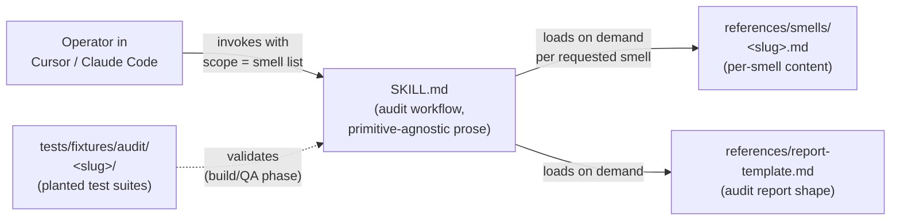

# Architecture Decision: Customization Primitive Shape & Granularity (OQ1)

## Requirements & Constraints

### Functional Requirements

- Package the audit so that an operator in Cursor **or** Claude Code can invoke it, scope it to a subset of smells, and receive a portable markdown report.
- Support two smells at Phase 1 (deliverable-fossils, naming-lies).
- Extend to all 15 taxonomy entries at Phase 2 without a second architectural pass.
- Couple cleanly to whatever OQ2 resolves for docs↔customization DRY.

### Quality Attributes (ranked)

1. **Harness portability.** Single canonical source runnable across Cursor + Claude Code. Avoid harness-specific primitives (`.mdc` frontmatter, `hooks.json`, Cursor-only Plugin spec, etc.).
2. **Phase-2 extensibility.** Adding the remaining 13 smells must be a content-addition task, not a re-architecture task.
3. **Knowledge-DRY.** Shared audit workflow lives once. Per-smell content lives once. No duplication either across smells or across harnesses.
4. **Simplicity.** Don't introduce primitives that aren't required by the functional requirements. Day-1 Plugin packaging is explicitly *not* required; user said "we may not need to build that shape from day one."
5. **Incremental shipping.** Choose a shape that can be extended or wrapped later (Plugin, Sub-Agents) without reshaping the canonical source.

### Technical Constraints

- Both target harnesses (Cursor, Claude Code) support a directory-with-`SKILL.md` primitive that conforms to the AgentSkills.io-inspired shape. This repo's own `.cursor/skills/shared/niko/` is a live example: `SKILL.md` at the root + typed `references/` subdirectories (`core/`, `level1/`, … `phases/`) loaded on demand.
- Both harnesses also support Sub-Agents / specialized agent primitives, but with materially different invocation semantics and configuration surfaces. Using them day-1 raises portability risk.
- Plugins in Cursor and Claude Code are different wire formats; a day-1 plugin means building two of them.

### Boundaries

- **In scope:** The *canonical customization source* — what file layout and primitive shape backs the audit.
- **Out of scope:** Distribution packaging (plugin wrappers, marketplace publishing, auto-install scripts). These are Phase 5 concerns. If they matter later, they wrap the canonical source; they don't replace it.

## Components



The key architectural property: **the per-smell content is data** (a `references/smells/<slug>.md` file), not code. Adding a smell is adding a file. The ur-skill's workflow does not change.

## Options Evaluated

- **Option 1 — Monolithic Skill, smells inline in `SKILL.md`.** One file, two smells' content embedded. *Rejected at the gate:* user explicitly called this out as unacceptable even if it technically ships Phase 1, because it sets a pattern that cannot survive Phase 2's 13 additional smells.
- **Option 2 — Ur-Skill + per-smell entries under `references/`.** One `SKILL.md` carrying the audit workflow; per-smell content lives in `references/smells/<slug>.md`. Adding a smell adds a file.
- **Option 3 — One Skill per smell.** `slobac-audit-fossils/SKILL.md`, `slobac-audit-naming-lies/SKILL.md`, each with its own copy of the audit workflow.
- **Option 4 — Ur-Skill + per-smell Sub-Agents.** Ur-Skill handles the orchestration; each smell is delegated to a dedicated Sub-Agent with an isolated prompt context.
- **Option 5 — Day-1 Plugin(s).** Cursor Plugin + Claude Code Plugin, each wrapping the customization.

## Analysis

| Criterion | Option 2 (ur-Skill + refs) | Option 3 (skill per smell) | Option 4 (Skill + Sub-Agents) | Option 5 (Day-1 Plugin) |
|---|---|---|---|---|
| Portability | High — `SKILL.md` + `references/` shape is supported by both harnesses (this repo already does it for Niko). | High per skill, but N× the porting work. | Medium — Sub-Agent invocation differs across harnesses; more glue needed. | Low per-harness-of-one; two plugins required for parity. |
| Phase-2 extensibility | **Add a file** to `references/smells/`. | Add a whole skill dir + duplicate the workflow prose. | Add a file + a sub-agent definition in each harness's format. | Rebuild both plugins. |
| Knowledge-DRY | One workflow, N smell-content files. | Workflow duplicated N times; bug-fixes in workflow prose touch N files. | One workflow, N smell-content files + N sub-agent defs. | Workflow lives in the skill inside the plugin; plugin shell is duplicated across harnesses. |
| Simplicity | One primitive (Skill). | One primitive (Skill) but N instances. | Two primitives (Skill + Sub-Agent). | Two primitives minimum (Plugin + Skill) × 2 harnesses. |
| Risk | Ur-workflow prose must accommodate two genuinely different fix-shape decision trees (two-phase vs three-way). The two-smell scope is designed precisely to stress-test this. | Divergence risk: workflow prose drifts across the N copies. | Sub-Agent API drift across harnesses. | Plugin format drift across harnesses + day-1 investment before Phase 1 has shipped anything. |
| Day-1 effort | Low. | High (N× workflow authoring). | Medium-high (two primitives to learn per harness). | High (two plugin builds). |

### Key insights

- **User-supplied constraints eliminate Options 1, 3, 5.** Option 1 was rejected directly. Option 3 violates the knowledge-DRY invariant and would mean fixing workflow bugs in 15 places at Phase 2's end. Option 5 was deferred by the user ("maybe not day 1") and pays a harness-specific packaging cost before Phase 1 has even shipped content.
- **Option 4 adds a primitive (Sub-Agents) whose cross-harness shape is materially less portable than `SKILL.md` + `references/`.** This is exactly the kind of harness-specific coupling the portability preference was written to discourage. Sub-Agents are a reasonable *Phase-2-or-later* optimization if the ur-Skill's prompt context grows too large — but they're not required at Phase 1.
- **Option 2 has a single real risk:** the ur-Skill's audit workflow must be generic enough to orchestrate two genuinely different fix-shape decision trees. Deliverable-fossils' fix is two-phase (rename → regroup). Naming-lies' fix is three-way (rename / strengthen / investigate). If the ur-Skill assumes a specific fix-shape, naming-lies will be mangled. The two-smell-scope constraint is the stress test for exactly this, and it is the principal reason Phase 1's scope is two smells rather than one.
- **This repo's own precedent reinforces Option 2.** `.cursor/skills/shared/niko/SKILL.md` with typed `references/{core,level1,level2,level3,level4,phases}/` subdirs is the same shape. The niko skill system *is* an ur-skill with per-variant content under `references/`. Nothing about the SLOBAC audit problem is unusual enough to need a different shape from what the project is already practicing.

### Quality-attribute tension

Simplicity vs optionality: Option 4 buys prompt-context isolation per smell that Option 2 doesn't; if detection quality turns out to be limited by ur-Skill prompt bloat at Phase 2's 15-smell scale, Option 2 may need to evolve into Option 4. The creative decision accepts that possibility — Option 2 is strictly a *subset* of Option 4's content (the smell-content files), so the migration path is "write Sub-Agent wrappers around the existing `references/smells/<slug>.md` files when needed," which is an additive change.

## Decision

**Selected**: Option 2 — Ur-Skill with per-smell entries under `references/`, packaged as an AgentSkills.io-shaped `SKILL.md` + typed `references/` directory tree. Top-level layout proposed:

```
slobac/                                 # canonical source, harness-agnostic
├── SKILL.md                            # audit workflow, primitive-agnostic prose
└── references/
    ├── smells/
    │   ├── deliverable-fossils.md
    │   └── naming-lies.md
    └── report-template.md
```

(Location of the `slobac/` directory within the repo is a implementation-detail decision deferred to the plan: candidates include `audit/`, `skills/slobac-audit/`, repo root, etc. This creative decides the *shape*, not the *path*.)

**Rationale**: 

- Uniquely satisfies the top-ranked quality attribute (harness portability) without harness-specific glue. `SKILL.md` + `references/` is the most stable cross-harness primitive available at Apr 2026, and this repo is already using it for Niko.
- Phase-2 extensibility is ideal: adding a smell is adding a file.
- Single-primitive simplicity (no Sub-Agents, no Plugin) keeps day-1 cost minimal and preserves migration paths.
- Knowledge-DRY: one workflow, one copy of report-template, N smell-content files.
- Accommodates the stress test: the two-smell scope exercises whether the ur-workflow can orchestrate genuinely different fix-shape decision trees.

**Tradeoff accepted**: Per-smell prompt-context isolation is *not* built day 1. If Phase 2's ur-Skill prompt grows unwieldy at 15-smell scale, we accept a future Option-4-style migration (add Sub-Agents wrapping the existing `references/smells/` files). That migration is additive and preserves the canonical source.

## Implementation Notes

### Component boundaries

- **`SKILL.md`** — primitive-agnostic audit workflow prose. Describes: (1) how to scope (which smells to audit), (2) how to load per-smell content on demand, (3) how to emit the report via the template. Contains *no* per-smell content.
- **`references/smells/<slug>.md`** — per-smell content: detection signals, decision tree for the fix, reporting hints. Shape is uniform across smells (cf. `docs/taxonomy/README.md`'s entry-shape invariant, which is a precedent to mimic but not necessarily copy).
- **`references/report-template.md`** — report schema / skeleton. Format: markdown (Phase 1 default). Structured enough that a future JSON extraction is mechanical.

### Integration approach

- **Cursor**: canonical source is discovered via Cursor's skill loader. Concrete discovery path (`.cursor/skills/`, user-level install, repo-root install) is a preflight/tech-validation step.
- **Claude Code**: same canonical source discoverable via Claude Code's skill loader. Both harnesses' concrete discovery paths differ; neither requires modifying the canonical source.
- **Operator scoping** (deferred from plan time): natural-language ("audit my suite for fossils") — the ur-Skill's workflow prose is responsible for parsing scope intent and loading the matching `references/smells/<slug>.md` files.

### Things this decision defers (by design)

- **Discovery-path mechanics in each harness** — a cross-harness compatibility verification step. The `SKILL.md` *contents* are cross-harness-portable; the *install path* differs per harness and is a tech-validation step, not an architectural decision. If tech-validation reveals that one harness cannot discover the layout we've chosen, that is a preflight FAIL and we revisit — not a reason to reject Option 2.
- **Sub-Agent migration path** — reserved for Phase 2 or later if prompt-context bloat emerges as a real limit.
- **Plugin packaging for marketplace distribution** — Phase 5 concern. Wraps, does not replace.

### Migration path

N/A — SLOBAC has no pre-existing customization layer to migrate from. This is the greenfield architectural decision for the audit's Phase 1+ shape.

## Confidence

**High.** The decision is airtight at the architectural layer under the stated constraints:

- Options 1, 3, 5 are eliminated by explicit user constraints.
- Option 4 loses on the top-ranked quality attribute (portability) and is a superset of Option 2's content, so the migration path is preserved.
- The single residual risk (ur-workflow surviving two different fix-shape decision trees) is exactly what the two-smell Phase-1 scope is designed to stress-test — it is a *test* of the architecture, not a gap in it.

Implementation-level questions about the harness-specific discovery path are appropriately a tech-validation / preflight concern and do not block the architectural commitment.
