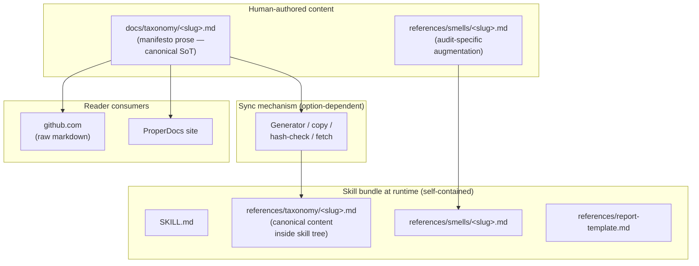

# Architecture Decision: Docs ↔ Skill DRY Mechanism under Skill-Root Self-Containment (OQ2-redux)

## Why this document exists

The prior creative pass on this question ([`creative-docs-skill-dry.md`](./creative-docs-skill-dry.md)) selected Option D (docs canonical; skill reads both `docs/taxonomy/<slug>.md` and `references/smells/<slug>.md` at runtime) and marked it **high confidence**. That decision missed a constraint: an AgentSkills.io skill's **runtime root is the skill's own install directory** (`~/.claude/skills/slobac-audit/`, a user-level Cursor install, or wherever the operator drops the bundle). The skill cannot assume anything outside that root is reachable. The prior analysis conflated *filesystem co-location in this repo* with *runtime co-location at the skill's install path*; the former holds, the latter does not, and Option D depended on the latter.

The rework invariant is **#11 Skill-root self-containment**: every file the skill reads at agent-runtime must be reachable via a path anchored inside the skill's own root. Under that invariant, Option D is structurally dead.

The question is re-opened with the corrected constraint. The ranked quality attributes from the original pass survive; a new hard constraint is added.

## Requirements & Constraints

### Functional Requirements (unchanged from OQ2)

- A single source of truth for each smell's definition (summary, description, signals, prescribed fix, example, related, polyglot notes) — the docs-side and skill-side representations must agree.
- Docs continues to render on **both** the ProperDocs site (via build) and **github.com** (via raw-markdown rendering).
- The skill side still carries audit-specific augmentation (invocation phrases, emission hints, false-positive guards) that the reader-facing docs deliberately do not carry.
- The mechanism composes with OQ1's ur-Skill + `references/` tree shape.

### Quality Attributes (unchanged ranking)

1. **Zero drift.** The docs and the skill's representation of canonical content do not silently diverge.
2. **Manifesto-independence invariant.** The audit may cite the manifesto; it must not fork it. (`systemPatterns.md` layering invariant.) Under the rework, this can no longer be enforced structurally by "no copy of the manifesto in the skill tree," because any copy is required to satisfy the new invariant. Procedural enforcement is the best achievable.
3. **Simplicity.** Don't add build steps, CI gates, or generators unless strictly required.
4. **github.com readability.** Docs tree renders cleanly on github.com without build tooling.

### New Hard Constraint (not a ranked QA — a structural invariant)

- **Skill-root self-containment (tasks.md invariant #11).** The skill tree must be a standalone bundle. No runtime reads outside the skill's own directory; no relative paths that escape the root; no dependencies on the repo's directory layout at invocation time.

### Technical Constraints (unchanged)

- **`pymdownx.snippets` is build-time only.** Does not run at agent-runtime; does not run on github.com. Options relying on snippet directives being interpreted by the skill runtime or github.com are dead on arrival.
- **Taxonomy-entry uniformity invariant.** All 15 taxonomy files in `docs/taxonomy/` must remain shape-interchangeable. Whatever mechanism is chosen must apply uniformly across the full suite, not just the Phase-1 two.
- **Cross-link integrity gate.** `properdocs build --strict` + `validation.anchors: warn` must continue to pass.

### Boundaries

- **In scope:** how canonical per-smell content that the skill needs at agent-runtime is made available inside the skill's root.
- **Out of scope:** hand-authored audit-specific augmentation (invocation phrases, emission hints, false-positive guards). That content lives unambiguously in `references/smells/<slug>.md` regardless of this decision.

## Components

Key architectural property under the new invariant: **the skill bundle at runtime contains every file the skill reads**, including canonical per-smell content. The docs tree remains the authorial SoT for readers; the skill's copy is a derivative produced by whatever sync mechanism the decision picks.

## Options Evaluated

- **Option D** (from original OQ2): docs canonical; SKILL.md reads `docs/taxonomy/<slug>.md` at agent-runtime. ❌ **Structurally dead under invariant #11.** Listed here only to mark it as the superseded option, not re-evaluated.
- **Option E** — **Generator + drift-check CI gate.** Docs canonical. A script (Python or `make` target) reads each `docs/taxonomy/<slug>.md` and writes a committed `skills/slobac-audit/references/taxonomy/<slug>.md`. CI gate runs the generator and fails if the committed output diverges (`git diff --exit-code`). Skill reads the committed copy at runtime.
- **Option H** — **Hand-authored operational playbook with role-split.** Docs = reader-facing manifesto; `references/smells/<slug>.md` = agent-facing operational notes overlapping the manifesto by design (signals, fix rules). No sync mechanism; drift is "expected" because the content has a different role.
- **Option K** — **Vendored copy with manual sync discipline.** Same file layout as E, but no generator and no CI gate. Operator manually re-copies on manifesto changes.
- **Option M** — **Vendored copy + content hash.** Skill carries a committed verbatim copy and a content hash pointing at the docs source. CI verifies hash match; re-sync is manual when CI fails.
- **Option J** — **Runtime fetch from stable URL.** Skill's workflow instructs the agent to fetch the manifesto from a public URL (GitHub Pages or `raw.githubusercontent.com`) at invocation time. No local copy.
- **Option N (noted for completeness)** — **Flip canonicality: skill is SoT; docs is generated.** Rejected not for correctness but for philosophical inversion: the manifesto is primary authorial work, not a derivative of the audit's needs. Forcing the reader-facing manifesto to be a by-product of the audit skill reverses the layering relationship in `systemPatterns.md` and misprioritises the tool relative to the worldview the tool implements. Not re-evaluated.

## Analysis

### Option D — why it's structurally dead (for the record)

`docs/taxonomy/<slug>.md` is not reachable from `~/.claude/skills/slobac-audit/` at agent-runtime. Relative paths from inside the skill resolve against the skill's install root; absolute paths require harness-specific conventions; harness cwd cannot be relied on (it's the operator's working directory, not the repo). No configuration of Option D survives install. Eliminated by invariant #11.

### Options E, H, K, M, J — comparison

| Criterion | E (generator + CI) | H (role-split) | K (manual copy) | M (copy + hash) | J (runtime fetch) |
|---|---|---|---|---|---|
| **Zero drift** (QA#1) | Yes — CI gate enforces | **No** — drift is structural (artifacts have different roles) | No — drift is silent | Yes — hash flags drift (but doesn't auto-repair) | Yes — always fetches live |
| **Manifesto-independence** (QA#2) | Procedural (generator is the discipline; skill copy is mechanically derived, not human-authored) | **Violated** — skill carries hand-authored content overlapping manifesto; parallel detection model emerges | Procedural (soft; no enforcement) | Procedural (hash is the enforcement; slightly weaker than E because it detects but doesn't resolve) | Structural (skill carries no copy) |
| **Simplicity** (QA#3) | Low-moderate — ~30-line script + 1-line CI check | **High** — no machinery | Highest — no machinery, no gate | Low-moderate — hash script + CI check | Moderate — no build infra, but adds runtime web-fetch dependency |
| **github.com readability** (QA#4) | Yes (docs unchanged) | Yes | Yes | Yes | Yes |
| **Skill-root self-containment** (hard invariant) | Yes | Yes | Yes | Yes | Yes **at content layer**; runtime depends on network + URL stability |
| **Harness portability** | Full — skill works offline in any harness | Full | Full | Full | Reduced — some harnesses sandbox skill context from arbitrary HTTP; offline use broken |
| **Maintenance burden** | Keep generator + CI healthy (low-frequency) | None at the infrastructure layer; high at the authoring layer (must re-read manifesto when authoring to stay aligned) | Operator remembers to re-copy (fragile) | Keep hash script healthy; re-copy manually on CI fail | Monitor URL/host stability externally |

### Eliminating H

H's structural proposal is "docs and skill are different artifacts with different roles; they overlap on content by design." The appeal is simplicity. The cost is violating QA#1 (zero drift) and QA#2 (manifesto-independence) simultaneously. Specifically:

- **Zero-drift is violated by definition.** H makes drift an expected feature, not a bug. Any change to the manifesto's Signals section requires a corresponding edit to the skill's operational notes, with no enforcement — only review discipline.
- **Manifesto-independence is violated structurally.** H puts signals and fix rules into the skill, hand-authored. This is a parallel detection model. The manifesto becomes one of two coordinate sources of truth, and the skill's model is the one the agent actually consults. The prior OQ2 analysis was explicit on this point: "if an audit-specific augmentation grows large enough that it starts to duplicate manifesto content, that is a structural smell." H would ship that structural smell as the design.

H is philosophically cleaner about what the skill *is* (an operational playbook) but pays for that clarity with the top two ranked quality attributes. Eliminated.

### Eliminating K

K dominates E on simplicity (no generator, no CI gate) but loses on QA#1 (zero drift). With 2 smells in Phase 1 and 13 more in Phase 2, the manual-sync-discipline burden scales linearly and has no enforcement. Drift will happen; it will be silent; it will be discovered only when the audit starts producing findings that don't match the current manifesto. QA#1 is ranked above simplicity, so K loses.

### Eliminating M

M is functionally a weaker E. It enforces drift *detection* without providing drift *resolution* — when CI fails, the operator must manually re-copy the changed content. Given that the generator in E is ~30 lines and M would have similar infrastructure (a hash-check script is about the same size as a minimal copy script), M pays roughly the same implementation cost as E for a strictly weaker drift mechanism. Eliminated.

### Eliminating J

J is structurally interesting: it delivers zero drift by construction (always-live source) and structural manifesto-independence (no copy in the skill). The costs:

- **Harness portability risk.** Not all skill runtimes grant web-fetch tools automatically. Claude Code skills, for instance, do not guarantee network access in skill execution context; Cursor's primitives vary. The skill's portability becomes contingent on external harness primitives.
- **Offline-use impossibility.** Any audit run on a disconnected machine (or behind an egress firewall) fails.
- **URL stability as a contract.** GitHub Pages URL structure, `raw.githubusercontent.com` conventions, or any chosen host becomes part of the skill's interface. Moving the manifesto's host breaks installed skills.
- **Latency and rate limits.** Per-invocation fetches add network time and expose the skill to rate-limit classes of failure.

Under the ranked QAs, J scores well on zero drift and manifesto-independence but fails on simplicity (network runtime is not simpler than a local copy) and introduces new failure modes (network, URL, rate-limits) that the skill-root self-containment invariant was specifically designed to avoid. Eliminated.

### E's costs made explicit

E is the last survivor; confirm we've acknowledged its costs honestly:

- **Procedural rather than structural manifesto-independence.** The skill tree will contain a copy of the manifesto. The copy is mechanically derived by a generator, and a CI gate prevents it from drifting, but the copy exists. A hostile edit to `references/taxonomy/<slug>.md` could in principle go unnoticed between generator runs; the CI gate catches it at commit time. This is weaker than the (now-invalid) Option D, which had no copy to edit. It is the best achievable under invariant #11.
- **Authoring boundary discipline.** The skill's `references/taxonomy/<slug>.md` files must not be hand-edited. The generator's output is authoritative; edits survive only in `docs/taxonomy/<slug>.md`. This is a file-level rule that the README and the file headers must both communicate.
- **Generator as new build artifact.** A script lives somewhere (likely `scripts/sync-taxonomy.py` or a `make` target). It's small, but it's new. Someone must keep it healthy as the docs-entry shape evolves — in particular, when Phase-2 additions land.
- **CI gate as new failure mode.** A contributor who edits `docs/taxonomy/<slug>.md` without regenerating will see CI fail. The fix is one command (`make sync-taxonomy` or `uv run scripts/sync-taxonomy.py`), but the failure mode is new.

None of these is a blocker. They are the real cost of making the skill self-contained.

### Why not a content-preserving variant of E that drops unused sections?

The manifesto entries contain sections the audit doesn't read at detection time (`Related modes` cross-links, `Polyglot notes` in some cases). A variant of E could have the generator strip these from the skill copy. Deliberately rejected here for two reasons:

1. **Verbatim copy preserves "no transform" as an invariant.** The skill's copy is a verbatim snapshot, not a curated subset. A transform step would need its own quality gate (is the right content being stripped? do downstream agent reads still work?) and would re-introduce a form of semantic drift between docs and skill.
2. **Context-budget savings are marginal.** A full manifesto entry is ~150 lines. The audit reads one per in-scope smell. Stripping sections saves ~30 lines per read. Not worth the transform-complexity cost at the phase-1 scale.

The generator therefore does **verbatim concatenation** with a clear "do not hand-edit" header and nothing more.

### Why separate the generated file from the hand-authored augmentation?

The prior OQ2 had one file per smell in `references/smells/<slug>.md`. Under E, that file would need to mix:
- Generated canonical content (never edit by hand).
- Hand-authored augmentation (only edit by hand).

Mixing these in one file creates a plausible footgun: a well-intentioned hand-edit to a "Signals" line in the canonical block silently dies the next time the generator runs. The footgun is mechanical, not human-error-only.

Two directories fix this at the filesystem level:
- `references/taxonomy/<slug>.md` — generated, verbatim copy of `docs/taxonomy/<slug>.md`. Generator-owned. Human edits forbidden.
- `references/smells/<slug>.md` — hand-authored augmentation, unchanged in role from the prior OQ2 decision. Generator never touches.

SKILL.md's workflow reads both — one canonical, one augmentation — per in-scope smell. The authoring boundary is enforced by directory, not by markers inside a single file.

## Decision

**Selected**: **Option E — Generator + drift-check CI gate, with two-directory file layout (`references/taxonomy/<slug>.md` generated; `references/smells/<slug>.md` hand-authored).**

**Rationale**:

- **Only surviving option under invariant #11 that also satisfies QA#1 (zero drift).** H, K, M lose on zero drift; J loses on harness portability and introduces runtime network dependency; D is structurally dead.
- **Best achievable manifesto-independence under invariant #11.** Structural enforcement is no longer available; procedural enforcement via a generator + CI gate is the tightest remaining substitute. The skill's copy is mechanically derived, read-only by convention, and drift-gated at commit time.
- **Preserves all other OQ2 invariants.** Docs-side shape unchanged; github.com rendering unchanged; ProperDocs `--strict` gate unchanged; taxonomy-entry uniformity unchanged.
- **Scales linearly to Phase 2.** Adding 13 more smells adds 13 entries; the generator walks `docs/taxonomy/*.md` and produces matching outputs. No infrastructure change when the suite grows.
- **Harness-neutral.** The skill bundle is pure filesystem content at runtime; no harness primitives beyond file reads are required. Works in Cursor, Claude Code, and any future AgentSkills.io-compliant harness.

**Tradeoff accepted**:

- Manifesto-independence downgrades from structural to procedural. This is the material cost of satisfying invariant #11 at all; no option preserves structural enforcement under that invariant (except J, which trades harness portability for it — unacceptable).
- A small amount of build infrastructure (one script + one CI job) is added, which the original OQ2 explicitly avoided. The rework's new invariant makes the avoidance impossible.

## Implementation Notes

### File-layout contract

- **`docs/taxonomy/<slug>.md`** — canonical manifesto entry. Authoritative. Unchanged in shape. Read by github.com, the ProperDocs build, and (indirectly via the generator) the skill.
- **`skills/slobac-audit/references/taxonomy/<slug>.md`** (new) — generated. Verbatim copy of `docs/taxonomy/<slug>.md` prefixed with a "do not hand-edit; regenerate with `<command>`" header. Generator-owned. One file per smell, always present for every smell the skill knows about.
- **`skills/slobac-audit/references/smells/<slug>.md`** — hand-authored augmentation. Role unchanged from prior OQ2 decision. Always present per the preflight amendment; contains the explicit "no augmentation required" marker if no content applies.
- **`skills/slobac-audit/SKILL.md`** — workflow reads *both* files per in-scope smell: `references/taxonomy/<slug>.md` for canonical definition and `references/smells/<slug>.md` for audit-specific augmentation. No external reads. Everything inside the skill root.

### Generator shape (prescriptive but not fully specified; build phase owns the details)

- Language: Python (consistent with existing `pyproject.toml` tooling).
- Location: `scripts/sync-taxonomy.py` (repo root `scripts/` directory is new; one file).
- Behavior: for each `<slug>` in `docs/taxonomy/*.md` (excluding `README.md`), emit `skills/slobac-audit/references/taxonomy/<slug>.md` with a fixed header (a "generated; do not hand-edit" preamble plus the source path) followed by the verbatim content of `docs/taxonomy/<slug>.md`.
- Modes: default (write the outputs); `--check` (compute outputs in memory and diff against committed files; exit non-zero on mismatch).
- CI hook: a new job in `.github/workflows/` (likely alongside or inside the existing docs workflow) runs `uv run python scripts/sync-taxonomy.py --check`. Failure message should tell the contributor to run `uv run python scripts/sync-taxonomy.py` locally and commit the result.

### Workflow-prose update for SKILL.md

Replace the "read `docs/taxonomy/<slug>.md` and `references/smells/<slug>.md`" instruction with "read `references/taxonomy/<slug>.md` (canonical, generated from the manifesto) and `references/smells/<slug>.md` (audit-specific augmentation)." The two-file read pattern survives; only the path of the canonical file changes.

### What the decision does NOT prescribe (build-phase concerns)

- The exact header text of the generated files. Minimal good-neighbour form is fine.
- Whether the generator uses `docs/taxonomy/README.md` or a glob. Either works; glob is simpler; README dictates shape but not enumeration.
- Whether the CI check runs on PRs only or on `main` pushes too. Pre-merge is the minimum; repo convention can widen it.
- Whether `make sync-taxonomy` wrapper is provided alongside `uv run python scripts/sync-taxonomy.py`. Cosmetic.
- Whether the generator should, in a far future, strip unused sections (Related, Polyglot). Not now; preserve verbatim.

### Failure modes the decision does NOT solve, and which are appropriately left open

- **Edits to `references/taxonomy/<slug>.md` between generator runs.** In principle a contributor could hand-edit the generated file and the change survives until the next `--check`. The CI gate catches it on PR. A pre-commit hook would close the window further; left to operator preference.
- **Manifesto-level restructuring (e.g. adding a new invariant section to all entries).** Handled identically to the current docs-side work: update the entries, run the generator, commit the synced skill copies. The generator is shape-agnostic; it does not need to change.
- **Phase-5 marketplace distribution.** The skill bundle is already self-contained; marketplace distribution is now trivially supported. The Phase-5 concern raised by the prior OQ2 (do we need a bundler?) is resolved by this decision — the skill's file layout at commit-time is also its install-time layout.

## Confidence

**High — with a calibration note.**

The option ranking is driven by the ranked QAs and invariant #11. E dominates the four surviving alternatives on the top-ranked attributes; the elimination of each alternative is traceable to a specific QA or constraint rather than a judgment call. The rework analysis has been deliberately explicit about what was missed before — the runtime-vs-filesystem co-location distinction — so this decision does not ride on the same blind spot.

**Calibration note**: the prior OQ2 was also marked "high confidence." That confidence was mis-calibrated because a constraint was missing from the analysis. Confidence is justified only to the extent that the analysis is complete. The analysis here explicitly enumerates: (a) invariant #11, codified and applied; (b) harness-portability effects on J; (c) authoring-boundary mechanics on the two-file split; (d) verbatim-vs-curated choice on the generator transform; (e) CI-gate failure modes. If another constraint surfaces that bears on one of these axes, the confidence claim is provisional.
