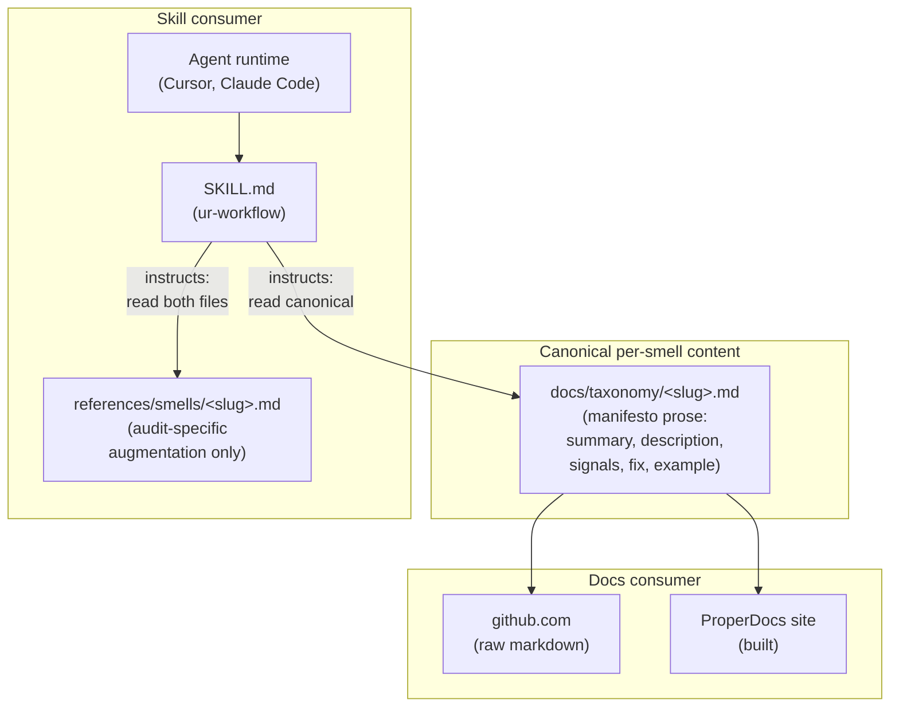

# Architecture Decision: Docs ↔ Customization DRY Mechanism (OQ2)

## Requirements & Constraints

### Functional Requirements

- A single source of truth for each smell's definition (summary, description, signals, prescribed fix, example, related, polyglot notes) — no duplication between `docs/taxonomy/<slug>.md` and the Skill's `references/` tree.
- The docs side continues to render on **both** the ProperDocs site (via build) and **github.com** (via raw-markdown rendering) — per `memory-bank/techContext.md`: "manifesto ships as raw markdown on github.com."
- The Skill side can include audit-specific augmentation (invocation phrases, emission hints, false-positive guards) that the reader-facing docs deliberately do **not** carry.
- The mechanism must compose with OQ1's decision: ur-Skill + `references/smells/<slug>.md`.

### Quality Attributes (ranked)

1. **Zero drift.** The canonical definition is singular; there is no mechanism by which the docs and the skill could silently diverge.
2. **Manifesto-independence invariant.** The audit may cite the manifesto; it must not fork it. (`systemPatterns.md` layering invariant.)
3. **Simplicity.** Don't add build steps, CI gates, or generators unless strictly required.
4. **github.com readability.** The docs tree must render as clean markdown on github.com without any build tooling.
5. **Distribution tractability.** The Skill should be installable in a target harness without requiring a bespoke build step per install.

### Technical Constraints

- **`pymdownx.snippets` is build-time only.** It runs inside ProperDocs/MkDocs at `properdocs build` time. It does **not** run at Cursor/Claude Code agent-runtime. It does **not** run on github.com. Any option that relies on snippet-include directives being interpreted at read-time by the agent runtime or by github.com is dead on arrival.
- **Taxonomy-entry uniformity invariant** (`systemPatterns.md` primary invariant). All 15 taxonomy files must remain shape-interchangeable. Any mechanism that moves content out of the uniform shape must do so for all 15 entries simultaneously, not just two.
- **Cross-link integrity gate** (`properdocs build --strict` + `validation.anchors: warn`). Any restructuring must leave the `docs/taxonomy/<slug>.md` → `docs/principles.md#<anchor>` cross-links intact.
- **OQ1 already-decided shape**: ur-Skill + `references/smells/<slug>.md`. Whatever decision emerges here must fit that shape.

### Boundaries

- **In scope:** the canonical-source decision for per-smell content shared between docs and Skill.
- **Out of scope:** audit-specific content that has no analog in the manifesto (invocation phrases, emission hints) — this lives unambiguously in `references/smells/<slug>.md` regardless of the DRY decision.

## Components

The key architectural property: **the canonical per-smell content exists in exactly one file** (`docs/taxonomy/<slug>.md`). Everyone else — the docs site, github.com, the Skill workflow — reads from that one file. The Skill's `references/smells/<slug>.md` carries only what the manifesto deliberately omits.

## Options Evaluated

- **Option A — Docs canonical; Skill uses `pymdownx.snippets` at build-time to generate a self-contained Skill file.** A pre-commit or CI step runs snippet expansion; the generated `references/smells/<slug>.md` is committed; a drift check gates the CI. Rejected per the constraint analysis below.
- **Option B — Skill canonical; Docs uses `pymdownx.snippets` at build-time.** Canonical lives in `references/smells/<slug>.md`; `docs/taxonomy/<slug>.md` contains `--8<--` directives. Rejected per the constraint analysis below.
- **Option C — Neutral third source; both consume via snippets.** A `taxonomy-core/<slug>.md` lives outside both trees; both docs and skill pull from it. Rejected per the constraint analysis below.
- **Option D — Docs canonical; Skill file carries only audit-specific augmentation; SKILL.md instructs the agent to read both files per in-scope smell.** Two files per smell, neither duplicates the other. No build machinery.
- **Option E — Docs canonical; generator produces a self-contained Skill file at pre-commit, CI checks for drift.** Same as Option A but without committing to the `pymdownx.snippets` mechanism — could be a plain bash/Python script doing literal concatenation.

## Analysis

### Why A, B, and C fail under the stated constraints

- **Option A:** `pymdownx.snippets` is build-time. The generated file is fine at agent-runtime (it's plain markdown). The drift check requires CI to re-run the generator and diff. Marginally viable, but the Skill file ends up with a ~200-line verbatim copy of the docs content plus its own tail of augmentation — the "one source of truth" property is preserved only through the generator + drift check infrastructure. Pays complexity for a property Option D provides for free.
- **Option B:** At agent-runtime, Cursor and Claude Code would read the `--8<--` directive as literal text, so the Skill never sees the smell's definition. **Fatal at the Skill layer.**
- **Option B (alternate read, docs only):** If we kept the Skill side as canonical and tried to let the *docs* side include from it, `docs/taxonomy/<slug>.md` on github.com would render with raw `--8<--` directives visible to readers. **Fatal at the github.com property.**
- **Option C:** Same failure modes as B plus added layering cost. A neutral third source reduces to Option B in both directions.

### D vs E

| Criterion | D (pointer + augmentation) | E (generator + drift check) |
|---|---|---|
| Zero drift | **Yes** — only one file contains the canonical content; there is nothing to drift. | Yes *if* CI gate works; otherwise silent drift is possible. |
| github.com readability | Yes — `docs/taxonomy/<slug>.md` is plain markdown. | Yes — same. |
| Build machinery | **None.** | Generator script + CI job. |
| Skill file size | Small (augmentation only; may be empty). | Full content + augmentation (~200 lines per smell at Phase-2 scale). |
| Distribution | Requires `docs/` tree co-located with Skill at runtime. Trivially true for in-repo; a design constraint at Phase-5 marketplace distribution. | Skill tree is self-contained; `docs/` not needed at runtime. |
| Manifesto-independence | **Structurally enforced** — the Skill has no copy of the manifesto. | Structurally soft — the Skill has a copy, with a generator promising it matches. |
| Runtime read cost | Agent reads 2 files per in-scope smell. | Agent reads 1 file per in-scope smell. |
| Maintenance | None. | Generator + CI gate must be kept healthy. |

### Key insights

- **Option D *structurally enforces* the manifesto-independence invariant.** The Skill cannot contain a manifesto copy because there is no manifesto copy in the Skill tree. Option E enforces this invariant *procedurally* (via a drift check), which is weaker.
- **The only real cost of Option D is the Phase-5 distribution constraint** — a marketplace-distributed Skill needs to ship or reference the `docs/` tree. This is the same class of constraint as "the Skill needs its `references/` subdir at runtime," which it already does. It is not a new problem.
- **Option E pays day-1 for a Phase-5 optimization.** The generator + CI gate is infrastructure that exists to make Phase-5 marketplace distribution easier. Phase-1 is in-repo only, so we would build infrastructure before shipping any smell's audit.
- **Option D's per-smell skill file is small or empty.** For smells where the manifesto entry is sufficient and no audit-specific augmentation is needed, `references/smells/<slug>.md` can contain nothing but a one-line pointer (or literally be absent, with the SKILL.md workflow treating absence as "no augmentation"). This scales gracefully to the Phase-2 15-smell case.

### Quality-attribute tension

Day-1 simplicity (D) vs. Phase-5 distribution self-containment (E). The portfolio decision accepts D's Phase-5 constraint because:

1. Phase 1 and Phase 2 will ship in-repo; co-location is free.
2. Phase 5 (marketplace distribution) has not been designed and may not demand self-containment at all (plugin wrappers can bundle both trees).
3. If Phase 5 *does* demand self-containment, adding a generator then is additive — the canonical source (docs) is unchanged, and a generator that synthesizes self-contained Skill files for distribution is a deployment-time tool, not an authoring-time tool.

## Decision

**Selected**: Option D — **docs canonical; Skill `references/smells/<slug>.md` carries only audit-specific augmentation (or is absent for smells that need none); SKILL.md workflow instructs the agent to read both the canonical docs entry and any present augmentation for each in-scope smell.**

**Rationale**:

- Uniquely satisfies the top-ranked quality attribute (zero drift) **structurally** rather than procedurally. There is no copy of the manifesto in the Skill tree, so nothing can drift.
- Structurally enforces the manifesto-independence invariant from `systemPatterns.md`.
- No build machinery, no CI gate, no generator. Lowest day-1 complexity of any option that preserves the canonical-source property.
- Composes cleanly with OQ1's ur-Skill shape: `references/smells/<slug>.md` is a valid, possibly small, possibly absent file — SKILL.md's workflow prose treats the two-file pair uniformly across smells.
- Preserves both docs-side invariants (github.com raw-markdown rendering; ProperDocs `--strict` cross-link gate).
- Preserves the taxonomy-entry uniformity invariant — `docs/taxonomy/<slug>.md` files are unchanged in shape by this decision.

**Tradeoff accepted**: the Skill at runtime reads two files per in-scope smell rather than one. This is a read-cost, not a maintenance or correctness concern. The Phase-5 distribution shape is deferred to Phase 5; if marketplace distribution demands self-contained Skill files, a generator can be added then as a deployment-time (not authoring-time) tool.

## Implementation Notes

### File-layout contract

- **`docs/taxonomy/<slug>.md`** — canonical manifesto entry. Unchanged by this decision. Every smell has one.
- **`references/smells/<slug>.md`** — audit-specific augmentation. Contents shape to be worked out during build, but minimally: invocation-phrase hints (natural-language phrases that scope to this smell), emission hints (how to phrase a finding for this smell in the report), false-positive guards if any. Every smell *may* have one. Absence is valid and means "no augmentation."
- **`SKILL.md`** workflow prose instructs the agent: for each in-scope smell `<slug>`:
  1. Read `docs/taxonomy/<slug>.md` for the canonical definition, signals, and prescribed fix.
  2. If `references/smells/<slug>.md` exists, read it for audit-specific augmentation.
  3. Apply.

### Distribution path

- **Phase 1 (in-repo):** both trees co-located; zero friction.
- **Phase 2 (same):** 13 additional smells land as new files; same shape; no infrastructure change.
- **Phase 5 (marketplace):** the distribution question will be "does the plugin bundle both trees, or does the generator synthesize self-contained Skill files?" That choice is a Phase-5 decision; both paths remain open from today's canonical-source decision.

### Failure modes the decision does NOT solve, and which are appropriately left open

- If a taxonomy entry's **Signals** section is insufficient for the audit's detection work, the fix is to **extend the manifesto entry**, not to add detection content to `references/smells/<slug>.md`. The audit must not carry a parallel detection model that the manifesto doesn't bless. `systemPatterns.md` layering invariant. Specific gaps discovered during build phase become PRs to `docs/taxonomy/<slug>.md`.
- If an audit-specific augmentation grows large enough that it starts to duplicate manifesto content, that is a structural smell — re-evaluate whether the augmentation is actually augmentation, or a manifesto extension masquerading as Skill-local content.

### Things this decision explicitly does NOT prescribe

- The exact augmentation file template (the skeleton shape of `references/smells/<slug>.md`). That's implementation work; belongs in the build phase, not a creative decision.
- The exact `SKILL.md` workflow prose. Same — implementation-level.
- A drift check between docs and Skill. None is needed because there is no duplication.

## Confidence

**High.** The decision is airtight at the architectural layer:

- Options A, B, C are eliminated by the `pymdownx.snippets`-is-build-time constraint combined with the github.com invariant. This elimination is structural, not judgmental.
- Between D and E, D dominates on every ranked quality attribute except Phase-5 distribution self-containment, which is a deferred problem, not a current one.
- Option D's only tradeoff (Phase-5 distribution) is a known, bounded, and additively-solvable future problem.
- Option D structurally enforces the manifesto-independence invariant rather than relying on procedural gates; this is a correctness property, not a convenience.
