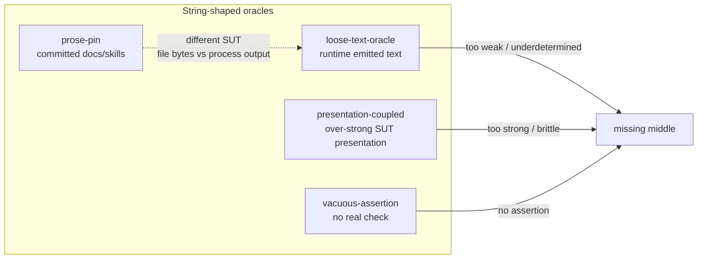

# Architecture Decision: Taxonomy Carve for Prose Pins vs Weak Runtime Text Oracles

## Requirements & Constraints

**Functional**
- Blind audit must flag stockroom committed-doc/skill pins (keyword checklists, order pins, feature-mention pins; packaging/front-matter as weaker sibling).
- Blind audit must flag common runtime shapes: `err.message` / `toThrow(/…/)` / `pytest.raises(..., match=)` / log-line / stdout-stderr substring asserts that underdetermine meaning.
- Explicit FP / legitimate carve-out for architectural fitness-function greps on agent-facing prose (stockroom hygiene).
- Readers must distinguish these from existing `presentation-coupled` and `vacuous-assertion`.

**Quality attributes (ranked)**
1. **Discriminability** — auditor can tell which smell fires and why (not a muddled mega-smell).
2. **Actionability** — prescribed fix matches the surface (docs-lint / delete / fitness-function vs typed error / structured log).
3. **Fit with SLOBAC style** — punchy slug, semantic judgment, polyglot, uniform entry shape.
4. **Maintainability of taxonomy web** — Related modes stay coherent; don’t force `presentation-coupled` to mean two opposite failure modes.
5. **Simplicity** — fewest smells that preserve (1)–(4); resist a third smell for “order pins” etc.

**Technical constraints**
- One document per smell; slug = filename; index generated from headers.
- Prior art: neither surface has a canonical catalog name; nearest cousins are change-detector + Sensitive Equality (docs) and partial/weak oracle + “error strings are not API” (runtime).
- Operator preference: `prose-pin` is a strong candidate for the committed-docs smell.

**Out of scope**
- Remediating stockroom tests.
- Apply-layer transforms.
- Inventing academic citation where none exists.

## Components

Axis that matters: **oracle strength on free text** × **artifact kind (committed file vs runtime emission)**.

## Options Evaluated

- **Option A — One smell (`prose-pin`) covering both surfaces**: Stretch “prose” to mean any natural-language text (docs *and* error/log/UI strings). Single entry, shared “string standing in for meaning” story.
- **Option B — Two smells (`prose-pin` + runtime companion)**: Separate by artifact: committed documentation/agent prose vs runtime-emitted text. Different fixes and FP guards.
- **Option C — Expand `presentation-coupled` only + add `prose-pin`**: Docs get a new smell; runtime weak substrings absorbed into `presentation-coupled` by rewriting it to cover both over-strong and underdetermined text.
- **Option D — Three smells**: `prose-pin`, weak runtime text, and a separate “fitness-function grep” smell for hygiene-style negatives.

## Analysis

| Criterion | A One smell | B Two smells | C Expand PC + prose-pin | D Three smells |
|---|---|---|---|---|
| Discriminability | Poor — conflates file-bytes vs SUT output | Strong | Medium — PC becomes bipolar (too strong *and* too weak) | Strong but noisy |
| Actionability | Mixed fix list confuses auditors | Clean per-surface fixes | Runtime fix hierarchy fights PC’s “parse the DOM” story | Splits FP into its own smell unnecessarily |
| SLOBAC style | `prose-pin` overloaded | Matches split of tautology-theatre family | Rewrites a shipped Medium smell’s core claim | Over-partition |
| Simplicity | Simplest count | +1 smell, clear | +1 smell but mutates PC meaning | +2 smells |
| Risk if wrong | Audits miscategorize constantly | Can merge later if redundant | Breaks existing PC fixtures/readers | Taxonomy bloat |

Key insights:
- Research briefs agree: committed-doc pins and runtime weak-text oracles are **cousins sharing “string as semantic stand-in,”** not the same smell. Fix hierarchies diverge (docs-lint / delete / fitness-function vs typed errors / structured logs / golden presentation contracts).
- `presentation-coupled` today is explicitly the **converse of vacuous-assertion**: oracle too *strong* on presentation. Folding “too weak substring” into it would invert that teaching and scramble the presentation-coupled fixture (long cosmetic `in` chains ≠ single underdetermined meaning pin).
- Stockroom hygiene is an **FP of prose-pin**, not a third smell — same pattern as ArchUnit negative rules / Building Evolutionary Architectures fitness functions (called out in the change-detector research brief).
- `prose-pin` is an excellent slug: short, searchable, matches “pinning”/change-detector intuition, does not pretend to be a classic Meszaros name.

### Naming shortlist for the runtime companion (Option B)

| Candidate | Pros | Cons |
|---|---|---|
| `loose-text-oracle` | “Loose” contrasts PC’s over-tight presentation; “oracle” matches Barr/partial-oracle vocabulary; covers errors/logs/stdout | Slightly academic “oracle” |
| `weak-text-oracle` | Matches “weak assertion” practitioner language | “Weak” overlaps vacuous/pseudo-tested casually |
| `underdetermined-text` | Precisely names the false-confidence failure | Long; jargon-heavy for Aliases-first discoverability |
| `message-pin` | Parallel to `prose-pin` | Undersells logs/stdout/UI; sounds exception-only |

**Winner for companion slug:** `loose-text-oracle`.

## Decision

### Choice Pre-Mortem

- **Auditors flag every `pytest.raises(..., match=)` including Go-Wiki-legitimate “parameter name appears in message” checks:** mitigated by FP guard (dynamic datum / supplementary check alongside type-or-code primary oracle) — **checked** in design.
- **`prose-pin` over-triggers on prose-as-SUT suites (a16n convert/emit):** mitigated by signal requiring assert on **repo’s own committed** docs/skills (or packaging manifests read as prose), not temp fixtures — **checked** (same distinction as our peer-repo survey).
- **`loose-text-oracle` steals presentation-coupled findings:** mitigated by Related-modes boundary — PC = over-strong cosmetic/exact presentation; LTO = underdetermined meaning on free text — **checked**; fixture plants must demonstrate both.

**Selected**: Option B — two smells: **`prose-pin`** and **`loose-text-oracle`**.

**Rationale**: Maximizes discriminability and actionability (ranked #1–#2) while staying simple enough (+1 smell, not +2). Preserves `presentation-coupled`’s existing teaching. Honors operator’s `prose-pin` preference with a companion name that names the *loose oracle* failure, not merely “error messages.”

**Tradeoff**: Taxonomy grows to 17 entries; auditors must learn a finer split between PC and LTO. Accepted — the split is the product value.

**Implementation notes:**
- Both: Severity **High**, Detection Scope **per-test**, Protect Maintainable + Independent of implementation (prose-pin also Necessary — docs pins often kill no behavioral mutants).
- `prose-pin` FP: fitness-function negative greps on agent-facing prose; schema/manifest validation of front-matter; docs-as-tests/doctest; Vale/markdownlint tiers.
- `loose-text-oracle` FP: text *is* the product (compiler UI / CLI UX golden files); i18n key checks; supplementary dynamic-datum match beside type/code; structured assert after parse.
- Update `presentation-coupled` Related modes + Description one-liner clarifying the too-strong vs too-weak split.
- Hedge `conditional-logic` fix examples: prefer type/code; `match=` only as supplementary.
- Fixtures: `tests/fixtures/audit/prose-pin/` and `tests/fixtures/audit/loose-text-oracle/` with positives + negative controls + `expected-findings.md`.

## Implementation Plan

1. Author `taxonomy/prose-pin.md` and `taxonomy/loose-text-oracle.md` to CONTRIBUTING shape.
2. Patch Related modes / boundary sentences on `presentation-coupled`, `vacuous-assertion`, `conditional-logic`.
3. `uv run python scripts/gen_taxonomy_index.py`.
4. Add audit fixtures + fixtures README rows.
5. `properdocs build --strict`; manual fixture-vs-expected consistency check.
