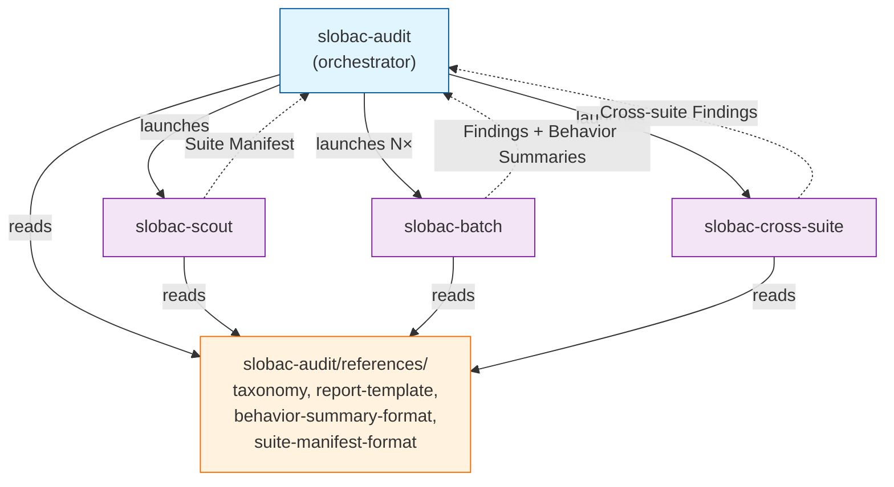
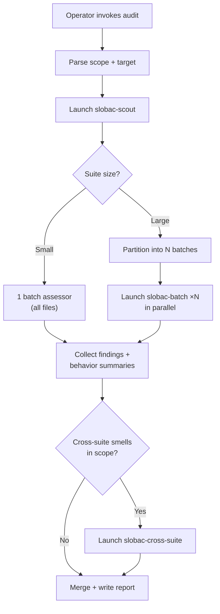

# Task: Audit Orchestration at Scale

* Task ID: audit-orchestration
* Complexity: Level 3
* Type: feature

Implement the Hybrid Scout + Batch + Cross-Suite audit orchestration architecture. Create three new sibling skills (`slobac-scout`, `slobac-batch`, `slobac-cross-suite`), evolve `slobac-audit` into an orchestrator, add `detection_scope` metadata to taxonomy entries, and prove all three detection scopes with a minimum smell set of 6 (2 per-test, 2 per-file, 2 cross-suite).

## Pinned Info

### Skill Topology & Reference Flow

How the four skills relate, what each produces, and which references flow where. All cross-skill references point into `slobac-audit/references/`.

### Orchestration Pipeline

The decision logic inside the orchestrator — when to shard and when to run single-agent.

### Detection Scope Routing

Which smells go to which agent type. The 6 in-scope smells for this build are **bold**.

| Scope | Smells | Agent |
|-------|--------|-------|
| per-test | **`deliverable-fossils`**, **`naming-lies`**, `vacuous-assertion`, `tautology-theatre`, `pseudo-tested`, `over-specified-mock`, `implementation-coupled`, `presentation-coupled`, `conditional-logic`, `mystery-guest`, `rotten-green` | Batch Assessor |
| per-file | **`shared-state`**, **`monolithic-test-file`** | Batch Assessor |
| cross-suite | **`semantic-redundancy`**, **`wrong-level`**, `deliverable-fossils` (Phase B) | Cross-Suite Assessor |

## Component Analysis

### Affected Components

- **`skills/slobac-audit/SKILL.md`**: single-agent linear workflow → orchestrator that dispatches scout, batch, cross-suite subagents based on suite size, with graceful single-agent fallback.
- **`skills/slobac-audit/references/docs/taxonomy/*.md`** (15 files): add `Detection Scope` column to every entry's header table.
- **`skills/slobac-audit/references/docs/taxonomy/README.md`**: add `Detection Scope` column to catalog table + update "How to read an entry" section.
- **`skills/slobac-audit/references/report-template.md`**: expand supported scope from 2 to 6 smells in instructional text.
- **`skills/slobac-audit/references/behavior-summary-format.md`** (new): the IR spec consumed by the cross-suite assessor.
- **`skills/slobac-audit/references/suite-manifest-format.md`** (new): the scout output spec consumed by the orchestrator.
- **`skills/slobac-audit/README.md`**: update to document orchestration, sibling skills, expanded scope.
- **`skills/slobac-scout/`** (new): scout skill — enumerate, measure, emit manifest.
- **`skills/slobac-batch/`** (new): batch assessor skill — deep-read files, assess per-test + per-file smells, emit findings + behavior summaries.
- **`skills/slobac-cross-suite/`** (new): cross-suite assessor skill — cluster behavior summaries, targeted reads, emit cross-suite findings.
- **`tests/fixtures/audit/`** (4 new scenarios): `shared-state/`, `monolithic-test-file/`, `semantic-redundancy/`, `wrong-level/`.
- **`tests/fixtures/audit/README.md`**: add new scenarios to the listing.

### Cross-Module Dependencies

- `slobac-audit` (orchestrator) → launches `slobac-scout`, `slobac-batch`, `slobac-cross-suite` as subagents
- `slobac-scout` → reads filesystem; reads `../slobac-audit/references/suite-manifest-format.md`
- `slobac-batch` → reads test files; reads `../slobac-audit/references/docs/taxonomy/<slug>.md` and `../slobac-audit/references/behavior-summary-format.md`
- `slobac-cross-suite` → reads targeted test files; reads `../slobac-audit/references/docs/taxonomy/<slug>.md`
- Sub-skills do NOT reference each other (unidirectional into `slobac-audit/references/`; ~90% rule — real exceptions raised for review)

### Boundary Changes

- **Public interface**: unchanged. Same natural-language invocation, same `slobac-audit.md` output.
- **Supported scope**: expands from `{deliverable-fossils, naming-lies}` to also include `{shared-state, monolithic-test-file, semantic-redundancy, wrong-level}`.
- **Taxonomy header table shape**: new `Detection Scope` column added to all 15 entries.
- **Internal contracts** (new): Suite Manifest format, Behavior Summary format — defined in reference docs.

### Invariants & Constraints

1. **Skill-root self-containment** (invariant #11): sub-skills reach into `slobac-audit/references/` via `../slobac-audit/references/...`. Assumes co-installation. Skills may have their own references if they need - but references and resources outside the slobac-audit skill must only be used by their containing skill.
2. **Slug → path is a direct mapping**: `taxonomy/<slug>.md`. No on-disk hierarchy change.
3. **Taxonomy entry shape uniformity**: `Detection Scope` column added to ALL 15 entries, not just the 6 in scope.
4. **Cross-link integrity**: `properdocs build --strict` must pass.
5. **Report shape stability**: all template field contracts preserved.
6. **Read-only**: audit never modifies test code.
7. **Graceful degradation**: small suites → single-agent path identical to current behavior.
8. **Cross-skill reference convention**: sub-skills reach into `slobac-audit/references/`, not into each other.

## Open Questions

- [x] Cross-suite clustering: LLM judgment over behavior sentences. No embedding API. (Operator pre-resolved)
- [x] Failure handling: Retry failed batches. Ignore garbage returns. (Operator pre-resolved)
- [x] Incremental audit: No. Full re-assess every time. Must conclude "no problems here" for healthy suites. (Operator pre-resolved)
- [x] Taxonomy restructuring: Metadata field in header table + README catalog column. No on-disk hierarchy. Slug → path stays a direct, context-free mapping — important for agents. (Operator pre-resolved; see `creative-audit-orchestration.md` §Open Sub-Questions)

## Test Plan (TDD)

### Behaviors to Verify

**Per-test scope (existing, proven by existing fixtures):**
1. `deliverable-fossils` detection on planted fossils → correct findings (existing `deliverable-fossils/` fixture)
2. `naming-lies` detection on planted naming-lies → correct findings (existing `naming-lies/` fixture)

**Per-file scope (new):**
3. `shared-state` detection: module-level mutables shared across tests → flagged with correct remediation
4. `shared-state` negative: per-test fixtures that look shared but use `beforeEach`-equivalent → not flagged
5. `monolithic-test-file` detection: file mixing 5+ behavior domains with section headers and mixed imports → flagged with split plan
6. `monolithic-test-file` negative: large but single-domain file (many edge cases of one parser) → not flagged

**Cross-suite scope (new):**
7. `semantic-redundancy` detection: same behavior tested across 2 files with different fixtures → flagged with canonical-location decision
8. `semantic-redundancy` negative: similar-looking tests that guard different knowledge (intentional duplication) → not flagged
9. `wrong-level` detection: test in `unit/` dir that spawns subprocess or uses integration-level deps → flagged
10. `wrong-level` negative: test in `unit/` dir that imports heavy-looking modules but uses them as mocks → not flagged

**Orchestration:**
11. Small suite → single-agent path (scout determines no sharding needed)
12. Scope honoring: requesting only per-test smells does not trigger cross-suite analysis
13. Report shape: output matches report-template.md for all 6 supported smells

**Integrity:**
14. `properdocs build --strict` passes after all taxonomy changes

### Test Infrastructure

- **Framework:** Manual invocation + comparison to `expected-findings.md`
- **Test location:** `tests/fixtures/audit/<scenario>/`
- **Conventions:** `.py` fixture files + `expected-findings.md` per scenario; each scenario has positive + negative examples
- **New fixture directories:** `shared-state/`, `monolithic-test-file/`, `semantic-redundancy/`, `wrong-level/`
- **Automated gate:** `properdocs build --strict` for cross-link integrity

### Integration Tests

- Orchestrator → scout → (single-agent | batch + cross-suite) → report: manual smoke test by invoking audit against fixture directories of varying sizes
- Scope routing: invoke with `shared-state` only, verify batch assessor handles per-file scope, cross-suite assessor not launched

## Implementation Plan

### Phase A: Foundation (taxonomy metadata + shared references)

#### 1. Add `Detection Scope` to taxonomy shape + all entries
- Files:
    - `skills/slobac-audit/references/docs/taxonomy/README.md` — add `Detection Scope` column to catalog table; update "How to read an entry" section to describe the new field
    - All 15 `skills/slobac-audit/references/docs/taxonomy/<slug>.md` — add `Detection Scope` column to header table
- Changes: Header table goes from `Slug | Severity | Protects` → `Slug | Severity | Detection Scope | Protects`. Values: `per-test`, `per-file`, or `cross-suite` per the classification in the creative doc.
- Verify: `properdocs build --strict`

#### 2. Create shared reference: behavior summary format
- Files: `skills/slobac-audit/references/behavior-summary-format.md` (new)
- Changes: Define the IR table shape (File | Line | Test ID | Behavior | Tier | Smells Found), field-level contracts, richness tiers (per creative doc §Auto-Tuned Summary Richness), and examples.

#### 3. Create shared reference: suite manifest format
- Files: `skills/slobac-audit/references/suite-manifest-format.md` (new)
- Changes: Define the scout output shape (per-file: path, line count, char count, test count; totals; metadata about tier conventions detected).

### Phase B: Fixtures (TDD — expected findings first, then fixture code)

#### 4. Create `shared-state` fixture
- Files:
    - `tests/fixtures/audit/shared-state/expected-findings.md` (new) — 2+ positive findings + 1 negative
    - `tests/fixtures/audit/shared-state/test_engine_state.py` (new) — module-level mutable shared across tests; one test with per-test fixture (negative example)
- Changes: Fixture plants module-level `Engine()` used by multiple tests without `beforeEach`/fixture reset. Negative example uses `@pytest.fixture` for isolation.

#### 5. Create `monolithic-test-file` fixture
- Files:
    - `tests/fixtures/audit/monolithic-test-file/expected-findings.md` (new) — 1 finding on the monolith + 0 on the cohesive file
    - `tests/fixtures/audit/monolithic-test-file/test_everything.py` (new) — 50+ stub tests across 5+ behavior domains with section-header comments and mixed imports
    - `tests/fixtures/audit/monolithic-test-file/test_parser_thorough.py` (new) — large but single-domain; many edge cases of one parser (negative example)
- Changes: The monolith file hits signals: >50 tests, multiple top-level classes with different subjects, comment section headers (`# === AUTH ===`, `# === SYNC ===`), imports from 5+ unrelated modules. The cohesive file is large but all about one thing.

#### 6. Create `semantic-redundancy` fixture
- Files:
    - `tests/fixtures/audit/semantic-redundancy/expected-findings.md` (new) — findings for cross-file duplicates + negative for intentional duplication
    - `tests/fixtures/audit/semantic-redundancy/test_auth_tokens.py` (new) — tests token validation behavior
    - `tests/fixtures/audit/semantic-redundancy/test_session_auth.py` (new) — different file, overlapping behavior (same observable tested differently)
    - `tests/fixtures/audit/semantic-redundancy/test_contract_keys.py` (new) — intentionally duplicates a constant check as a contract guard (negative example)
- Changes: Two files test the same token-validation behavior with different names/fixtures. Third file has an intentional duplicate that guards different knowledge (contract check).

#### 7. Create `wrong-level` fixture
- Files:
    - `tests/fixtures/audit/wrong-level/expected-findings.md` (new) — findings for mis-tiered tests + negative
    - `tests/fixtures/audit/wrong-level/unit/test_api_client.py` (new) — directory says "unit" but test spawns subprocess / uses real DB
    - `tests/fixtures/audit/wrong-level/unit/test_calculator.py` (new) — pure unit test, correctly placed (verifies we don't flag everything in unit/)
    - `tests/fixtures/audit/wrong-level/integration/test_pure_helpers.py` (new) — directory says "integration" but tests are pure-function unit tests (wrong-level: too low)
- Changes: Directory structure encodes tier convention (`unit/`, `integration/`). Tests that don't match their tier are wrong-level. Negative: pure calc test in `unit/` that imports a heavy-sounding module name but only uses constants.

#### 8. Update fixtures README
- Files: `tests/fixtures/audit/README.md`
- Changes: Add `shared-state/`, `monolithic-test-file/`, `semantic-redundancy/`, `wrong-level/` to the scenario listing. Note that `semantic-redundancy/` and `wrong-level/` exercise cross-suite detection scope. Note that `monolithic-test-file/` has a multi-file scenario (one monolith + one cohesive control).

### Phase C: Sub-Skills

#### 9. Create `slobac-scout` skill
- Files:
    - `skills/slobac-scout/SKILL.md` (new) — AgentSkills.io frontmatter + workflow
    - `skills/slobac-scout/README.md` (new) — minimal: purpose, relationship to slobac-audit, invocation
    - `skills/slobac-scout/references/exploration-commands.md` (new) — ready-made shell command templates for efficient test-suite exploration: `rg` patterns for test-file discovery and per-file test counting across ecosystems, `wc`/`stat` for size measurement, `find` for directory-structure detection (tier conventions). Organized by task (enumerate → count → measure → detect tiers) with per-language variants (Python, JS/TS, Go, Ruby, JVM). The scout loads this reference and adapts the commands to the target suite's ecosystem rather than reinventing the wheel each invocation.
- Changes: SKILL.md workflow: (1) receive target directory, (2) load `references/exploration-commands.md` for command templates, (3) detect ecosystem from file extensions, (4) enumerate test files using ecosystem-appropriate patterns, (5) per file: count test functions/methods, measure line count and char count, (6) detect tier conventions from directory structure, (7) compute totals, (8) emit Suite Manifest per `../slobac-audit/references/suite-manifest-format.md`.
- Cross-skill refs: reads `../slobac-audit/references/suite-manifest-format.md`

#### 10. Create `slobac-batch` skill
- Files:
    - `skills/slobac-batch/SKILL.md` (new) — AgentSkills.io frontmatter + workflow
    - `skills/slobac-batch/README.md` (new)
- Changes: SKILL.md workflow: (1) receive file list, in-scope smell slugs (per-test + per-file only), and summary richness level, (2) for each in-scope slug, read the canonical taxonomy entry at `../slobac-audit/references/docs/taxonomy/<slug>.md`, (3) read the behavior summary format at `../slobac-audit/references/behavior-summary-format.md`, (4) for each assigned file: read fully, evaluate per-test smells per test, evaluate per-file smells per file, (5) emit findings (per report template field contracts) + behavior summaries (per format spec).
- Cross-skill refs: reads `../slobac-audit/references/docs/taxonomy/<slug>.md`, `../slobac-audit/references/behavior-summary-format.md`

#### 11. Create `slobac-cross-suite` skill
- Files:
    - `skills/slobac-cross-suite/SKILL.md` (new) — AgentSkills.io frontmatter + workflow
    - `skills/slobac-cross-suite/README.md` (new)
- Changes: SKILL.md workflow: (1) receive all behavior summaries + in-scope cross-suite smell slugs, (2) for each in-scope slug, read the canonical taxonomy entry at `../slobac-audit/references/docs/taxonomy/<slug>.md`, (3) cluster behavior summaries by LLM judgment over behavior sentences, (4) for each candidate group: perform targeted source reads of just those tests, (5) confirm or reject findings, (6) for confirmed findings: emit with full report-template field contracts (location, smell, rationale, remediation, false-positive guard).
- Cross-skill refs: reads `../slobac-audit/references/docs/taxonomy/<slug>.md`

### Phase D: Orchestrator Evolution

#### 12. Rewrite `slobac-audit/SKILL.md` as orchestrator
- Files: `skills/slobac-audit/SKILL.md`
- Changes: Replace the 6-step single-agent workflow with the orchestration pipeline:
    - Step 1: determine target suite root (unchanged)
    - Step 2: parse scope — expand supported set to 6 smells, classify each by `detection_scope` from taxonomy headers, partition into per-test/per-file vs cross-suite sets
    - Step 3: launch `slobac-scout` subagent with target directory → receive Suite Manifest
    - Step 4: partition files into batches per heuristic (greedy bin-packing by char count, directory-cohesive), compute summary richness level. Small suite → 1 batch. Large suite → N batches.
    - Step 5: launch `slobac-batch` subagent(s) — always, even for small suites. 1 batch assessor with all files for small suites; N in parallel for large. This eliminates the dual code path between inline single-agent audit and batch assessors. The batch assessor IS the universal audit engine for per-test/per-file smells — the "single-agent path" is simply the degenerate case of 1 batch.
    - Step 6: collect batch results — merge findings, merge behavior summaries
    - Step 7: if cross-suite smells in scope → launch `slobac-cross-suite` subagent with all behavior summaries + cross-suite smell slugs
    - Step 8: merge all findings (batch + cross-suite), deduplicate, write report per `references/report-template.md`
    - Step 9: close (unchanged intent, updated scope list)
    - Constraints and guards section: update Phase-1 references, add failure handling (retry failed batches, ignore garbage), add context-budget handshake logic
- Creative ref: `memory-bank/active/creative/creative-audit-orchestration.md` — Option D, §Implementation Notes
- Preflight innovation: eliminated dual code paths per preflight finding #8

#### 13. Update report template + audit README
- Files:
    - `skills/slobac-audit/references/report-template.md` — update "Out-of-scope requests" instructional text from "anything other than `deliverable-fossils` or `naming-lies`" to reflect the 6-smell supported set
    - `skills/slobac-audit/README.md` — document: orchestration architecture, sibling skills, expanded scope (6 smells, 3 detection scopes), cross-skill reference convention, updated smoke-test instructions, operator guidance on context window size

### Phase E: Verification

#### 14. Final verification
- Run `properdocs build --strict` — confirms all taxonomy cross-links intact after header table changes
- Manual review: read each new SKILL.md end-to-end for internal consistency
- Manual review: verify each fixture's expected-findings.md is structurally valid per report template
- Describe smoke-test plan in README for manual validation

## Technology Validation

No new technology — validation not required. All deliverables are markdown prose (SKILL.md files, reference docs, fixture files). The only build tool is properdocs (existing).

## Challenges & Mitigations

- **Monolithic fixture size**: The `monolithic-test-file` smell requires a file with 50+ tests. Fixture tests are never executed, so stub bodies (`pass` / minimal assertions) are acceptable. The structural signals (multiple domains, section headers, mixed imports) are what matter.
- **Cross-suite fixture design**: `semantic-redundancy` and `wrong-level` need multi-file fixtures with directory structure. This is new — existing fixtures are single-file. Mitigation: follow the same `expected-findings.md` + fixture-files pattern; the fixture README documents the multi-file convention.
- **Subagent dispatch portability**: Cursor uses `Task` tool; Claude Code uses `dispatch_agent`. The orchestrator SKILL.md must describe dispatch abstractly ("launch a readonly subagent with this skill"). The host agent translates to its harness's primitive. Mitigation: use harness-neutral language in the orchestrator steps; note the Cursor and Claude Code primitives as examples.
- **Context budget estimation**: The partitioning heuristic uses character counts as a proxy for tokens. The chars-to-context ratio is configurable but imprecise. Mitigation: conservative defaults (60% content budget), document the tradeoff, over-sharding is safe (just wasteful).
- **New smell detection quality**: The 4 new smells haven't been through audit testing. Mitigation: well-crafted fixtures with positive + negative examples; canonical taxonomy entries are mature and well-written.

## Status

- [x] Component analysis complete
- [x] Open questions resolved (all 4 pre-resolved by operator)
- [x] Test planning complete (TDD)
- [x] Implementation plan complete
- [x] Technology validation complete
- [x] Preflight
- [x] Build
- [ ] QA
