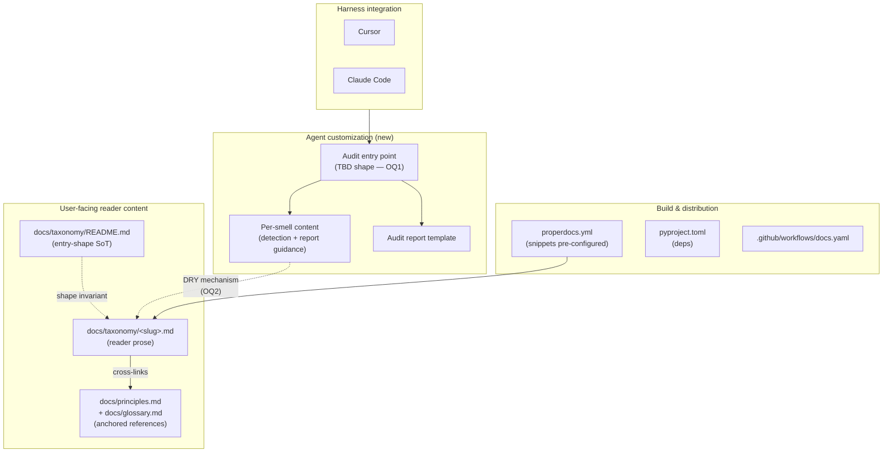

# Task: Phase 1 Audit MVP (deliverable-fossils + naming-lies)

* Task ID: phase-1-audit-mvp
* Complexity: Level 3
* Type: feature

Ship Phase 1 of [`planning/VISION.md`](../../planning/VISION.md): an audit MVP for the `deliverable-fossils` and `naming-lies` smells, packaged as harness-portable agent customizations runnable in both Cursor and Claude Code. Two smells are in scope together so any shared structure we pick is stress-tested against two genuinely different fix shapes (two-phase rename→regroup vs three-way rename/strengthen/investigate).

## Pinned Info

### Component Dependency Graph

Pinned because the docs↔customization coupling mechanism (Open Question #2) is exactly the edge this graph is asking about. Every implementation step needs to know which side is canonical.

## Component Analysis

### Affected Components

- **`docs/taxonomy/deliverable-fossils.md`** — existing reader-facing entry. May be restructured or snippet-extracted depending on OQ2; must continue to render identically in docs after any change.
- **`docs/taxonomy/naming-lies.md`** — same as above.
- **`docs/taxonomy/README.md`** — source of truth for taxonomy-entry shape. If OQ2 resolves to "extend the shape so Skills can consume it directly," this is the file that codifies the new shape.
- **`docs/taxonomy/` (rest)** — not directly changed by Phase 1, but the shape invariant is suite-wide; whatever we do for two entries we must be able to replicate for all 15 when Phase 2 lands.
- **`docs/principles.md`, `docs/glossary.md`** — referenced, not changed.
- **`properdocs.yml`** — `pymdownx.snippets` already enabled with `base_path: [.]`. May need base_path adjustment or plugin tweaks depending on OQ2.
- **`.github/workflows/docs.yaml`** — no changes expected unless OQ2 resolves to a layout the CI build needs to know about.
- **`pyproject.toml`** / `uv.lock` — no runtime Python added by Phase 1; may add docs-side extensions if needed.
- **`README.md`** (repo root) — needs a Phase 1 install/use section for operators.
- **NEW: Customization artefacts** — the agent-customization files (shape TBD in OQ1). Target location likely under a new top-level directory (e.g. `skills/`, `audit/`, or similar — naming deferred until shape is known).
- **NEW: Fixture test suites** — small planted test suites used to validate the audit detects the two smells. Location likely `tests/fixtures/audit/{deliverable-fossils,naming-lies}/`.
- **NEW: Audit-runtime documentation** — operator-facing README or similar describing how to invoke the audit in each harness. May live with the customization artefacts.

### Cross-Module Dependencies

- Customization → smell content (via the DRY mechanism resolved in OQ2).
- Customization → audit report template (owned by the customization).
- Docs build → smell content (must continue to render the reader prose for github.com and the ProperDocs site).
- Harness (Cursor, Claude Code) → customization entry point (via whatever primitive shape is chosen in OQ1).
- Fixture test suites have no dependency on production code; they *are* the production surface for validating the audit.

### Boundary Changes

- **New user-facing entry point:** how an operator invokes the audit in their harness. Shape depends on OQ1.
- **New user-facing artifact:** the audit report. Format: markdown by default for Phase 1 (see "Defaults decided at plan time" below).
- **New installation contract:** how the customization lands in a user's Cursor / Claude Code. Shape depends on OQ1.
- **Taxonomy entry shape** may or may not change, depending on OQ2. If it changes, it changes for all 15 entries (not just the two in scope).

### Invariants & Constraints

The correct solution must preserve:

1. **Taxonomy-entry uniformity** (`systemPatterns.md` primary invariant). All 15 taxonomy files must remain interchangeable in shape after any Phase-1 change, not just the two in scope.
2. **Cross-link integrity** (`properdocs build --strict` + `validation.anchors: warn`). No broken internal links after any restructuring.
3. **Manifesto-independence** (`systemPatterns.md` layering invariant). The audit may cite the manifesto; it must not fork, rewrite, or imply a different manifesto. If the audit needs information the manifesto doesn't contain, that's a signal to extend the manifesto, not bypass it.
4. **Principles-taxonomy bidirectional coupling**. Every smell in the audit's scope must still cite a named principle, and every principle referenced must still have a taxonomy entry using it.
5. **Audit read-only**. No test-code mutation in Phase 1.
6. **Audit portability**. A report produced by the audit in Cursor must be executable by a different agent or a human without rereading the manifesto, and vice versa.
7. **Harness interoperability** (preference, not strict). Prefer customization primitives that are not harness-specific. Explicitly avoid Cursor-only surfaces (e.g. `.mdc` frontmatter, `alwaysApply`) and Claude-Code-only surfaces (e.g. `hooks.json`).
8. **Phase-2 extensibility**. Whatever shape is picked must extend to the remaining 13 smells without a second architectural pass. Two smells in scope are the stress test for this constraint.
9. **Knowledge-DRY (not syntactic-DRY)** — from the manifesto's own governor rules, applied reflexively to SLOBAC's authorship.
10. **Commit-before-refactor**, per the manifesto's governor rules. Every per-file restructuring of the docs tree must be a standalone commit if applied, so it can be reverted cleanly.

## Defaults Decided at Plan Time (not creative-phase)

These VISION §5 open questions were judged resolvable without creative-phase exploration; rationale recorded here so the creative phase isn't re-litigating them:

- **§5 #1 Audit output format:** **Markdown only** for Phase 1. A structured (JSON) sibling is a Phase-3 concern, because its consumer is the apply layer which doesn't exist yet. Shipping markdown-only keeps the scope honest and defers the schema question. The markdown format's structure should nonetheless be regular enough that a future JSON sibling is a mechanical extraction, not a rewrite.
- **§5 #3 Subset-selection UX:** **Natural-language invocation + explicit per-smell artifacts.** The operator says "audit my suite for deliverable fossils" (or similar) and the customization is responsible for scoping. Per-smell artifacts under the ur-shape (if that's what OQ1 resolves to) make scoping mechanical for the customization even when the language is natural. Specific invocation syntax is a UI concern, not an architecture concern.
- **§5 #8 Audit-report artifact name:** **`slobac-audit.md`** as a working name; bikeshed-stable enough to ship. Operator can override per invocation.
- **Testing approach:** **fixture test suites with planted smells + operator-confirmed detection** for Phase 1. A proper eval harness (deterministic golden-file or structured-pattern validation) is Phase 2 concern, not MVP blocker. The fixtures themselves are real code artifacts and belong in `tests/fixtures/audit/`.

## Open Questions

Two questions are genuinely ambiguous, have real architectural implications, and need creative-phase exploration with an airtight bar.

- [x] **OQ1 — Customization primitive shape and granularity.** → **Resolved (high confidence):** Ur-Skill with per-smell entries under `references/smells/<slug>.md`, packaged as an AgentSkills.io-shaped `SKILL.md` + `references/` tree. Uniquely satisfies the portability + Phase-2-extensibility + knowledge-DRY quality attributes under the user's stated constraints. See [`creative/creative-customization-shape.md`](./creative/creative-customization-shape.md).
- [ ] **OQ2 — Docs↔customization DRY mechanism.** How do the customization's knowledge of a smell and the user-facing `docs/taxonomy/<slug>.md` share a single source of truth, and which side is canonical?
  - *Why ambiguous:* Three candidate shapes at a minimum. **(a)** Docs are canonical; customization snippet-includes from docs. **(b)** Customization is canonical (e.g. `references/<slug>.md` inside the ur-shape); docs snippet-include from the customization via `pymdownx.snippets` (already configured). **(c)** A neutral third source that both sides consume. The right answer depends on whether the taxonomy entry as currently shaped is **sufficient** input for the customization or whether the customization needs a **superset** (detection heuristics beyond the "Signals" section, report-template prose, decision-tree guidance the manifesto deliberately does not contain). If superset is needed, (a) requires extending the taxonomy-entry shape (systemPatterns invariant #1); (b) makes the customization the SoT and the docs a partial view; (c) adds a layer.
  - *Constraints the decision must satisfy:* Taxonomy-entry uniformity invariant preserved. Cross-link integrity preserved (`properdocs build --strict`). Manifesto-independence invariant preserved. Resolution must be compatible with OQ1's shape decision (so OQ1 resolves first).

### Question sequencing

OQ1 first; OQ2 second. OQ2's candidate shapes reference specific locations within the customization shape (e.g. "`references/<slug>.md`"), which only exist once OQ1 is decided.

## Test Plan (TDD)

*Deferred until OQ1 and OQ2 resolve; test infrastructure choice depends on where customization files live and what shape they have. Fixture test suites under `tests/fixtures/audit/` are the anchor — specific behaviors to verify and the framework for running them will be populated after creative phases complete.*

## Implementation Plan

*Deferred until OQ1 and OQ2 resolve.*

## Technology Validation

*Deferred until OQ1 and OQ2 resolve. Minimum likely: verify `pymdownx.snippets` can include from the chosen customization location and produces byte-identical docs rendering.*

## Challenges & Mitigations

*Deferred until OQ1 and OQ2 resolve. Pre-identified challenges:*

- **Harness-primitive drift:** if Cursor or Claude Code changes their Skill/Sub-Agent API shape, the customization breaks. Mitigation direction: pick a primitive that is already stable across both; document the coupling in `techContext.md`.
- **Cross-link integrity during any docs restructuring:** any OQ2 resolution that moves content must pass `properdocs build --strict`. Mitigation: CI gate already in place; validate locally before commit.
- **Prompt-engineering false positives:** the audit may flag things that are not actually fossils/naming-lies. Mitigation: fixture suites with planted *and* negative-example tests; operator review of initial runs.

## Status

- [x] Component analysis complete
- [ ] Open questions resolved (OQ1, OQ2 — creative phases pending)
- [ ] Test planning complete (TDD)
- [ ] Implementation plan complete
- [ ] Technology validation complete
- [ ] Preflight
- [ ] Build
- [ ] QA
