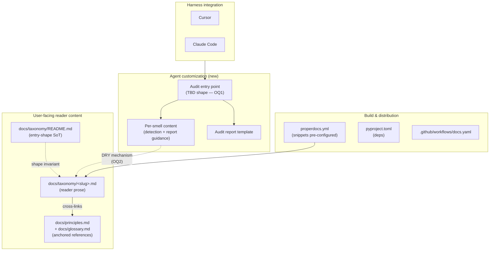

# Task: Phase 1 Audit MVP (deliverable-fossils + naming-lies)

* Task ID: phase-1-audit-mvp
* Complexity: Level 3
* Type: feature

Ship Phase 1 of [`planning/VISION.md`](../../planning/VISION.md): an audit MVP for the `deliverable-fossils` and `naming-lies` smells, packaged as harness-portable agent customizations runnable in both Cursor and Claude Code. Two smells are in scope together so any shared structure we pick is stress-tested against two genuinely different fix shapes (two-phase rename→regroup vs three-way rename/strengthen/investigate).

## Rework Context (post-reflect re-entry)

A post-reflect review by the operator surfaced a material defect in the previously-shipped implementation: the skill references `docs/taxonomy/<slug>.md` via relative paths that cross the skill's root directory (`skills/slobac-audit/references/smells/*.md` → `../../../../docs/taxonomy/<slug>.md`, and the SKILL.md workflow step "read `docs/taxonomy/<slug>.md`"). This is a **skill-portability violation**: AgentSkills.io skills are self-contained units whose runtime root is the skill's own install location (`~/.claude/skills/slobac-audit/`, user-level Cursor install, or wherever the skill is dropped). A skill cannot reach outside that root and assume anything is there.

**Root cause:** the OQ2 creative analysis conflated **filesystem co-location** (the files live in the same tree in this repo) with **runtime co-location** (the path is reachable relative to the skill's install root at invocation time). The former is true; the latter is false on every real install.

**What this invalidates:**

- The OQ2 creative decision (`creative/creative-docs-skill-dry.md`). Option D relied on runtime co-location of the `docs/` tree; that premise does not survive install. Option D is structurally dead under the corrected constraint.
- The SKILL.md workflow's per-smell "read both files" step (reads only one of the two files are reachable at runtime).
- The "no manifesto copy in skill tree" structural invariant claim, which depended on Option D.
- The reflection's insight #2 ("OQ2 held up cleanly") — wrong under a false premise. To be corrected in the post-rework Reflect phase.

**What this preserves:**

- OQ1 (ur-Skill + `references/smells/<slug>.md` shape). This decision is orthogonal to the runtime-root issue and survives unchanged.
- The fixtures and expected-findings files (they live under `tests/fixtures/audit/`, not inside the skill; their reader-facing cross-links to `docs/taxonomy/` are fine).
- The report template (lives inside the skill, references nothing outside).
- The invocation-UX, the scope-parsing workflow, the five-field per-finding invariant, the read-only guard — all unchanged.

The rework scope is therefore narrow: resolve the redux open question (OQ2-redux), rewrite the SKILL.md workflow step that reads external files, re-author the per-smell augmentation files under the new shape, and update the README / techContext / systemPatterns accordingly. The fixtures and expected-findings are preserved as-is.

## Pinned Info

### Component Dependency Graph

Pinned because the docs↔customization coupling mechanism (Open Question #2) is exactly the edge this graph is asking about. Every implementation step needs to know which side is canonical.

## Component Analysis

### Affected Components

- **`docs/taxonomy/deliverable-fossils.md`** — existing reader-facing entry. May be restructured or snippet-extracted depending on OQ2; must continue to render identically in docs after any change.
- **`docs/taxonomy/naming-lies.md`** — same as above.
- **`docs/taxonomy/README.md`** — source of truth for taxonomy-entry shape. If OQ2 resolves to "extend the shape so Skills can consume it directly," this is the file that codifies the new shape.
- **`docs/taxonomy/` (rest)** — not directly changed by Phase 1, but the shape invariant is suite-wide; whatever we do for two entries we must be able to replicate for all 15 when Phase 2 lands.
- **`docs/principles.md`, `docs/glossary.md`** — referenced, not changed.
- **`properdocs.yml`** — `pymdownx.snippets` already enabled with `base_path: [.]`. May need base_path adjustment or plugin tweaks depending on OQ2.
- **`.github/workflows/docs.yaml`** — no changes expected unless OQ2 resolves to a layout the CI build needs to know about.
- **`pyproject.toml`** / `uv.lock` — no runtime Python added by Phase 1; may add docs-side extensions if needed.
- **`README.md`** (repo root) — needs a Phase 1 install/use section for operators.
- **NEW: Customization artefacts** — the agent-customization files (shape TBD in OQ1). Target location likely under a new top-level directory (e.g. `skills/`, `audit/`, or similar — naming deferred until shape is known).
- **NEW: Fixture test suites** — small planted test suites used to validate the audit detects the two smells. Location likely `tests/fixtures/audit/{deliverable-fossils,naming-lies}/`.
- **NEW: Audit-runtime documentation** — operator-facing README or similar describing how to invoke the audit in each harness. May live with the customization artefacts.

### Cross-Module Dependencies

- Customization → smell content (via the DRY mechanism resolved in OQ2).
- Customization → audit report template (owned by the customization).
- Docs build → smell content (must continue to render the reader prose for github.com and the ProperDocs site).
- Harness (Cursor, Claude Code) → customization entry point (via whatever primitive shape is chosen in OQ1).
- Fixture test suites have no dependency on production code; they *are* the production surface for validating the audit.

### Boundary Changes

- **New user-facing entry point:** how an operator invokes the audit in their harness. Shape depends on OQ1.
- **New user-facing artifact:** the audit report. Format: markdown by default for Phase 1 (see "Defaults decided at plan time" below).
- **New installation contract:** how the customization lands in a user's Cursor / Claude Code. Shape depends on OQ1.
- **Taxonomy entry shape** may or may not change, depending on OQ2. If it changes, it changes for all 15 entries (not just the two in scope).

### Invariants & Constraints

The correct solution must preserve:

1. **Taxonomy-entry uniformity** (`systemPatterns.md` primary invariant). All 15 taxonomy files must remain interchangeable in shape after any Phase-1 change, not just the two in scope.
2. **Cross-link integrity** (`properdocs build --strict` + `validation.anchors: warn`). No broken internal links after any restructuring.
3. **Manifesto-independence** (`systemPatterns.md` layering invariant). The audit may cite the manifesto; it must not fork, rewrite, or imply a different manifesto. If the audit needs information the manifesto doesn't contain, that's a signal to extend the manifesto, not bypass it.
4. **Principles-taxonomy bidirectional coupling**. Every smell in the audit's scope must still cite a named principle, and every principle referenced must still have a taxonomy entry using it.
5. **Audit read-only**. No test-code mutation in Phase 1.
6. **Audit portability**. A report produced by the audit in Cursor must be executable by a different agent or a human without rereading the manifesto, and vice versa.
7. **Harness interoperability** (preference, not strict). Prefer customization primitives that are not harness-specific. Explicitly avoid Cursor-only surfaces (e.g. `.mdc` frontmatter, `alwaysApply`) and Claude-Code-only surfaces (e.g. `hooks.json`).
8. **Phase-2 extensibility**. Whatever shape is picked must extend to the remaining 13 smells without a second architectural pass. Two smells in scope are the stress test for this constraint.
9. **Knowledge-DRY (not syntactic-DRY)** — from the manifesto's own governor rules, applied reflexively to SLOBAC's authorship.
10. **Commit-before-refactor**, per the manifesto's governor rules. Every per-file restructuring of the docs tree must be a standalone commit if applied, so it can be reverted cleanly.
11. **Skill-root self-containment** (new, added in rework). An AgentSkills.io-shaped skill's runtime root is its own install directory. Every file the skill reads at agent-runtime must be reachable via a path anchored inside that root — no references that escape the skill tree (`../`, absolute paths outside the root, or assumptions about the harness cwd). This invariant is the corrected form of the assumption that broke OQ2; it is codified here so future phases do not miss it.

## Defaults Decided at Plan Time (not creative-phase)

These VISION §5 open questions were judged resolvable without creative-phase exploration; rationale recorded here so the creative phase isn't re-litigating them:

- **§5 #1 Audit output format:** **Markdown only** for Phase 1. A structured (JSON) sibling is a Phase-3 concern, because its consumer is the apply layer which doesn't exist yet. Shipping markdown-only keeps the scope honest and defers the schema question. The markdown format's structure should nonetheless be regular enough that a future JSON sibling is a mechanical extraction, not a rewrite.
- **§5 #3 Subset-selection UX:** **Natural-language invocation + explicit per-smell artifacts.** The operator says "audit my suite for deliverable fossils" (or similar) and the customization is responsible for scoping. Per-smell artifacts under the ur-shape (if that's what OQ1 resolves to) make scoping mechanical for the customization even when the language is natural. Specific invocation syntax is a UI concern, not an architecture concern.
- **§5 #8 Audit-report artifact name:** **`slobac-audit.md`** as a working name; bikeshed-stable enough to ship. Operator can override per invocation.
- **Testing approach:** **fixture test suites with planted smells + operator-confirmed detection** for Phase 1. A proper eval harness (deterministic golden-file or structured-pattern validation) is Phase 2 concern, not MVP blocker. The fixtures themselves are real code artifacts and belong in `tests/fixtures/audit/`.

## Open Questions

Two questions are genuinely ambiguous, have real architectural implications, and need creative-phase exploration with an airtight bar.

- [x] **OQ1 — Customization primitive shape and granularity.** → **Resolved (high confidence):** Ur-Skill with per-smell entries under `references/smells/<slug>.md`, packaged as an AgentSkills.io-shaped `SKILL.md` + `references/` tree. Uniquely satisfies the portability + Phase-2-extensibility + knowledge-DRY quality attributes under the user's stated constraints. See [`creative/creative-customization-shape.md`](./creative/creative-customization-shape.md). **Unaffected by the rework** — orthogonal to the runtime-root issue.
- [ ] ~~**OQ2 — Docs↔customization DRY mechanism.**~~ → ~~Resolved (high confidence): Docs canonical; SKILL.md reads both files per smell.~~ **Invalidated** by the skill-root self-containment invariant (see Rework Context above). Superseded by OQ2-redux. The superseded creative document [`creative/creative-docs-skill-dry.md`](./creative/creative-docs-skill-dry.md) is preserved for traceability; its Option-D decision is marked invalid on re-entry.
- [ ] **OQ2-redux — Docs↔skill DRY mechanism under skill-root self-containment.** The skill tree must be self-contained at runtime: `references/smells/<slug>.md` can no longer delegate canonical content to `docs/taxonomy/<slug>.md`. The question is how the skill carries (or synthesises) the canonical content it needs for detection, while preserving the ranked quality attributes from the original OQ2 (zero-drift, manifesto-independence, knowledge-DRY). Candidates to evaluate include (non-exhaustive): **E** — generator + drift-check CI gate (docs canonical, skill content generated and committed, CI verifies no drift); **H** — hand-authored operational playbook with explicit role-split (docs = reader-facing manifesto, skill-refs = agent-facing operational notes, overlap by design, drift handled by periodic review); **K** — vendored copy with manual sync discipline (docs canonical, skill carries a committed copy, no automation, operator responsible for re-copying on docs changes); **J** — runtime fetch from GitHub Pages or raw URL (eliminates local copy but introduces network dependency and harness-specific fetch capabilities). Requires creative-phase exploration with airtight bar, especially given that the previous "high confidence" OQ2 decision missed a constraint. → **Creative phase pending.**

## Test Plan (TDD)

The audit's "code" is prompt/instruction content (SKILL.md workflow prose + per-smell augmentation), which doesn't fit the classical unit-test shape. The testable artifacts are **fixture test suites** with planted smells plus per-fixture **expected-findings documents**. The TDD discipline for Phase 1 is: author fixtures + expected-findings **before** authoring the skill content, then validate the skill against them.

### Behaviors to Verify

- **B1 — Fossils detected correctly.** Fixture `tests/fixtures/audit/deliverable-fossils/` contains Python tests with planted fossils (derived from the example in `docs/taxonomy/deliverable-fossils.md`). Invocation scoped to `deliverable-fossils` → audit report flags each planted fossil with a rename recommendation that encodes the test's actual behavior (not the fossil label).
- **B2 — Naming-lies detected correctly.** Fixture `tests/fixtures/audit/naming-lies/` contains Python tests with planted naming-lies (derived from the example in `docs/taxonomy/naming-lies.md`). Invocation scoped to `naming-lies` → report flags each planted lie with one of {rename, strengthen, investigate} and rationale that cites the claimed vs verified behavior.
- **B3 — Scoping honored.** Fixture `tests/fixtures/audit/both-smells/` contains tests exhibiting both smells (some tests may exhibit both). Invocation scoped to one smell emits findings only for that smell; invocation with no explicit scope (or scope = "all") emits findings for both.
- **B4 — Clean suite → no false findings.** Fixture `tests/fixtures/audit/clean/` contains tests with behavior-encoded names and body-matching claims. Invocation (any scope) emits a report declaring no findings.
- **B5 — Negative-example guards.** Each smell fixture includes a negative-example test (e.g. a test named `test_refactor_preserves_behavior` whose body actually tests refactoring behavior, not a fossil reference). Audit does not flag these.
- **B6 — Report structure invariant.** Every finding in a report has: test location (file + identifier), smell slug, rationale citing the docs entry, and prescribed remediation. Machine-consistent enough that a future JSON extraction is mechanical.
- **B7 — Runs in both target harnesses.** Skill is discoverable and invocable in both Cursor and Claude Code. Output across harnesses is qualitatively equivalent (same findings, not necessarily byte-identical phrasing).

### Edge Cases

- Cross-smell overlap: a test that is both a fossil *and* a naming-lie. Audit should flag it under each applicable smell without duplicating the finding's core rationale, consistent with the taxonomy's "Related modes" cross-links.
- Empty suite: a directory with no tests. Report emits "no findings" cleanly.
- Scope mismatch: an invocation requests a smell slug the skill doesn't support (e.g. `tautology-theatre` in Phase 1). Skill responds with a clear "not-in-scope" message rather than silently skipping.

### Test Infrastructure

- **Framework**: none exists yet; fixture suites are themselves valid Python test files (pytest-compatible shape, though they are NOT executed as part of SLOBAC's CI — they are *input* to the audit, not tests of SLOBAC).
- **Location**: `tests/fixtures/audit/<scenario>/` — one directory per scenario. Scenarios: `deliverable-fossils/`, `naming-lies/`, `both-smells/`, `clean/`.
- **Conventions**: each scenario dir contains (a) one or more `.py` test files embodying the scenario and (b) an `expected-findings.md` documenting what the audit should emit. The `expected-findings.md` format mirrors the report template (see implementation step 7).
- **Runner**: manual for Phase 1 — operator invokes the skill in the target harness against a fixture path and compares output to `expected-findings.md`. A scripted eval harness (golden-file comparison or structured-pattern validation) is Phase 2+ scaffolding, explicitly deferred.
- **Polyglot note**: Python-only fixtures are sufficient for Phase 1 MVP. The per-smell augmentation can note the ecosystems the detector is **expected** to handle (per polyglot notes in the taxonomy entries), but fixture validation is Python-only.

### Integration Tests

- B3 (scoping) is effectively a cross-smell integration test.
- B7 (both harnesses) is a cross-harness integration test.
- Both are operator-executed manual validations in Phase 1.

## Implementation Plan

TDD order: fixtures + expected-findings first; then skill content; then tech-validation in each harness.

**Rework annotation:** Steps 1–6 are unaffected (shipped and still valid). Step 7 (SKILL.md workflow) needs rewriting to eliminate the cross-root read. Steps 8–9 (per-smell augmentation files) need re-authoring under whatever shape OQ2-redux picks. Step 11 (READMEs) needs the "skill reads docs at runtime" language removed. Step 13 (techContext) needs the "canonical-docs-referenced-from-skill" pattern replaced. New steps may be added after OQ2-redux resolves (e.g. a generator script + CI gate under Option E, or a sync-discipline section under Option K). Steps are revisited in detail after creative-phase closure.

1. **Establish fixture infrastructure.**
    - Files: `tests/fixtures/audit/README.md`
    - Changes: new; describes the fixture convention (one scenario per subdir, `expected-findings.md` per scenario, Python-only for Phase 1, scenarios are *input* to the audit not tests *of* SLOBAC).
    - Creative ref: n/a.

2. **Author deliverable-fossils fixture.**
    - Files: `tests/fixtures/audit/deliverable-fossils/test_plugin_registry.py`, `tests/fixtures/audit/deliverable-fossils/expected-findings.md`
    - Changes: Python file with the fossil tests from `docs/taxonomy/deliverable-fossils.md` "Before" example, plus one additional planted fossil and one negative-example test (a test named with `refactor` but whose body actually tests refactoring). `expected-findings.md` documents the expected rename recommendations citing actual behavior.
    - Creative ref: OQ1 shape — fixtures validate the skill's per-smell output against the manifesto's prescribed fix.

3. **Author naming-lies fixture.**
    - Files: `tests/fixtures/audit/naming-lies/test_session_lifecycle.py`, `tests/fixtures/audit/naming-lies/expected-findings.md`
    - Changes: Python file with the naming-lies test from `docs/taxonomy/naming-lies.md` "Before" example, plus one additional planted lie and one negative-example test (title matches body). `expected-findings.md` documents the expected per-finding path (rename / strengthen / investigate) with rationale.

4. **Author combined-scope fixture.**
    - Files: `tests/fixtures/audit/both-smells/test_mixed.py`, `tests/fixtures/audit/both-smells/expected-findings.md`
    - Changes: Python file where some tests are fossils, some are naming-lies, and at least one is both. `expected-findings.md` documents per-scope expectations (fossils-only, naming-lies-only, both).

5. **Author clean fixture.**
    - Files: `tests/fixtures/audit/clean/test_example.py`, `tests/fixtures/audit/clean/expected-findings.md`
    - Changes: Python file with behavior-encoded names, body-matching claims, no fossils or lies. `expected-findings.md` states "no findings expected for either smell at any scope."

6. **Author report template.**
    - Files: `skills/slobac-audit/references/report-template.md`
    - Changes: markdown skeleton for the `slobac-audit.md` report. Per-finding shape: test location, smell slug, rationale (cites `docs/taxonomy/<slug>.md`), prescribed remediation, and a one-sentence "why this isn't a false positive" guard. Top-of-report: scope invoked, audit date, target suite root. Default emission path: `./slobac-audit.md` in the operator's current working directory; SKILL.md workflow allows the operator to override per invocation. Structure regular enough that a future JSON extraction is mechanical.
    - Creative ref: OQ1 — lives under the ur-skill's `references/` tree, not a separate customization.

7. **Author SKILL.md (ur-workflow).**
    - Files: `skills/slobac-audit/SKILL.md`
    - Changes: primitive-agnostic prose describing: (a) scope parsing — map natural-language operator intent to a list of in-scope smell slugs, with explicit behavior for out-of-scope slugs (Phase 1 supports only `deliverable-fossils` and `naming-lies`); (b) per-in-scope-smell workflow — read `docs/taxonomy/<slug>.md` for canonical definition **and** read `references/smells/<slug>.md` for augmentation (always-present convention, see preflight amendment); (c) detection prose — iterate target test files and identify candidate findings using the manifesto's Signals section; (d) report emission — use `references/report-template.md`, default path `./slobac-audit.md` in operator's working directory, override path accepted per invocation.
    - Creative ref: OQ1 (ur-skill shape) + OQ2 (read-both-files pattern for per-smell content).

8. **Author deliverable-fossils augmentation.**
    - Files: `skills/slobac-audit/references/smells/deliverable-fossils.md`
    - Changes: audit-specific augmentation only — always present, never a duplicate of manifesto content. Expected contents: invocation-phrase hints ("fossils," "stale names," "checklist-shaped tests"); emission hints (rename recommendations must encode the behavior, not the fossil label); false-positive guards (e.g., tests named with `refactor` that actually test refactoring behavior). If no smell-specific augmentation is needed, the file contains an explicit "no audit-specific augmentation required" marker rather than being absent — convention enforced for Phase-2 authoring consistency (see preflight amendment).
    - Creative ref: OQ2 — explicitly does *not* duplicate manifesto content.

9. **Author naming-lies augmentation.**
    - Files: `skills/slobac-audit/references/smells/naming-lies.md`
    - Changes: same shape as step 8 (always present). Emission hints must distinguish which of the three fix paths applies and why; false-positive guards for "title matches body though the words differ" (semantic synonymy).

10. **Tech validation: harness discovery.**
    - Unneeded - an AgentSkills.io-compliant Skill is assumed to be discoverable by relevant harnesses.

11. **Author operator-facing README (Phase 1 install + invocation).**
    - Files: `skills/slobac-audit/README.md` (new), update `README.md` (repo root) to link to it.
    - Changes: install instructions per harness (paths from step 10), invocation examples (scoping phrases), fixture-driven smoke test the operator can run to verify the install.

12. **Run each fixture through the skill in each harness; validate against expected-findings.**
    - Files: *none authored;* this is the manual validation gate.
    - Changes: operator confirms B1–B7; any divergence is a bug to fix in step 7/8/9. Not a gate to ship — just a gate to declare Phase-1 behaviorally correct.

13. **Update `memory-bank/techContext.md`.**
    - Files: `memory-bank/techContext.md`
    - Changes: add the `skills/slobac-audit/` directory as a now-existing component, note the canonical-docs-referenced-from-skill pattern, note the cross-harness discovery-path mapping.

14. **Mid-build pivot: taxonomy-entry extension if required.**
    - Files: `docs/taxonomy/<slug>.md` (either or both)
    - Changes: *conditional.* If step 12 reveals the manifesto's Signals or Prescribed Fix sections are insufficient for the audit (per the OQ2 decision's "taxonomy entry extension" failure mode), extend the docs entry. Per governor rules (commit-before-refactor), land this as its own PR/commit *before* resuming audit work that depends on the extension.
    - Creative ref: OQ2 — the audit cannot carry detection content the manifesto doesn't bless.

## Technology Validation

No new runtime dependencies. The validation target is **harness discovery**: both Cursor and Claude Code must find and invoke a `SKILL.md`-format skill at whatever path we settle on.

- **POC:** step 10 above. Put a minimal SKILL.md at a candidate location, invoke in each harness, confirm discovery.
- **Expected outcome:** either (a) a shared path both harnesses can read (ideal), or (b) a canonical path plus thin per-harness symlinks/pointers (acceptable), or (c) per-harness path wrappers with a shared content root (acceptable). If none of these work, preflight FAIL.
- **No new packages:** `uv.lock` unchanged. `properdocs.yml` unchanged (the creative decision does not use build-time snippet includes for the Skill tree).

## Challenges & Mitigations

- **Harness discovery-path divergence.** If Cursor and Claude Code want skills in materially different locations, the canonical `skills/slobac-audit/` directory may need symlinks or wrappers. *Mitigation:* tech-validation step 10 up front; documented install path per harness in step 11; canonical source stays harness-agnostic.
- **Prompt-engineering false positives/negatives.** The skill may misclassify. *Mitigation:* negative-example tests in every fixture (B5); augmentation files (steps 8, 9) explicitly carry false-positive guards.
- **Cross-harness output variation.** Same skill, different harness agents, may emit subtly different report phrasing. *Mitigation:* report template (step 6) prescribes structure; Phase 1 portability is qualitative equivalence (same findings, same remediations), not byte-identical output.
- **Taxonomy entry found insufficient mid-build.** Per OQ2, detection content the manifesto doesn't bless cannot live in the skill. *Mitigation:* step 14 is an explicit mid-build pivot branch; PR-able manifesto extensions are a normal outcome, not a blocker.
- **Skill prompt-context bloat at scale.** Phase 1 is two smells and manageable. At Phase 2's 15 smells, the ur-SKILL.md + referenced files may overflow context budgets in the target harness. *Mitigation:* the OQ1 decision already reserves the additive Option-4 migration (Sub-Agents) if/when this emerges as a real limit.
- **Preservation of regression-detection power (governor rule).** Phase 1 is read-only audit; nothing the audit *does* touches the regression-detection power of the target suite. *Mitigation:* Phase 1 is structurally out-of-scope for this governor rule; only the apply capability (Phase 3) carries that gate.

## Status

### Pre-rework (original pass through the L3 workflow)

- [x] Component analysis complete
- [x] Open questions resolved (OQ1, OQ2)
- [x] Test planning complete (TDD)
- [x] Implementation plan complete
- [x] Technology validation complete
- [x] Preflight — PASS with two implementation amendments applied (report default path; always-present augmentation file) + one advisory (report versioning)
- [x] Build — PASS, 12 of 14 planned steps executed (step 10 marked unneeded at plan time; step 14 conditional pivot not triggered)
- [x] QA — PASS with one trivial fix applied (removed preflight-advisory "Skill version" field that was scope-crept into the report template)
- [x] Reflect — COMPLETE, with the caveat that insight #2 ("OQ2 held up cleanly") is retroactively invalidated

### Post-rework (re-entry from plan)

- [x] Component analysis re-assessed (narrow delta: OQ2-redux, steps 7–9, 11, 13; fixtures + report template preserved; invariant #11 added)
- [ ] OQ2-redux resolved (creative phase pending)
- [ ] Test plan re-verified (expected no change; expected-findings docs survive; rework is internal to the skill tree)
- [ ] Implementation plan restated with OQ2-redux resolution applied (pending creative)
- [ ] Preflight (post-rework)
- [ ] Build (post-rework)
- [ ] QA (post-rework)
- [ ] Reflect (post-rework; must also correct the invalidated reflection insight)

## Preflight Amendments Applied (pre-rework)

- **Report emission path specified.** Steps 6 and 7 now pin the default output location to `./slobac-audit.md` in the operator's working directory, with override allowed per invocation. (Addresses completeness gap.)
- **Always-present augmentation file.** The OQ2 creative decision's allowance for `references/smells/<slug>.md` to be absent is tightened at the implementation level: every smell has an augmentation file, even if its contents are an explicit "no audit-specific augmentation required" marker. Simplifies SKILL.md workflow (no if-present branch) and enforces convention consistency at Phase-2 scale.

## Preflight Advisory (Not Applied, pre-rework)

- **Audit-report versioning.** Consider stamping each emitted `slobac-audit.md` with the manifesto git ref / audit-skill version that produced it. Supports VISION §1.2's portability goal (a reviewer three months later can trace which smell definitions a finding was based on) and costs ~1 line of template. Not applied because the user explicitly did not flag VISION §5 #2 (persistence/versioning) as a Phase-1 concern; surfacing here for operator consideration before build.
