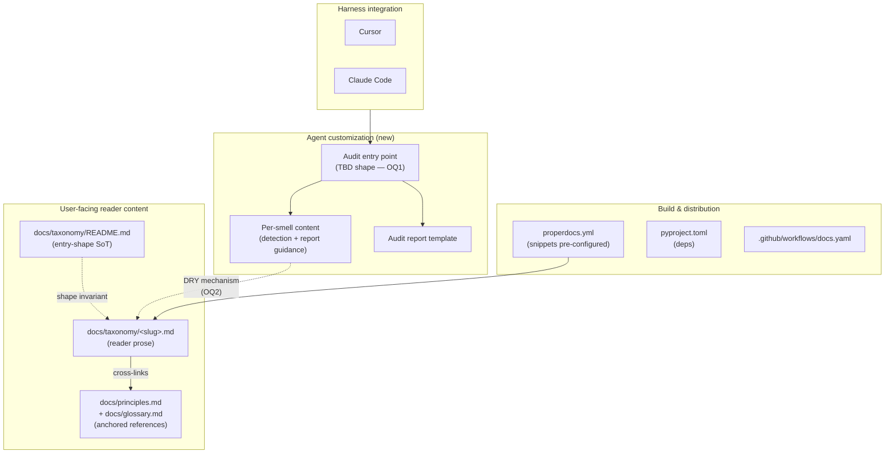

# Task: Phase 1 Audit MVP (deliverable-fossils + naming-lies)

* Task ID: phase-1-audit-mvp
* Complexity: Level 3
* Type: feature

Ship Phase 1 of [`planning/VISION.md`](../../planning/VISION.md): an audit MVP for the `deliverable-fossils` and `naming-lies` smells, packaged as harness-portable agent customizations runnable in both Cursor and Claude Code. Two smells are in scope together so any shared structure we pick is stress-tested against two genuinely different fix shapes (two-phase rename→regroup vs three-way rename/strengthen/investigate).

## Rework Context (post-reflect re-entry)

A post-reflect review by the operator surfaced a material defect in the previously-shipped implementation: the skill references `docs/taxonomy/<slug>.md` via relative paths that cross the skill's root directory (`skills/slobac-audit/references/smells/*.md` → `../../../../docs/taxonomy/<slug>.md`, and the SKILL.md workflow step "read `docs/taxonomy/<slug>.md`"). This is a **skill-portability violation**: AgentSkills.io skills are self-contained units whose runtime root is the skill's own install location (`~/.claude/skills/slobac-audit/`, user-level Cursor install, or wherever the skill is dropped). A skill cannot reach outside that root and assume anything is there.

**Root cause:** the OQ2 creative analysis conflated **filesystem co-location** (the files live in the same tree in this repo) with **runtime co-location** (the path is reachable relative to the skill's install root at invocation time). The former is true; the latter is false on every real install.

**What this invalidates:**

- The OQ2 creative decision (`creative/creative-docs-skill-dry.md`). Option D relied on runtime co-location of the `docs/` tree; that premise does not survive install. Option D is structurally dead under the corrected constraint.
- The SKILL.md workflow's per-smell "read both files" step (reads only one of the two files are reachable at runtime).
- The "no manifesto copy in skill tree" structural invariant claim, which depended on Option D.
- The reflection's insight #2 ("OQ2 held up cleanly") — wrong under a false premise. To be corrected in the post-rework Reflect phase.

**What this preserves:**

- OQ1 (ur-Skill + `references/smells/<slug>.md` shape). This decision is orthogonal to the runtime-root issue and survives unchanged.
- The fixtures and expected-findings files (they live under `tests/fixtures/audit/`, not inside the skill; their reader-facing cross-links to `docs/taxonomy/` are fine).
- The report template (lives inside the skill, references nothing outside).
- The invocation-UX, the scope-parsing workflow, the five-field per-finding invariant, the read-only guard — all unchanged.

The rework scope is therefore narrow: resolve the redux open question (OQ2-redux), rewrite the SKILL.md workflow step that reads external files, re-author the per-smell augmentation files under the new shape, and update the README / techContext / systemPatterns accordingly. The fixtures and expected-findings are preserved as-is.

## Pinned Info

### Component Dependency Graph

Pinned because the docs↔customization coupling mechanism (Open Question #2) is exactly the edge this graph is asking about. Every implementation step needs to know which side is canonical.

## Component Analysis

### Affected Components

- **`docs/taxonomy/deliverable-fossils.md`** — existing reader-facing entry. May be restructured or snippet-extracted depending on OQ2; must continue to render identically in docs after any change.
- **`docs/taxonomy/naming-lies.md`** — same as above.
- **`docs/taxonomy/README.md`** — source of truth for taxonomy-entry shape. If OQ2 resolves to "extend the shape so Skills can consume it directly," this is the file that codifies the new shape.
- **`docs/taxonomy/` (rest)** — not directly changed by Phase 1, but the shape invariant is suite-wide; whatever we do for two entries we must be able to replicate for all 15 when Phase 2 lands.
- **`docs/principles.md`, `docs/glossary.md`** — referenced, not changed.
- **`properdocs.yml`** — `pymdownx.snippets` already enabled with `base_path: [.]`. May need base_path adjustment or plugin tweaks depending on OQ2.
- **`.github/workflows/docs.yaml`** — no changes expected unless OQ2 resolves to a layout the CI build needs to know about.
- **`pyproject.toml`** / `uv.lock` — no runtime Python added by Phase 1; may add docs-side extensions if needed.
- **`README.md`** (repo root) — needs a Phase 1 install/use section for operators.
- **NEW: Customization artefacts** — the agent-customization files (shape TBD in OQ1). Target location likely under a new top-level directory (e.g. `skills/`, `audit/`, or similar — naming deferred until shape is known).
- **NEW: Fixture test suites** — small planted test suites used to validate the audit detects the two smells. Location likely `tests/fixtures/audit/{deliverable-fossils,naming-lies}/`.
- **NEW: Audit-runtime documentation** — operator-facing README or similar describing how to invoke the audit in each harness. May live with the customization artefacts.

### Cross-Module Dependencies

- Customization → smell content (via the DRY mechanism resolved in OQ2).
- Customization → audit report template (owned by the customization).
- Docs build → smell content (must continue to render the reader prose for github.com and the ProperDocs site).
- Harness (Cursor, Claude Code) → customization entry point (via whatever primitive shape is chosen in OQ1).
- Fixture test suites have no dependency on production code; they *are* the production surface for validating the audit.

### Boundary Changes

- **New user-facing entry point:** how an operator invokes the audit in their harness. Shape depends on OQ1.
- **New user-facing artifact:** the audit report. Format: markdown by default for Phase 1 (see "Defaults decided at plan time" below).
- **New installation contract:** how the customization lands in a user's Cursor / Claude Code. Shape depends on OQ1.
- **Taxonomy entry shape** may or may not change, depending on OQ2. If it changes, it changes for all 15 entries (not just the two in scope).

### Invariants & Constraints

The correct solution must preserve:

1. **Taxonomy-entry uniformity** (`systemPatterns.md` primary invariant). All 15 taxonomy files must remain interchangeable in shape after any Phase-1 change, not just the two in scope.
2. **Cross-link integrity** (`properdocs build --strict` + `validation.anchors: warn`). No broken internal links after any restructuring.
3. **Manifesto-independence** (`systemPatterns.md` layering invariant). The audit may cite the manifesto; it must not fork, rewrite, or imply a different manifesto. If the audit needs information the manifesto doesn't contain, that's a signal to extend the manifesto, not bypass it.
4. **Principles-taxonomy bidirectional coupling**. Every smell in the audit's scope must still cite a named principle, and every principle referenced must still have a taxonomy entry using it.
5. **Audit read-only**. No test-code mutation in Phase 1.
6. **Audit portability**. A report produced by the audit in Cursor must be executable by a different agent or a human without rereading the manifesto, and vice versa.
7. **Harness interoperability** (preference, not strict). Prefer customization primitives that are not harness-specific. Explicitly avoid Cursor-only surfaces (e.g. `.mdc` frontmatter, `alwaysApply`) and Claude-Code-only surfaces (e.g. `hooks.json`).
8. **Phase-2 extensibility**. Whatever shape is picked must extend to the remaining 13 smells without a second architectural pass. Two smells in scope are the stress test for this constraint.
9. **Knowledge-DRY (not syntactic-DRY)** — from the manifesto's own governor rules, applied reflexively to SLOBAC's authorship.
10. **Commit-before-refactor**, per the manifesto's governor rules. Every per-file restructuring of the docs tree must be a standalone commit if applied, so it can be reverted cleanly.
11. **Skill-root self-containment** (new, added in rework). An AgentSkills.io-shaped skill's runtime root is its own install directory. Every file the skill reads at agent-runtime must be reachable via a path anchored inside that root — no references that escape the skill tree (`../`, absolute paths outside the root, or assumptions about the harness cwd). This invariant is the corrected form of the assumption that broke OQ2; it is codified here so future phases do not miss it.

## Defaults Decided at Plan Time (not creative-phase)

These VISION §5 open questions were judged resolvable without creative-phase exploration; rationale recorded here so the creative phase isn't re-litigating them:

- **§5 #1 Audit output format:** **Markdown only** for Phase 1. A structured (JSON) sibling is a Phase-3 concern, because its consumer is the apply layer which doesn't exist yet. Shipping markdown-only keeps the scope honest and defers the schema question. The markdown format's structure should nonetheless be regular enough that a future JSON sibling is a mechanical extraction, not a rewrite.
- **§5 #3 Subset-selection UX:** **Natural-language invocation + explicit per-smell artifacts.** The operator says "audit my suite for deliverable fossils" (or similar) and the customization is responsible for scoping. Per-smell artifacts under the ur-shape (if that's what OQ1 resolves to) make scoping mechanical for the customization even when the language is natural. Specific invocation syntax is a UI concern, not an architecture concern.
- **§5 #8 Audit-report artifact name:** **`slobac-audit.md`** as a working name; bikeshed-stable enough to ship. Operator can override per invocation.
- **Testing approach:** **fixture test suites with planted smells + operator-confirmed detection** for Phase 1. A proper eval harness (deterministic golden-file or structured-pattern validation) is Phase 2 concern, not MVP blocker. The fixtures themselves are real code artifacts and belong in `tests/fixtures/audit/`.

## Open Questions

Two questions are genuinely ambiguous, have real architectural implications, and need creative-phase exploration with an airtight bar.

- [x] **OQ1 — Customization primitive shape and granularity.** → **Resolved (high confidence):** Ur-Skill with per-smell entries under `references/smells/<slug>.md`, packaged as an AgentSkills.io-shaped `SKILL.md` + `references/` tree. Uniquely satisfies the portability + Phase-2-extensibility + knowledge-DRY quality attributes under the user's stated constraints. See [`creative/creative-customization-shape.md`](./creative/creative-customization-shape.md). **Unaffected by the rework** — orthogonal to the runtime-root issue.
- [ ] ~~**OQ2 — Docs↔customization DRY mechanism.**~~ → ~~Resolved (high confidence): Docs canonical; SKILL.md reads both files per smell.~~ **Invalidated** by the skill-root self-containment invariant (see Rework Context above). Superseded by OQ2-redux. The superseded creative document [`creative/creative-docs-skill-dry.md`](./creative/creative-docs-skill-dry.md) is preserved for traceability; its Option-D decision is marked invalid on re-entry.
- [x] **OQ2-redux — Docs↔skill DRY mechanism under skill-root self-containment.** → **Resolved (high confidence, with calibration note):** Option E — generator + drift-check CI gate, with a two-directory file layout. `docs/taxonomy/<slug>.md` stays canonical; a new Python script (`scripts/sync-taxonomy.py`) regenerates `skills/slobac-audit/references/taxonomy/<slug>.md` as a verbatim copy with a "do not hand-edit" header; a new CI job runs the script in `--check` mode and fails on drift. The hand-authored `skills/slobac-audit/references/smells/<slug>.md` file is unchanged in role — it carries only audit-specific augmentation. SKILL.md's per-smell workflow reads both files inside the skill root; no cross-root reads. Eliminated: Option H (violates zero-drift and manifesto-independence by design), Option K (silent drift with no enforcement), Option M (strictly weaker than E), Option J (introduces runtime network dependency and harness-portability risk). The **calibration note** in the creative doc acknowledges that the prior OQ2 was also marked "high confidence" and still missed a constraint; this decision's confidence is conditional on the five analysis axes enumerated there being complete. See [`creative/creative-docs-skill-dry-redux.md`](./creative/creative-docs-skill-dry-redux.md).

--- SUPERSEDED PROBLEM STATEMENT (preserved for traceability) ---

- [ ] **OQ2-redux — Docs↔skill DRY mechanism under skill-root self-containment.** The skill tree must be self-contained at runtime: `references/smells/<slug>.md` can no longer delegate canonical content to `docs/taxonomy/<slug>.md`. The question is how the skill carries (or synthesises) the canonical content it needs for detection, while preserving the ranked quality attributes from the original OQ2 (zero-drift, manifesto-independence, knowledge-DRY). Candidates to evaluate include (non-exhaustive): **E** — generator + drift-check CI gate (docs canonical, skill content generated and committed, CI verifies no drift); **H** — hand-authored operational playbook with explicit role-split (docs = reader-facing manifesto, skill-refs = agent-facing operational notes, overlap by design, drift handled by periodic review); **K** — vendored copy with manual sync discipline (docs canonical, skill carries a committed copy, no automation, operator responsible for re-copying on docs changes); **J** — runtime fetch from GitHub Pages or raw URL (eliminates local copy but introduces network dependency and harness-specific fetch capabilities). Requires creative-phase exploration with airtight bar, especially given that the previous "high confidence" OQ2 decision missed a constraint. → **Creative phase pending.**

## Test Plan (TDD)

The audit's "code" is prompt/instruction content (SKILL.md workflow prose + per-smell augmentation), which doesn't fit the classical unit-test shape. The testable artifacts are **fixture test suites** with planted smells plus per-fixture **expected-findings documents**. The TDD discipline for Phase 1 is: author fixtures + expected-findings **before** authoring the skill content, then validate the skill against them.

### Behaviors to Verify

- **B1 — Fossils detected correctly.** Fixture `tests/fixtures/audit/deliverable-fossils/` contains Python tests with planted fossils (derived from the example in `docs/taxonomy/deliverable-fossils.md`). Invocation scoped to `deliverable-fossils` → audit report flags each planted fossil with a rename recommendation that encodes the test's actual behavior (not the fossil label).
- **B2 — Naming-lies detected correctly.** Fixture `tests/fixtures/audit/naming-lies/` contains Python tests with planted naming-lies (derived from the example in `docs/taxonomy/naming-lies.md`). Invocation scoped to `naming-lies` → report flags each planted lie with one of {rename, strengthen, investigate} and rationale that cites the claimed vs verified behavior.
- **B3 — Scoping honored.** Fixture `tests/fixtures/audit/both-smells/` contains tests exhibiting both smells (some tests may exhibit both). Invocation scoped to one smell emits findings only for that smell; invocation with no explicit scope (or scope = "all") emits findings for both.
- **B4 — Clean suite → no false findings.** Fixture `tests/fixtures/audit/clean/` contains tests with behavior-encoded names and body-matching claims. Invocation (any scope) emits a report declaring no findings.
- **B5 — Negative-example guards.** Each smell fixture includes a negative-example test (e.g. a test named `test_refactor_preserves_behavior` whose body actually tests refactoring behavior, not a fossil reference). Audit does not flag these.
- **B6 — Report structure invariant.** Every finding in a report has: test location (file + identifier), smell slug, rationale citing the docs entry, and prescribed remediation. Machine-consistent enough that a future JSON extraction is mechanical.
- **B7 — Runs in both target harnesses.** Skill is discoverable and invocable in both Cursor and Claude Code. Output across harnesses is qualitatively equivalent (same findings, not necessarily byte-identical phrasing).

### Edge Cases

- Cross-smell overlap: a test that is both a fossil *and* a naming-lie. Audit should flag it under each applicable smell without duplicating the finding's core rationale, consistent with the taxonomy's "Related modes" cross-links.
- Empty suite: a directory with no tests. Report emits "no findings" cleanly.
- Scope mismatch: an invocation requests a smell slug the skill doesn't support (e.g. `tautology-theatre` in Phase 1). Skill responds with a clear "not-in-scope" message rather than silently skipping.

### Test Infrastructure

- **Framework**: none exists yet; fixture suites are themselves valid Python test files (pytest-compatible shape, though they are NOT executed as part of SLOBAC's CI — they are *input* to the audit, not tests of SLOBAC).
- **Location**: `tests/fixtures/audit/<scenario>/` — one directory per scenario. Scenarios: `deliverable-fossils/`, `naming-lies/`, `both-smells/`, `clean/`.
- **Conventions**: each scenario dir contains (a) one or more `.py` test files embodying the scenario and (b) an `expected-findings.md` documenting what the audit should emit. The `expected-findings.md` format mirrors the report template (see implementation step 7).
- **Runner**: manual for Phase 1 — operator invokes the skill in the target harness against a fixture path and compares output to `expected-findings.md`. A scripted eval harness (golden-file comparison or structured-pattern validation) is Phase 2+ scaffolding, explicitly deferred.
- **Polyglot note**: Python-only fixtures are sufficient for Phase 1 MVP. The per-smell augmentation can note the ecosystems the detector is **expected** to handle (per polyglot notes in the taxonomy entries), but fixture validation is Python-only.

### Integration Tests

- B3 (scoping) is effectively a cross-smell integration test.
- B7 (both harnesses) is a cross-harness integration test.
- Both are operator-executed manual validations in Phase 1.

### Rework-Specific Behaviors (added in rework)

- **B8 — Generator output matches committed skill files.** `uv run python scripts/sync-taxonomy.py --check` exits zero on a clean working tree (no drift between `docs/taxonomy/*.md` and committed `skills/slobac-audit/references/taxonomy/*.md`) and non-zero when a manifesto entry is changed without regenerating. This is the CI drift gate.
- **B9 — Skill tree contains no cross-root references.** No file under `skills/slobac-audit/` references a path outside the skill's root (no `../` escaping the root, no bare `docs/` path references in agent-runtime reads). This is an invariant-#11 spot check, verified manually during build; optional future automation is out of scope for Phase 1.

## Implementation Plan

TDD order: fixtures + expected-findings first; then skill content; then tech-validation in each harness.

**Rework annotation:** Steps 1–6 are unaffected (shipped and still valid). Step 7 (SKILL.md workflow) needs rewriting to eliminate the cross-root read. Steps 8–9 (per-smell augmentation files) need re-authoring under whatever shape OQ2-redux picks. Step 11 (READMEs) needs the "skill reads docs at runtime" language removed. Step 13 (techContext) needs the "canonical-docs-referenced-from-skill" pattern replaced. New steps may be added after OQ2-redux resolves (e.g. a generator script + CI gate under Option E, or a sync-discipline section under Option K). Steps are revisited in detail after creative-phase closure.

1. **Establish fixture infrastructure.**
    - Files: `tests/fixtures/audit/README.md`
    - Changes: new; describes the fixture convention (one scenario per subdir, `expected-findings.md` per scenario, Python-only for Phase 1, scenarios are *input* to the audit not tests *of* SLOBAC).
    - Creative ref: n/a.

2. **Author deliverable-fossils fixture.**
    - Files: `tests/fixtures/audit/deliverable-fossils/test_plugin_registry.py`, `tests/fixtures/audit/deliverable-fossils/expected-findings.md`
    - Changes: Python file with the fossil tests from `docs/taxonomy/deliverable-fossils.md` "Before" example, plus one additional planted fossil and one negative-example test (a test named with `refactor` but whose body actually tests refactoring). `expected-findings.md` documents the expected rename recommendations citing actual behavior.
    - Creative ref: OQ1 shape — fixtures validate the skill's per-smell output against the manifesto's prescribed fix.

3. **Author naming-lies fixture.**
    - Files: `tests/fixtures/audit/naming-lies/test_session_lifecycle.py`, `tests/fixtures/audit/naming-lies/expected-findings.md`
    - Changes: Python file with the naming-lies test from `docs/taxonomy/naming-lies.md` "Before" example, plus one additional planted lie and one negative-example test (title matches body). `expected-findings.md` documents the expected per-finding path (rename / strengthen / investigate) with rationale.

4. **Author combined-scope fixture.**
    - Files: `tests/fixtures/audit/both-smells/test_mixed.py`, `tests/fixtures/audit/both-smells/expected-findings.md`
    - Changes: Python file where some tests are fossils, some are naming-lies, and at least one is both. `expected-findings.md` documents per-scope expectations (fossils-only, naming-lies-only, both).

5. **Author clean fixture.**
    - Files: `tests/fixtures/audit/clean/test_example.py`, `tests/fixtures/audit/clean/expected-findings.md`
    - Changes: Python file with behavior-encoded names, body-matching claims, no fossils or lies. `expected-findings.md` states "no findings expected for either smell at any scope."

6. **Author report template.**
    - Files: `skills/slobac-audit/references/report-template.md`
    - Changes: markdown skeleton for the `slobac-audit.md` report. Per-finding shape: test location, smell slug, rationale (cites `docs/taxonomy/<slug>.md`), prescribed remediation, and a one-sentence "why this isn't a false positive" guard. Top-of-report: scope invoked, audit date, target suite root. Default emission path: `./slobac-audit.md` in the operator's current working directory; SKILL.md workflow allows the operator to override per invocation. Structure regular enough that a future JSON extraction is mechanical.
    - Creative ref: OQ1 — lives under the ur-skill's `references/` tree, not a separate customization.

7. **Author SKILL.md (ur-workflow).**
    - Files: `skills/slobac-audit/SKILL.md`
    - Changes: primitive-agnostic prose describing: (a) scope parsing — map natural-language operator intent to a list of in-scope smell slugs, with explicit behavior for out-of-scope slugs (Phase 1 supports only `deliverable-fossils` and `naming-lies`); (b) per-in-scope-smell workflow — read `docs/taxonomy/<slug>.md` for canonical definition **and** read `references/smells/<slug>.md` for augmentation (always-present convention, see preflight amendment); (c) detection prose — iterate target test files and identify candidate findings using the manifesto's Signals section; (d) report emission — use `references/report-template.md`, default path `./slobac-audit.md` in operator's working directory, override path accepted per invocation.
    - Creative ref: OQ1 (ur-skill shape) + OQ2 (read-both-files pattern for per-smell content).

8. **Author deliverable-fossils augmentation.**
    - Files: `skills/slobac-audit/references/smells/deliverable-fossils.md`
    - Changes: audit-specific augmentation only — always present, never a duplicate of manifesto content. Expected contents: invocation-phrase hints ("fossils," "stale names," "checklist-shaped tests"); emission hints (rename recommendations must encode the behavior, not the fossil label); false-positive guards (e.g., tests named with `refactor` that actually test refactoring behavior). If no smell-specific augmentation is needed, the file contains an explicit "no audit-specific augmentation required" marker rather than being absent — convention enforced for Phase-2 authoring consistency (see preflight amendment).
    - Creative ref: OQ2 — explicitly does *not* duplicate manifesto content.

9. **Author naming-lies augmentation.**
    - Files: `skills/slobac-audit/references/smells/naming-lies.md`
    - Changes: same shape as step 8 (always present). Emission hints must distinguish which of the three fix paths applies and why; false-positive guards for "title matches body though the words differ" (semantic synonymy).

10. **Tech validation: harness discovery.**
    - Unneeded - an AgentSkills.io-compliant Skill is assumed to be discoverable by relevant harnesses.

11. **Author operator-facing README (Phase 1 install + invocation).**
    - Files: `skills/slobac-audit/README.md` (new), update `README.md` (repo root) to link to it.
    - Changes: install instructions per harness (paths from step 10), invocation examples (scoping phrases), fixture-driven smoke test the operator can run to verify the install.

12. **Run each fixture through the skill in each harness; validate against expected-findings.**
    - Files: *none authored;* this is the manual validation gate.
    - Changes: operator confirms B1–B7; any divergence is a bug to fix in step 7/8/9. Not a gate to ship — just a gate to declare Phase-1 behaviorally correct.

13. **Update `memory-bank/techContext.md`.**
    - Files: `memory-bank/techContext.md`
    - Changes: add the `skills/slobac-audit/` directory as a now-existing component, note the canonical-docs-referenced-from-skill pattern, note the cross-harness discovery-path mapping.

14. **Mid-build pivot: taxonomy-entry extension if required.**
    - Files: `docs/taxonomy/<slug>.md` (either or both)
    - Changes: *conditional.* If step 12 reveals the manifesto's Signals or Prescribed Fix sections are insufficient for the audit (per the OQ2 decision's "taxonomy entry extension" failure mode), extend the docs entry. Per governor rules (commit-before-refactor), land this as its own PR/commit *before* resuming audit work that depends on the extension.
    - Creative ref: OQ2 — the audit cannot carry detection content the manifesto doesn't bless.

## Rework Implementation Plan (applied after OQ2-redux closure)

TDD order: author the generator and emit its output first (which produces the canonical content the skill will read at runtime); then rewrite SKILL.md and the augmentation files against that shape; then update docs; then re-run the fixture validation. Steps R1–R11 are additive to (and in one case explicitly deletes/rewrites content from) the pre-rework implementation plan above.

**R1. Author `scripts/sync-taxonomy.py`.**
- Files: `scripts/sync-taxonomy.py` (new), `scripts/__init__.py` if needed, `pyproject.toml` (likely unchanged — Python stdlib only).
- Changes: Python script that walks `docs/taxonomy/*.md` (excluding `README.md`), and for each writes `skills/slobac-audit/references/taxonomy/<slug>.md` with a fixed "generated from `docs/taxonomy/<slug>.md`; do not hand-edit; regenerate with `uv run python scripts/sync-taxonomy.py`" header followed by the verbatim content of the source. Supports two modes: default (write outputs); `--check` (compute outputs in memory, diff against committed files, exit non-zero on mismatch with a clear error message telling the contributor which files are stale and how to fix).
- Scope: the generator walks all 15 taxonomy entries, not just the Phase-1 two. Rationale: Phase-2 ready, no allowlist to maintain, bundle-size impact is minor and uniform. SKILL.md's scope-parsing logic independently controls which smells the skill actually recognizes at invocation time.
- **Link-handling policy (added during preflight):** generator output preserves source content **verbatim** — no rewriting of intra-manifesto relative links (`[slug](./<slug>.md)`, `[principle](../principles.md#anchor)`, etc.). At agent-runtime, these links are inert text the agent ignores; the agent reads the prose for detection content. At report-emission time, the agent synthesizes published URLs from the project's publish-domain convention. This is a conscious design decision: the verbatim-copy property is an invariant on the generator, which keeps the generator trivial and prevents silent link-rewriting drift between in-docs and in-skill representations. If an intra-manifesto link ever needs to be reachable from inside the skill tree, that is a ticket to add the cross-referenced file to the skill bundle (as the augmentation files already do for intra-manifesto cross-references via R5b), not a ticket for the generator to get smart about rewriting.
- Creative ref: OQ2-redux.

**R2. Run the generator and commit outputs.**
- Files: `skills/slobac-audit/references/taxonomy/*.md` (15 new files, one per manifesto entry).
- Changes: verbatim-copy-with-header of each manifesto entry into the skill tree. Committed; file-mode read-only by convention (not enforced at filesystem level).
- Creative ref: OQ2-redux.

**R3. Add CI job that verifies no drift.**
- Files: update `.github/workflows/docs.yaml` (or a new small workflow if that file's scope is strictly docs-build).
- Changes: new job step `uv run python scripts/sync-taxonomy.py --check`. Runs on every PR against `main`. Failure message in the script output tells the contributor to run the generator locally and commit the result.
- Creative ref: OQ2-redux.

**R4. Rewrite SKILL.md to eliminate every cross-root reference.**
- Files: `skills/slobac-audit/SKILL.md`
- Changes: four distinct edits, not one:
  - **R4a.** Per-smell workflow step: replace "read `docs/taxonomy/<slug>.md` ... and read `references/smells/<slug>.md`" with "read `references/taxonomy/<slug>.md` (canonical, generated from the manifesto) and `references/smells/<slug>.md` (audit-specific augmentation)." (Line 41 in the currently-shipped SKILL.md.)
  - **R4b.** Phase-1 scope header (line 10): rewrite `[deliverable-fossils](../../docs/taxonomy/deliverable-fossils.md)` and `[naming-lies](../../docs/taxonomy/naming-lies.md)` to intra-skill links `[deliverable-fossils](references/taxonomy/deliverable-fossils.md)` and `[naming-lies](references/taxonomy/naming-lies.md)`.
  - **R4c.** Governor-rule cite (line 79): rewrite `[preservation-of-regression-detection-power](../../docs/principles.md#...)` to a published-URL link (`https://slobac.github.io/slobac/principles/#preservation-of-regression-detection-power` or the equivalent under the project's actual publish domain). The skill cannot ship `principles.md`; intra-skill link is not an option; the URL is the correct target for an operator reading the rendered report.
  - **R4d.** Any other `../` or `docs/` reference surfaced by the invariant-#11 spot-check in R10 gets the same treatment: intra-skill target if the content is (or will be) inside the skill; published URL if it's manifesto content the skill deliberately does not bundle.
- Verification: after R4, `rg '(\.\./|docs/)' skills/slobac-audit/SKILL.md` emits nothing.
- Creative ref: OQ2-redux.

**R5. Rewrite per-smell augmentation files; restore their intra-manifesto cross-references through intra-skill paths.**
- Files: `skills/slobac-audit/references/smells/deliverable-fossils.md`, `skills/slobac-audit/references/smells/naming-lies.md`
- Changes:
  - **R5a.** Rewrite the opening paragraph that cross-links to `../../../../docs/taxonomy/<slug>.md`. New preamble clarifies the role-split: the generated `references/taxonomy/<slug>.md` sibling is the canonical definition; this file carries only audit-runtime augmentation. No external link.
  - **R5b.** Rewrite intra-manifesto cross-references that currently use `../../../../docs/taxonomy/<other>.md` to intra-skill paths `../taxonomy/<other>.md`. Specifically: `naming-lies.md` references `vacuous-assertion`; `deliverable-fossils.md` references `semantic-redundancy`. Both `vacuous-assertion.md` and `semantic-redundancy.md` will be present under `references/taxonomy/` as a byproduct of R2 (generator walks all 15 manifesto entries).
  - **R5c.** Rewrite principle references that currently use `../../../../docs/principles.md#anchor` to published URLs (same treatment as R4c). Specifically: `naming-lies.md` line 22 references `describe-before-edit` at `docs/principles.md#behavior-articulation-before-change` → becomes a published URL.
  - The body of each file (invocation phrases, emission hints, false-positive guards) is otherwise preserved verbatim — it's all hand-authored augmentation, unaffected by the rework.
- Verification: after R5, `rg '(\.\./\.\.|\.\./\.\./\.\./\.\./|docs/)' skills/slobac-audit/references/smells/` emits nothing.
- Creative ref: OQ2-redux.

**R5a. Update `references/report-template.md` citation instruction.**
- Files: `skills/slobac-audit/references/report-template.md`
- Changes: line 32's "Cite the specific signal from `docs/taxonomy/<slug>.md`" becomes "Cite the specific signal from `references/taxonomy/<slug>.md` (the skill's canonical copy of the manifesto entry) and include a link to the published manifesto URL for the reader." The agent-facing instruction changes from a cross-root content reference to an intra-skill content reference plus a URL-emission instruction for report output. Rationale: the agent reads from inside the skill; the human reader of the report is served by a published URL they can navigate to. No invariant violation; no broken link at runtime; readers of the report still get a clickable target.
- Creative ref: OQ2-redux.

**R6. Update `skills/slobac-audit/README.md` to fix every external reference.**
- Files: `skills/slobac-audit/README.md`
- Changes: four distinct edits, not one. (The README is operator-facing, not agent-runtime, so invariant #11 does not strictly apply. But the README ships with the skill bundle to external installers, who see broken links on every relative path. Fix unconditionally.)
  - **R6a.** Line 3 manifesto scope links: rewrite `[deliverable-fossils](../../docs/taxonomy/deliverable-fossils.md)` and `[naming-lies](../../docs/taxonomy/naming-lies.md)` to absolute GitHub URLs (e.g. `https://github.com/Texarkanine/slobac/blob/main/docs/taxonomy/deliverable-fossils.md` or the published site's URL).
  - **R6b.** Line 20 "skill reads `docs/taxonomy/<slug>.md` at runtime" paragraph: replace entirely with a self-contained-bundle paragraph: "This skill ships its own canonical per-smell content under `references/taxonomy/`, generated verbatim from the project manifesto and gated by CI drift-check. At runtime, the skill reads only files inside its own directory — no external paths, no network fetches, no harness-cwd assumptions. Contributors editing the manifesto must regenerate (`uv run python scripts/sync-taxonomy.py`) and commit the synced outputs before push; CI fails on drift."
  - **R6c.** Fixture references (lines 71, 74): rewrite `[tests/fixtures/audit/](../../tests/fixtures/audit/)` and the specific `expected-findings.md` path to absolute GitHub URLs. External installers don't have the fixture tree locally; in-repo contributors' relative links still work via GitHub redirect on absolute URLs.
  - **R6d.** Line 90 `docs/taxonomy/` reference and the entire line-91 "skill cannot find `docs/taxonomy/<slug>.md`" paragraph: delete the paragraph (the failure mode is structurally impossible after R1–R3; the paragraph no longer applies). The preceding "skill misses a finding" paragraph (line 90) keeps its manifesto-gap recommendation but rewrites the docs-taxonomy link to an absolute URL.
- Verification: after R6, `rg '(\.\./|^\s*docs/)' skills/slobac-audit/README.md` emits nothing.
- Creative ref: OQ2-redux.

**R7. Update `memory-bank/techContext.md`.**
- Files: `memory-bank/techContext.md`
- Changes: replace the "canonical-docs-referenced-from-skill pattern" note with the "generator-synchronised skill bundle" pattern. Note the new `scripts/sync-taxonomy.py` tool and the CI drift-check job. Note the two-directory skill-references layout.

**R8. Update `memory-bank/systemPatterns.md`.**
- Files: `memory-bank/systemPatterns.md`
- Changes: revise the "no manifesto copy in skill tree" claim if present — the claim becomes "the skill tree contains a verbatim, generator-produced copy of the manifesto's per-smell content; manifesto-independence is enforced procedurally via CI rather than structurally." Record invariant #11 (skill-root self-containment) as a system-level pattern now that it has been codified by a rework.

**R9. Re-run the manual harness validation (operator gate).**
- Files: *none authored.* Operator runs the skill against each fixture in each harness and confirms findings match `expected-findings.md`. Same gate as pre-rework step 12; re-run because the workflow prose has changed.

**R10. Structural spot-check for invariant #11.**
- Files: *none authored.* Manual `rg '(\.\./|^\s*docs/)' skills/slobac-audit/` (scoped to the skill tree) confirms no cross-root references remain in agent-runtime files (SKILL.md, `references/taxonomy/**`, `references/smells/**`, `references/report-template.md`). Non-agent-runtime files (README) are checked separately for operator-UX correctness via R6's verification clauses. Exceptions that should survive the spot-check: (a) the generated `references/taxonomy/<slug>.md` files may contain `../principles.md#anchor` style links from the source manifesto — these are inert at runtime per the R1 link-handling policy and are not invariant-#11 violations; (b) absolute `https://` URLs obviously pass. The spot-check is a one-time gate after R4/R5/R6 land; future invariant-#11 enforcement is procedural (code review) plus the CI drift-gate on the generator.

**R11. Reflection follow-up.**
- Files: `memory-bank/active/reflection/reflection-phase-1-audit-mvp.md`
- Changes: amend insight #2 ("OQ2 held up cleanly") with a retraction noting that the pre-rework "high confidence" was misplaced because a constraint (runtime-root vs filesystem co-location) was missed; the rework pass made invariant #11 explicit. This is calibration work, not a rewrite — the other reflection insights stand.

## Technology Validation

No new runtime dependencies. The validation target is **harness discovery**: both Cursor and Claude Code must find and invoke a `SKILL.md`-format skill at whatever path we settle on.

- **POC:** step 10 above. Put a minimal SKILL.md at a candidate location, invoke in each harness, confirm discovery.
- **Expected outcome:** either (a) a shared path both harnesses can read (ideal), or (b) a canonical path plus thin per-harness symlinks/pointers (acceptable), or (c) per-harness path wrappers with a shared content root (acceptable). If none of these work, preflight FAIL.
- **No new packages:** `uv.lock` unchanged. `properdocs.yml` unchanged (the creative decision does not use build-time snippet includes for the Skill tree).

### Rework additions

- **New tool:** `scripts/sync-taxonomy.py` — stdlib-only Python script. No new `pyproject.toml` deps required. Validation approach: write the script, run it once to generate the 15 taxonomy copies, confirm outputs are byte-identical (modulo the generated header) to the source manifesto entries. Then delete the outputs and re-run; confirm idempotence. This is a trivial POC done inline during build step R1.
- **New CI job:** addition to the existing docs workflow (or a sibling workflow) that runs `uv run python scripts/sync-taxonomy.py --check`. No new infrastructure; uses the existing `uv` toolchain already bootstrapped for the docs build.
- **Nothing else in the rework adds runtime deps, build steps, or external-service dependencies.** The skill itself remains filesystem-only at runtime, per invariant #11.

## Challenges & Mitigations

- **Harness discovery-path divergence.** If Cursor and Claude Code want skills in materially different locations, the canonical `skills/slobac-audit/` directory may need symlinks or wrappers. *Mitigation:* tech-validation step 10 up front; documented install path per harness in step 11; canonical source stays harness-agnostic.
- **Prompt-engineering false positives/negatives.** The skill may misclassify. *Mitigation:* negative-example tests in every fixture (B5); augmentation files (steps 8, 9) explicitly carry false-positive guards.
- **Cross-harness output variation.** Same skill, different harness agents, may emit subtly different report phrasing. *Mitigation:* report template (step 6) prescribes structure; Phase 1 portability is qualitative equivalence (same findings, same remediations), not byte-identical output.
- **Taxonomy entry found insufficient mid-build.** Per OQ2, detection content the manifesto doesn't bless cannot live in the skill. *Mitigation:* step 14 is an explicit mid-build pivot branch; PR-able manifesto extensions are a normal outcome, not a blocker.
- **Skill prompt-context bloat at scale.** Phase 1 is two smells and manageable. At Phase 2's 15 smells, the ur-SKILL.md + referenced files may overflow context budgets in the target harness. *Mitigation:* the OQ1 decision already reserves the additive Option-4 migration (Sub-Agents) if/when this emerges as a real limit.
- **Preservation of regression-detection power (governor rule).** Phase 1 is read-only audit; nothing the audit *does* touches the regression-detection power of the target suite. *Mitigation:* Phase 1 is structurally out-of-scope for this governor rule; only the apply capability (Phase 3) carries that gate.

### Rework-specific challenges

- **Authoring footgun: hand-edits to generated files silently overwritten.** Despite the two-directory split (generated under `references/taxonomy/`; hand-authored under `references/smells/`), a contributor could still edit a generated file; the next `sync-taxonomy.py` run wipes the edit. *Mitigation:* every generated file opens with a "do not hand-edit" header naming the canonical source; CI drift-gate catches uncommitted hand-edits at PR time. Pre-commit hook deliberately deferred (contributor-ergonomics optimisation, not a Phase-1 blocker).
- **Generator-CI failure mode is new to contributors.** A manifesto change without a `sync-taxonomy` re-run fails CI with a message the first-time contributor hasn't seen. *Mitigation:* error message in `--check` mode names the exact command to fix (`uv run python scripts/sync-taxonomy.py`); skill README documents the sync step.
- **Invariant #11 is procedurally enforced, not structurally.** A future contributor could still, in principle, reintroduce a `../` cross-root reference somewhere in the skill tree. *Mitigation:* the one-time spot-check in R10 confirms current cleanliness; future violations are caught at code-review time. If they start recurring, a dedicated lint in CI is an additive Phase-2 improvement.
- **Calibration-debt from the failed prior OQ2.** The rework adds trust cost: the next architectural claim in this project should be treated with extra scrutiny until a few more decisions have landed cleanly. *Mitigation:* the creative doc's explicit calibration note and the enumeration of the five analysis axes that Option E depends on. Future creative-phase invocations on SLOBAC should similarly surface assumed-vs-verified constraints.

## Status

### Pre-rework (original pass through the L3 workflow)

- [x] Component analysis complete
- [x] Open questions resolved (OQ1, OQ2)
- [x] Test planning complete (TDD)
- [x] Implementation plan complete
- [x] Technology validation complete
- [x] Preflight — PASS with two implementation amendments applied (report default path; always-present augmentation file) + one advisory (report versioning)
- [x] Build — PASS, 12 of 14 planned steps executed (step 10 marked unneeded at plan time; step 14 conditional pivot not triggered)
- [x] QA — PASS with one trivial fix applied (removed preflight-advisory "Skill version" field that was scope-crept into the report template)
- [x] Reflect — COMPLETE, with the caveat that insight #2 ("OQ2 held up cleanly") is retroactively invalidated

### Post-rework (re-entry from plan)

- [x] Component analysis re-assessed (narrow delta: OQ2-redux, steps 7–9, 11, 13; fixtures + report template preserved; invariant #11 added)
- [x] OQ2-redux resolved (Option E — generator + drift-check CI gate; see creative doc)
- [x] Test plan re-verified (B8 drift-gate and B9 invariant spot-check added; fixtures and expected-findings preserved)
- [x] Implementation plan extended with rework steps R1–R11
- [x] Technology validation re-assessed (one new stdlib-only Python script + one CI job; no new runtime deps)
- [x] Preflight (post-rework) — **PASS with amendments** (PF1 MAJOR, applied: R4/R5/R6 expanded; R5a added; R1 and R10 clarified) + three advisories (PF3 scripts-dir convention, PF4 CI-job placement, PF5 smells-manifest idea); see `.preflight-status` for the full report
- [x] Build (post-rework) — **PASS**. All rework steps executed: R1 (generator authored, stdlib-only, default + `--check` modes); R2 (15 taxonomy copies committed under `skills/slobac-audit/references/taxonomy/`); R3 (CI drift-check step added to `.github/workflows/docs.yaml` build job — PF4 advisory applied: co-located with docs build to reuse the bootstrapped `uv` env); R4 (all four SKILL.md sub-edits); R5 (all three augmentation sub-edits per file × 2 files); R5a (report-template citation instruction); R6 (all four README sub-edits); R7 (techContext pattern replaced); R8 (systemPatterns invariant #11 codified as a system-level pattern); R10 (spot-check passes — `rg \]\(\.\./\.\./ skills/slobac-audit/` returns zero); R11 (reflection insight #2 retracted, plus two companion retractions in Summary and Cross-Phase Analysis sections). R9 (operator-run harness validation) deferred to operator per plan, not a ship gate.
- [ ] ~~QA (post-rework)~~ — **superseded by Second Rework** (operator rejected the shipped Option-E architecture post-build; committed generated content + augmentation-file drift concerns). See "Second Rework Context" below.
- [ ] ~~Reflect (post-rework)~~ — **superseded by Second Rework**.

### Second rework (re-entry from plan)

- [x] Component analysis re-assessed (inversion of canonicality; `scripts/sync-taxonomy.py` + generated `references/taxonomy/` + `references/smells/` all evaporate; `references/docs/taxonomy/` becomes the canonical location; `docs/taxonomy/*.md` becomes snippet-include wrappers; invariant-#3 wording updated; invariant-#11 preserved and now structurally enforced)
- [x] OQ3 resolved (Option γ — definitional canonical + discursive wrapper; false-positive guards promoted into canonical; augmentation files collapse; see creative doc)
- [x] Test plan re-verified (B8 drift-gate removed — no generator; B10 added — `properdocs build --strict` passes under the new snippet-include shape; B11 added — no content duplicated between canonical and wrapper)
- [x] Implementation plan authored (S1–S14)
- [x] Technology validation re-assessed (pymdownx.snippets already enabled; no new runtime deps; generator + CI step removed)
- [x] Preflight (second rework) — **PASS with amendments** (PF1 MAJOR, applied: S4a added for README shape update; PF2 MAJOR, applied: S1+S2 combined into single commit) + three advisories (PF3 emission-hints content loss, PF4 edit_uri contributor UX, PF5 snippet path resolution verification)
- [x] Build (second rework) — **PASS**. All implementation steps executed: S1+S2 (combined commit: `git mv` 15 entries + 15 snippet wrappers); S3 (Phase-1 false-positive guards promoted); S4 (stub guards added to 13 non-Phase-1 entries); S4a (README shape spec updated); S5 (SKILL.md rewritten: single-file read, inline invocation vocabulary, published-URL governor-rule cite); S6 (augmentation files + `references/smells/` deleted); S7 (no-op: first-rework generator artifacts were never committed); S8 (report-template citation path updated); S9 (README layout, self-contained-bundle paragraph, fixture links as GitHub URLs, docs-tree caveat removed); S10 (techContext canonical-in-bundle pattern); S11 (systemPatterns structural enforcement, invariant #11, canonical-in-bundle authoring model); S12 (reflection second retraction). S13 (operator-run harness validation) deferred to operator per plan. S14 (`properdocs build --strict`) passes. B9 (invariant #11 spot-check) passes. B10 (snippet-include rendering) passes. B11 (zero content duplication) passes.
- [x] QA (second rework) — **PASS** with one trivial fix (stale "augmentation file" reference in SKILL.md Constraints section; fixed to "canonical entry"). No substantive issues. Full report in `.qa-validation-status`.
- [ ] Reflect (second rework; must correct the twice-invalidated reflection insight #2)

## Preflight Amendments Applied (rework pass)

- **R4 split into four sub-edits** (R4a/R4b/R4c/R4d) to cover the three distinct cross-root reference shapes in SKILL.md (workflow step, scope header, principle cite) plus a catch-all for anything R10's spot-check surfaces.
- **R5 split into three sub-edits** (R5a/R5b/R5c) to separate (a) the preamble rewrite from (b) intra-manifesto cross-references (which become intra-skill links since R2 ships all 15 taxonomy entries) from (c) principle references (which become published URLs).
- **R5a (new step)** rewrites `references/report-template.md`'s agent-facing citation instruction to name `references/taxonomy/` as the in-skill canonical source and instruct the agent to emit a published URL in the report for human readers.
- **R6 split into four sub-edits** (R6a/R6b/R6c/R6d) to cover the README's manifesto scope links, the runtime-reads paragraph, fixture links, and the now-obsolete "skill cannot find docs/taxonomy/<slug>.md" paragraph (deletion).
- **R1 amended** with an explicit link-handling policy: the generator preserves source content verbatim; intra-manifesto relative links in generated files are inert text at runtime, not invariant-#11 violations.
- **R10 amended** to exclude the generated taxonomy files' inert links from the spot-check and to separate agent-runtime invariant-#11 enforcement (SKILL.md, references/**) from README operator-UX correctness.

## Preflight Advisories (rework pass, not applied)

- **PF3 — scripts/ directory convention.** The rework adds a new top-level `scripts/` dir for `sync-taxonomy.py`. Common Python convention; no new deps; not blocking. Operator may consider moving future tooling under a `[dependency-groups].tools` group in `pyproject.toml` once there are multiple scripts, but stdlib-only single-script tooling does not warrant it.
- **PF4 — CI-job placement.** R3 is permissive ("existing docs workflow or a sibling workflow"). Recommended: add a step to the existing `build` job in `.github/workflows/docs.yaml` for uv-cache reuse. A parallel job is also acceptable. Decision deferred to build phase.
- **PF5 — smells-manifest idea.** SKILL.md currently enumerates active slugs in prose. A `references/smells-manifest.yaml` (or similar) declaring the active Phase-1 slugs as data would make Phase-2 additions a manifest edit rather than a SKILL.md prose edit. Out of Phase-1 rework scope; surfaced as a Phase-2 entry-point candidate for operator consideration.

## Preflight Amendments Applied (pre-rework)

- **Report emission path specified.** Steps 6 and 7 now pin the default output location to `./slobac-audit.md` in the operator's working directory, with override allowed per invocation. (Addresses completeness gap.)
- **Always-present augmentation file.** The OQ2 creative decision's allowance for `references/smells/<slug>.md` to be absent is tightened at the implementation level: every smell has an augmentation file, even if its contents are an explicit "no audit-specific augmentation required" marker. Simplifies SKILL.md workflow (no if-present branch) and enforces convention consistency at Phase-2 scale.

## Preflight Advisory (Not Applied, pre-rework)

- **Audit-report versioning.** Consider stamping each emitted `slobac-audit.md` with the manifesto git ref / audit-skill version that produced it. Supports VISION §1.2's portability goal (a reviewer three months later can trace which smell definitions a finding was based on) and costs ~1 line of template. Not applied because the user explicitly did not flag VISION §5 #2 (persistence/versioning) as a Phase-1 concern; surfacing here for operator consideration before build.

## Second Rework Context (post-build-2 re-entry)

After the first rework's build phase shipped (Option E: generator + CI drift-gate + hand-authored augmentation files), the operator rejected the result on reading the shipped artefacts. Two objections, both load-bearing:

1. **Committing generated code is architecturally a smell.** `scripts/sync-taxonomy.py` produces 15 verbatim copies that are tracked in git. Even with the CI drift-gate, the bundle carries committed derivative content, and the "remember to regenerate before commit" ritual is exactly the kind of out-of-band discipline that silently rots.
2. **The augmentation files are mostly restatement of the manifesto.** Duplication assessment (per the creative doc): ~60% of `references/smells/deliverable-fossils.md` is restated manifesto content (Fix-phase labels, Related-modes cross-refs, ticket-as-provenance rule, semantic-redundancy overlap flag); ~35% of `references/smells/naming-lies.md` is similar restatement. The genuinely unique content in both files is false-positive guards + invocation-phrase hints. An editor updating the manifesto has no structural prompt to open the augmentation file, so the restated content silently drifts over time.

**Root cause (both objections, same root):** the first rework's creative phase (OQ2-redux) tried to preserve the premise that `docs/taxonomy/*.md` is the authoring source of truth *while* satisfying invariant #11 (skill-root self-containment). The only way to satisfy both simultaneously is copy-with-sync-discipline. Option E was a competent instance of that pattern; the pattern itself was the problem.

**Operator's corrective direction:** invert canonicality. The skill bundle holds the canonical taxonomy (at `skills/slobac-audit/references/docs/taxonomy/<slug>.md`); `docs/taxonomy/<slug>.md` becomes a thin `pymdownx.snippets`-include wrapper that the properdocs site renders. The operator also confirmed a constraint that was previously assumed but now explicit: **nobody reads `docs/*.md` directly — readers consume the rendered site.** This eliminates the objection from original OQ2 that killed snippet-include options ("build-time only; incompatible with github.com rendering"); snippet-includes are on the table again.

**What this second rework invalidates:**

- `creative/creative-docs-skill-dry-redux.md` (Option E). The generator+drift-gate mechanism is obsolete; snippet-include is structural sync.
- R1–R11 shipped artefacts (below): the generator script, 15 generated taxonomy copies, CI drift-check step, and the `references/smells/*.md` augmentation files are all reverted or replaced in the second rework.
- Insight #2 in the Phase-1 reflection (already once-retracted for the OQ2→OQ2-redux transition) needs a *second* retraction note.

**What this second rework preserves:**

- Invariant #11 (skill-root self-containment). Structurally satisfied under the inversion — the skill reads only paths rooted in its own `references/` tree.
- All fixtures and expected-findings files (no changes).
- The report template (text updates only: path references change).
- Scope-parsing vocabulary, invocation UX, five-field per-finding invariant, read-only guard — all unchanged.
- The 13 non-Phase-1 manifesto entries' content (moved to the new canonical path via `git mv`; shape stays reader-shaped for now; Phase-2 reshape pending per-smell).

**What this second rework surfaces:**

- Invariant #3 (manifesto-independence) wording needs revision. The invariant's spirit (audit doesn't fork the manifesto) is structurally stronger under the inversion (forking is impossible; there's one document). But the old wording implied the manifesto was authored *outside* the audit and consumed by it; now the audit bundle *is* the authoring surface and the reader site is a rendering derivative. systemPatterns.md and techContext.md both need this relationship clarified — no architectural work, just wording.

## Open Questions (Second Rework)

- [x] **OQ3 — Canonical-entry shape under snippet-include inversion.** → **Resolved (high confidence, with recurring-calibration note):** Option γ — definitional canonical + discursive wrapper. The canonical (`skills/slobac-audit/references/docs/taxonomy/<slug>.md`) carries every section that's part of the smell's definition (Summary, Description, Signals, **False-positive guards** (new first-class section, promoted from augmentation), Prescribed Fix, Example, Related modes, Polyglot notes). The wrapper (`docs/taxonomy/<slug>.md`) is usually just a `pymdownx.snippets` directive; optional reader-framing prose can wrap the snippet when an author consciously wants it. For Phase-1 scope (2 smells), all wrappers are bare. For the 13 non-Phase-1 smells, canonical content is migrated verbatim via `git mv`; a stub False-positive guards section is added to each with a "No audit-specific guards yet; Phase-2 per-smell work will author these" marker. Augmentation files (`references/smells/*.md`) are **deleted**; guards content moves into canonical; invocation-phrase hints move into SKILL.md scope-parsing; restated manifesto content is dropped; Phase-1 polyglot notes and detection-priorities sections are dropped (per the duplication assessment). Eliminated: Option α (maximal canonical — functionally identical to γ for Phase-1, but lacks the named wrapper affordance for later reader-framing content); Option β (minimal canonical — violates both operator signals: "there might not be ANY" wrapping, and "tight description" taken as minimalism fails agent detection quality and maintainability). **Recurring-calibration note:** this is the third OQ2 pass; each prior "high confidence" decision met its stated constraints and failed a later-surfaced one. Phase-2 creative-phase invocations on SLOBAC should explicitly ask "what will the operator's first reaction to the shipped artefact be, and can we surface that objection now?" as hedge against the pattern. See [`creative/creative-canonical-entry-shape.md`](./creative/creative-canonical-entry-shape.md).

## Test Plan updates (Second Rework)

**Preserved:** B1–B7 from the original plan, B9 (invariant #11 spot-check) from the first rework.

**Removed:** B8 (generator drift-gate) — no generator under the inversion.

**Added:**

- **B10 — Snippet-include rendering.** After migration, `properdocs build --strict` exits zero and every `docs/taxonomy/<slug>.md` site page renders content equivalent to its pre-rework counterpart. `pymdownx.snippets`'s `check_paths: true` + `strict: true` together verify every wrapper's snippet target exists and resolves; `validation.anchors` gates broken principle/glossary anchor references after inline.
- **B11 — Zero duplication between canonical and wrapper.** After migration, `rg` against wrapper files reveals no content beyond optional framing prose — i.e., no `## Signals`, `## Prescribed Fix`, etc. headers in any `docs/taxonomy/<slug>.md`. Every wrapper contains exactly one snippet-include directive (and optionally framing prose, which no Phase-1 entry needs).

## Implementation Plan (Second Rework)

TDD order: migrate canonical first (so the test of "does the canonical exist at the new path?" is authoritative); update the skill to read from the new path; update wrappers; update memory-bank docs; delete obsolete artefacts last.

**S1. Migrate the 15 manifesto entries to the new canonical path.**

- Files: `git mv docs/taxonomy/<slug>.md skills/slobac-audit/references/docs/taxonomy/<slug>.md` for each of the 15 slugs (excludes `docs/taxonomy/README.md`).
- Preserves git history via `git mv`. **Preflight amendment (PF2):** S1 and S2 are combined into a single commit — between them, `docs/taxonomy/<slug>.md` files would not exist, breaking `docs/taxonomy/README.md` catalog links and `properdocs build --strict`. The combined commit is a single structural operation (move + redirect) and is fully revertable as a unit; invariant #10 (commit-before-refactor) is preserved in spirit.
- No content changes to the migrated files at this step — just a path migration plus the new wrapper files at the original locations.
- Creative ref: OQ3 decision; implementation notes "Migration path" step 1.

**S2. Replace each `docs/taxonomy/<slug>.md` wrapper with a bare snippet-include.**

- Files: write new `docs/taxonomy/<slug>.md` (15 files) each containing exactly the snippet-include directive: `--8<-- "skills/slobac-audit/references/docs/taxonomy/<slug>.md"`.
- `docs/taxonomy/README.md` is not affected by this step (it's the shape-spec reference document, not a smell entry; it is updated by S4a).
- **Preflight amendment (PF2):** Executed in the same commit as S1 (see S1 amendment).
- Creative ref: OQ3 decision; implementation notes "Wrapper shape (concrete)".

**S3. Reshape the two Phase-1 canonical entries: promote false-positive guards from augmentation into canonical.**

- Files: `skills/slobac-audit/references/docs/taxonomy/deliverable-fossils.md`, `skills/slobac-audit/references/docs/taxonomy/naming-lies.md`.
- Changes: add `## False-positive guards` section after `## Signals` in both files. Content sourced from the current augmentation files' guard sections, after dropping the restated-manifesto pieces. Specifically: from `deliverable-fossils.md` augmentation, migrate `refactor-as-behavior`, `domain vocabulary` guards as-is; drop `ticket-as-provenance` and `team-specific ticket prefixes` (restatements of manifesto Fix A.3 and Polyglot notes). From `naming-lies.md` augmentation, migrate `cross-language synonymy`, `domain synonymy`, `short-hand / under-specified titles`, `failure-case tests` guards as-is (all four are genuinely unique to the augmentation).
- Creative ref: OQ3 decision; duplication assessment in creative doc.

**S4. Add Phase-2-deferred guards stubs to the 13 non-Phase-1 canonical entries.**

- Files: the 13 non-Phase-1 `skills/slobac-audit/references/docs/taxonomy/<slug>.md` files.
- Changes: add `## False-positive guards` section after `## Signals` with content: `No audit-specific guards yet; Phase-2 per-smell work will author these.` One paragraph, each file.
- Rationale: preserves taxonomy-entry uniformity (invariant #1). Marks the section's existence without claiming detection content that hasn't been thought through.

**S4a. Update `docs/taxonomy/README.md` shape spec to include `## False-positive guards`. (Preflight amendment PF1.)**

- Files: `docs/taxonomy/README.md`.
- Changes: add `False-positive guards` to the "How to read an entry" section's shape description, positioned after `Signals`. Brief description: common over-triggers and why they aren't the smell — calibrates both human readers and agent consumers. This section is new in the second rework; S3 and S4 add it to every canonical entry, so the shape SoT must document it.
- Rationale: `docs/taxonomy/README.md` is the source of truth for taxonomy entry shape (per systemPatterns.md: "That file is the source of truth for taxonomy file shape"). Adding a new first-class section to all 15 entries without updating the shape documentation is a completeness gap.

**S5. Rewrite `skills/slobac-audit/SKILL.md` for the new canonical path and inline invocation vocabulary.**

- Files: `skills/slobac-audit/SKILL.md`.
- Changes: three distinct edits.
  - **S5a.** Workflow step (line 37–44 of current): remove the "read *both* files — `references/taxonomy/<slug>.md` and `references/smells/<slug>.md`" language. Replace with a single-file read: "read `references/docs/taxonomy/<slug>.md` — the canonical smell definition including Signals, False-positive guards, Prescribed Fix, and Related modes." Remove the "do-not-hand-edit generator header" guidance (no generator in this rework).
  - **S5b.** Phase-1 scope header (line 10 of current): update path from `references/taxonomy/<slug>.md` to `references/docs/taxonomy/<slug>.md`.
  - **S5c.** Scope-parsing section (Step 2, around line 30–36 of current): extend the per-slug vocabulary into explicit NL-phrase enumerations per slug, migrated from the deleted augmentation files' "Invocation-phrase hints" sections. Keep the existing "natural phrases map to slugs by meaning, not string match" framing; add the concrete phrase lists inline.
- Creative ref: OQ3 implementation notes "Canonical shape" and "Invocation-phrase hints".

**S6. Delete `skills/slobac-audit/references/smells/*.md` and the `smells/` directory.**

- Files: `rm skills/slobac-audit/references/smells/deliverable-fossils.md`, `rm skills/slobac-audit/references/smells/naming-lies.md`, then `rmdir` the now-empty directory.
- Content migration: false-positive guards → canonical (S3); invocation phrases → SKILL.md (S5c); everything else dropped per the duplication assessment.

**S7. Delete the first-rework generator + its outputs + its CI step.**

- Files: `rm scripts/sync-taxonomy.py`; `rm skills/slobac-audit/references/taxonomy/*.md` (15 files); `rmdir skills/slobac-audit/references/taxonomy/`.
- CI: remove the `Verify audit-skill taxonomy copy is in sync with docs` step from `.github/workflows/docs.yaml`.
- `scripts/` directory may or may not be deleted depending on whether S7's step leaves it empty (it does, for Phase-1). Delete the empty directory.

**S8. Update `skills/slobac-audit/references/report-template.md`.**

- Files: `skills/slobac-audit/references/report-template.md`.
- Changes: agent-facing rationale-citation instruction (line 32 in current shipped version) updates path from `references/taxonomy/<slug>.md` to `references/docs/taxonomy/<slug>.md`. Published-URL emission for human readers preserved (unchanged).

**S9. Update `skills/slobac-audit/README.md`.**

- Files: `skills/slobac-audit/README.md`.
- Changes: three edits.
  - **S9a.** Layout section: directory listing updates — `references/taxonomy/` removed; `references/smells/` removed; `references/docs/taxonomy/` added.
  - **S9b.** Runtime/canonical-content paragraph (currently describes the generator + CI drift-gate): replace with a canonical-in-bundle description. Suggested wording: "The canonical smell definitions live in `references/docs/taxonomy/<slug>.md` — hand-authored, single source of truth. The rendered SLOBAC site (`properdocs`) consumes these files via `pymdownx.snippets` at build time. The skill reads the same files at agent-runtime; no generator, no drift-check, no external paths."
  - **S9c.** Troubleshooting drift-gate entry: remove (no drift-gate).

**S10. Update `memory-bank/techContext.md`.**

- Files: `memory-bank/techContext.md`.
- Changes: replace the "Generator-synchronised skill-bundle pattern" section with "Canonical-in-bundle, site-rendered-via-snippet" pattern description. Record `pymdownx.snippets` as the site-rendering mechanism, note `check_paths: true` + `strict: true` as the integrity gate, note that the skill's agent-runtime reads are path-rooted inside `references/docs/taxonomy/`. Remove references to `scripts/sync-taxonomy.py` (deleted in S7). Update the skill layout tree description to reflect the new `references/docs/taxonomy/` canonical location and the absence of `references/smells/` and `references/taxonomy/`.

**S11. Update `memory-bank/systemPatterns.md`.**

- Files: `memory-bank/systemPatterns.md`.
- Changes: four edits.
  - **S11a.** Opening "How This System Works" paragraph — replace the first-rework wording "Manifesto-independence is enforced **procedurally**" with the new wording: "Manifesto-independence is enforced **structurally**: the skill bundle at `skills/slobac-audit/references/docs/taxonomy/` *is* the authoring surface for per-smell content, and `docs/taxonomy/*.md` are `pymdownx.snippets`-composed rendering wrappers. There is one document per smell; forking is structurally impossible."
  - **S11b.** "Three deliverables layer" paragraph — clarify that the authoring surface for the manifesto lives inside the audit skill's bundle; the rendered site is a reader-facing derivative. Audit and apply remain downstream of the bundle's canonical content. The layering relationship is preserved; the authoring location is now named.
  - **S11c.** "Skill-root self-containment (invariant #11)" section — retract the "procedural enforcement is weaker than structural" note. Under the second rework the enforcement *is* structural: the skill's canonical content lives inside the skill root by architectural construction. The in-canonical `../principles.md#...` links are inert verbatim text at agent-runtime; they resolve correctly at the wrapper's render location via snippet-inline semantics. This is a conscious tradeoff and acceptable per the "nobody reads raw" operator constraint.
  - **S11d.** Add a new sub-paragraph or admonition titled "Canonical-in-bundle authoring model" explaining: the skill bundle holds the canonical manifesto entry; `docs/taxonomy/*.md` wrappers are rendering surfaces; the `pymdownx.snippets` mechanism bridges them at site-build time; `--8<-- ` syntax is the author's signal that "this file is a rendering wrapper, not canonical content."

**S12. Amend `memory-bank/active/reflection/reflection-phase-1-audit-mvp.md` with the second retraction.**

- Files: `memory-bank/active/reflection/reflection-phase-1-audit-mvp.md`.
- Changes: add a second retraction note to insight #2 (the first rework already retracted it once for the OQ2→OQ2-redux transition). New retraction note: "Amended a second time: the OQ2-redux (Option E) decision is itself invalidated by the second rework. The recurring failure mode — each creative phase satisfies its enumerated constraints and misses a later-surfaced one — is calibration-bearing and flagged for Phase-2 creative-phase discipline." The other reflection insights are preserved.
- Creative ref: OQ3 "Calibration note" section.

**S13. Run the manual harness validation (operator gate).**

- Files: *none authored.* Operator runs the skill against each fixture in each harness and confirms findings match `expected-findings.md`. Same gate as prior rework; re-run because SKILL.md's workflow prose changed (single-file read vs two-file read; path change).

**S14. Verify `properdocs build --strict` passes under the new shape.**

- Files: *none authored.* Run `uv run properdocs build --strict` locally (or equivalent); confirm no warnings-treated-as-errors surface for the 15 snippet-include wrappers. B10 gate.

## Challenges & Mitigations (Second Rework)

- **Link-path footgun in raw canonical files.** The canonical contains relative links like `[Understandable](../principles.md#understandable)` which resolve from the *wrapper's* render location (`docs/taxonomy/`), not from the canonical's filesystem location (`skills/slobac-audit/references/docs/taxonomy/`). A contributor opening the raw canonical sees paths that look broken. *Mitigation:* techContext.md and systemPatterns.md document the "nobody reads raw" premise and the snippet-inline-location link-resolution semantics explicitly. Build-time `strict: true` + `check_paths: true` catches actual breakage at render.
- **Non-Phase-1 canonical content is reader-shaped, not agent-shaped.** The 13 non-Phase-1 entries migrate verbatim and carry reader-facing prose that the audit won't exercise in Phase-1. The stub "False-positive guards" section (`No audit-specific guards yet; Phase-2 per-smell work will author these.`) makes this status explicit. *Mitigation:* shape uniformity is preserved; Phase-2 per-smell content work reshapes each entry when it becomes audit-scope; no Phase-1 ship blocker.
- **Invariant #3 wording revision may confuse readers of earlier memory-bank versions.** The "manifesto-independence" invariant is now structurally stronger (forking is impossible) but the authoring surface has moved. *Mitigation:* S11a–S11d record the clarification explicitly and mark it as wording-update, not architectural change. The invariant's spirit is preserved.
- **Recurring-calibration debt from three OQ2 passes.** Each prior "high confidence" creative phase decision met its enumerated constraints and missed a later-surfaced one. *Mitigation:* creative doc's "Calibration note" records this explicitly and proposes the Phase-2 discipline hedge ("what will the operator's first reaction to the shipped artefact be, and can we surface that objection now?"). Future SLOBAC creative phases should use this as a checklist item.
- **The `references/docs/taxonomy/` directory name is unusual.** The nested `docs/` inside a `references/` subtree is ergonomic for preserving intuition (these files *are* docs; they live in a skill) but looks quirky. *Mitigation:* named explicitly by the operator; matched the operator's pathing preference; techContext.md documents the choice. Alternative `references/taxonomy/` was taken by the first rework and carries the wrong semantic association (generated copies). Path is accepted.

## Preflight Amendments Applied (second rework)

- **S1+S2 combined into a single commit (PF2).** The `git mv` of 15 manifesto entries (S1) and the creation of 15 snippet-include wrappers (S2) must land in the same commit. Between them, `docs/taxonomy/<slug>.md` files would not exist, breaking the README catalog links and `properdocs build --strict`. The combined operation is semantically a single structural change (move + redirect) and is fully revertable.
- **S4a added (PF1).** New step to update `docs/taxonomy/README.md`'s "How to read an entry" shape spec to include the new `## False-positive guards` section. The README is the source of truth for taxonomy entry shape; S3 and S4 add the section to every entry without documenting it in the README. Completeness gap fixed by adding S4a between S4 and S5.

## Preflight Advisories (second rework, not applied)

- **PF3 — Emission hints content loss.** The augmentation files' "Emission hints" sections contain genuinely unique operational heuristics not verbatim in the manifesto: `deliverable-fossils`' Phase-A default and semantic-redundancy-overlap mention; `naming-lies`' RENAME-vs-STRENGTHEN tiebreaker ("is the title's claim specific and testable?") and related-smell-citation guidance. The plan drops these under "restated manifesto content" (S6). The manifesto's Prescribed Fix and SKILL.md Step 4 + report-template already cover the core fix arms and emission shape; the dropped content is operational refinement at decision boundaries. If agent detection quality is observed to degrade on edge cases during S13 (harness validation), this content can be selectively promoted into the canonical Prescribed Fix or SKILL.md Step 4. Not blocking; agent can derive similar heuristics from the canonical.
- **PF4 — `edit_uri` contributor UX.** After migration, the properdocs site's "Edit this page" link for taxonomy entries points to `docs/taxonomy/<slug>.md` (the snippet-include wrapper), not the canonical content. Contributors clicking "Edit" see a snippet directive, not prose. Consistent with the "nobody reads raw docs" premise and documented in systemPatterns.md / techContext.md (S10–S11), but may confuse first-time contributors to the canonical-in-bundle architecture. Consider adding a note in the systemPatterns.md authoring-model section (S11d).
- **PF5 — Snippet path resolution outside `docs_dir`.** `pymdownx.snippets` is configured with `base_path: [.]` (project root). Snippet paths to `skills/slobac-audit/references/docs/taxonomy/<slug>.md` should resolve correctly since the file is under the project root. No `restrict_base_path` override is needed (the default `true` restricts to within `base_path` entries, and `.` covers everything). Verify during S14 (`properdocs build --strict`) as a new-usage-pattern smoke check.

## Technology Validation (Second Rework)

- **No new runtime dependencies.** `pymdownx.snippets` is already enabled in `properdocs.yml` with `base_path: [.]` and `check_paths: true`. `uv.lock` unchanged.
- **No new CI jobs.** `docs.yaml` loses a step (drift-check) rather than gaining one.
- **No new scripts.** `scripts/sync-taxonomy.py` is deleted; no replacement.
- **Snippet-include semantics validated at S14.** `properdocs build --strict` passing over the 15 new wrappers is the validation.

---

## Third Rework Context (pre-merge cleanup)

Pre-merge review of the second-rework artefacts identified two remaining architectural seams, both artifacts of the same root cause: the `docs/` directory still exists as a routing layer between properdocs and the canonical content that now lives inside the skill.

1. **SKILL.md Constraints section uses stale pre-inversion language.** "The audit cites the manifesto; it does not fork it" — architecturally wrong when the skill *is* the manifesto's home. The intro (also operator-facing, not agent-facing) was already removed by the operator. The Constraints need the same treatment.
2. **15 snippet-include wrappers are pure indirection.** `docs/taxonomy/<slug>.md` files each contain a single `--8<-- ` directive pointing into the skill. They exist solely because `properdocs.yml` has `docs_dir: docs`. If properdocs points directly at the skill's content directory, the wrappers — and the `docs/` directory itself — evaporate.

**Root cause:** the second rework inverted canonicality for taxonomy entries but left the non-taxonomy manifesto files (`principles.md`, `glossary.md`, `workflows.md`, `index.md`, `taxonomy/README.md`) at `docs/` and used snippet-include wrappers to bridge the taxonomy split. This was pragmatic but left a half-inverted architecture: taxonomy canonical inside the skill, everything else outside it.

**Operator's corrective direction:** complete the inversion. Move the entire `docs/` tree into `skills/slobac-audit/references/docs/` and point `properdocs.yml` `docs_dir` at it. The skill bundle then contains the full manifesto. `docs/` at repo root disappears.

**What this eliminates:**

- All 15 snippet-include wrappers (pure indirection, zero content)
- The `pymdownx.snippets` dependency for content composition (extension stays configured; no longer load-bearing)
- The "link-path footgun" from the second rework — canonical files' relative links (`../principles.md#anchor`) now resolve at their actual filesystem location because properdocs renders from that location
- The published-URL workaround in SKILL.md's governor-rule cite — `principles.md` is now inside the skill root
- The stale "audit cites the manifesto" framing — the manifesto IS in the skill

**What this preserves:**

- Invariant #11 (structurally stronger — full manifesto inside skill root, not just taxonomy)
- All 15 canonical taxonomy entries (content unchanged; already at `references/docs/taxonomy/`)
- All fixtures and expected-findings files (content unchanged; path references updated)
- The SKILL.md workflow behavior (Steps 1–6), detection logic, report template shape
- `properdocs build --strict` as the CI integrity gate
- `.github/workflows/docs.yaml` (unchanged — it runs `properdocs build --strict` which reads `properdocs.yml`)

**What this changes (invariant/pattern updates):**

- Invariant #3 wording (manifesto-independence): now structurally absolute — the skill doesn't reference the manifesto, it IS the manifesto's home. Forking is structurally impossible by construction.
- The "canonical-in-bundle authoring model" in `systemPatterns.md`: updated to say the full manifesto lives in the skill, not just taxonomy entries. The snippet-include bridge is gone.
- The "link-path footgun" discussion in `techContext.md`: deleted — links resolve natively at their filesystem location.

## Open Questions (Third Rework)

None. The approach is unambiguous: `git mv` the remaining docs files, point properdocs at the new location, delete the indirection layer. No creative phase required.

## Test Plan Updates (Third Rework)

**Preserved:** B1–B7 (original), B9 (invariant #11 spot-check).

**Updated:**

- **B10 (updated) — Docs build under new `docs_dir`.** `properdocs build --strict` passes with `docs_dir: skills/slobac-audit/references/docs`. All 15 taxonomy pages + principles + glossary + workflows + index render correctly. Anchor validation catches any broken cross-links from the move.

**Removed:**

- **B11 (removed) — Zero duplication between canonical and wrapper.** No wrappers exist; check is structurally impossible to fail.

**Added:**

- **B13 — Relative links resolve at filesystem location.** After the move, `../principles.md#anchor` links in taxonomy entries resolve to `skills/slobac-audit/references/docs/principles.md` both at properdocs build time AND at the raw-GitHub-rendering level. The "link-path footgun" from the second rework is gone. Verified by B10 (`properdocs build --strict`).

## Implementation Plan (Third Rework)

TDD order: execute the structural move first (so the build gate is authoritative), then fix prose/references that the move makes stale.

**T1. Move remaining docs files + delete wrappers + update config (single atomic commit).**

- Files moved (`git mv`):
  - `docs/index.md` → `skills/slobac-audit/references/docs/index.md`
  - `docs/principles.md` → `skills/slobac-audit/references/docs/principles.md`
  - `docs/glossary.md` → `skills/slobac-audit/references/docs/glossary.md`
  - `docs/workflows.md` → `skills/slobac-audit/references/docs/workflows.md`
  - `docs/taxonomy/README.md` → `skills/slobac-audit/references/docs/taxonomy/README.md`
  - `docs/.pages` → `skills/slobac-audit/references/docs/.pages`
- Files deleted: 15 snippet-include wrappers at `docs/taxonomy/<slug>.md`.
- Directories deleted: `docs/taxonomy/`, then `docs/`.
- Config updated: `properdocs.yml` — `docs_dir: skills/slobac-audit/references/docs`, `edit_uri: edit/main/skills/slobac-audit/references/docs/`.
- **Rationale for single commit:** between the `git mv` and the wrapper deletion + config update, `properdocs build --strict` would fail (missing files or double-rendered files). Same S1+S2 combined-commit pattern from the second rework.
- Verification: `properdocs build --strict` passes (B10, B13).

**T2. Fix SKILL.md Constraints section + governor-rule cite.**

- Files: `skills/slobac-audit/SKILL.md`.
- Changes:
  - **T2a.** "Manifesto is canonical" constraint: rewrite. The canonical smell definitions are the single source of truth; the manifesto content lives inside this skill bundle. If a detection needs a signal the canonical entry doesn't cover, extend the canonical entry.
  - **T2b.** Governor-rule cite: change from published URL `https://texarkanine.github.io/slobac/principles/#preservation-of-regression-detection-power` to intra-skill path `references/docs/principles.md#preservation-of-regression-detection-power` — the file is now inside the skill root.
  - **T2c.** Step 3 reference to `references/docs/taxonomy/<slug>.md`: unchanged (path is already correct).
- Note: the operator's intro-removal and heading-flattening changes are already committed. This step is additive.

**T3. Update fixture expected-findings path references.**

- Files: `tests/fixtures/audit/deliverable-fossils/expected-findings.md`, `tests/fixtures/audit/naming-lies/expected-findings.md`.
- Changes: relative links `../../../../docs/taxonomy/<slug>.md` → published URLs `https://texarkanine.github.io/slobac/taxonomy/<slug>/`. Fixtures live outside the skill; they reference the manifesto for human readers. Published URLs are stable and don't depend on repo layout.

**T4. Update skill README.md.**

- Files: `skills/slobac-audit/README.md`.
- Changes:
  - **T4a.** Layout section: add non-taxonomy docs files (`index.md`, `principles.md`, `glossary.md`, `workflows.md`, `taxonomy/README.md`, `.pages`).
  - **T4b.** "Canonical smell definitions" paragraph: broaden to describe the full manifesto living in the bundle. Remove snippet-include language ("The rendered SLOBAC site (properdocs) consumes these files via `pymdownx.snippets` at build time" → "The rendered SLOBAC site (properdocs) is built directly from this directory (`docs_dir` in `properdocs.yml` points here). No indirection, no snippet includes, no wrappers.").

**T5. Update repo-root README.md and planning references.**

- Files: `README.md`, `planning/VISION.md`.
- Changes:
  - **T5a.** "Read the manifesto" entry-point links: update `docs/principles.md` → `skills/slobac-audit/references/docs/principles.md` (and similarly for workflows, taxonomy/README, glossary).
  - **T5b.** "Raw markdown" line: update the `docs/` reference. The raw markdown still renders on GitHub — it just lives at a different path.
  - **T5c.** "Docs publishing" section: update "The `docs/` manifesto is published…" to name the new path.
  - **T5d. (Preflight amendment PF1.)** `planning/VISION.md` has 14 `../docs/` relative references that break after the move. Update all to published URLs (`https://texarkanine.github.io/slobac/...`). Published URLs are stable regardless of repo layout and correct for a planning document.

**T6. Update `memory-bank/techContext.md`.**

- Files: `memory-bank/techContext.md`.
- Changes:
  - **T6a.** Remove the "Canonical-in-bundle, site-rendered-via-snippet pattern" section. Replace with "Full-manifesto-in-bundle pattern": the entire `docs/` site lives at `skills/slobac-audit/references/docs/`; `properdocs.yml` `docs_dir` points there; no snippet indirection; relative links in canonical files resolve at their actual filesystem location.
  - **T6b.** Environment setup "editing the manifesto" paragraph: update path from `skills/slobac-audit/references/docs/taxonomy/<slug>.md` to the broader `skills/slobac-audit/references/docs/` and note that non-taxonomy files (`principles.md`, `glossary.md`, etc.) also live there now.
  - **T6c.** Remove the "link-path footgun" discussion — links now resolve natively.

**T7. Update `memory-bank/systemPatterns.md`.**

- Files: `memory-bank/systemPatterns.md`.
- Changes:
  - **T7a.** Opening paragraph: update to say the skill bundle contains the full manifesto (not just per-smell content). Remove "and `docs/taxonomy/*.md` are `pymdownx.snippets`-composed rendering wrappers" — no wrappers.
  - **T7b.** "Three deliverables layer" paragraph: update manifesto location from "canonical per-smell content lives at `skills/slobac-audit/references/docs/taxonomy/<slug>.md`" to "the manifesto lives at `skills/slobac-audit/references/docs/`" (broader).
  - **T7c.** Cross-link references: update `../docs/taxonomy/` and `../docs/principles.md` etc. to `../skills/slobac-audit/references/docs/` paths.
  - **T7d.** "Canonical-in-bundle authoring model" subsection: simplify. Remove snippet-include language. The `properdocs.yml` `docs_dir` points directly at the skill's content; no `--8<-- ` directives; no wrapper files. Contributors edit files in `skills/slobac-audit/references/docs/` and that's both the skill's runtime content and the site source.
  - **T7e.** Invariant #11 section: update to note that the full manifesto (not just taxonomy) is inside the skill root. Remove the "inert verbatim text at agent-runtime" hedging about relative links — they resolve correctly at their filesystem location now.

**T8. Amend reflection with third-rework note.**

- Files: `memory-bank/active/reflection/reflection-phase-1-audit-mvp.md`.
- Changes: add a brief third-rework note acknowledging the snippet-include indirection's elimination. Not a retraction (the second rework's approach was correct at the time); an evolution note.

**T9. Verify `properdocs build --strict` (final gate).**

- Files: *none authored.* Run `uv run properdocs build --strict` and confirm clean output.

**T10. Invariant #11 spot-check.**

- Files: *none authored.* `rg '(\.\./\.\./|^\s*docs/)' skills/slobac-audit/` confirms no cross-root references. With the full manifesto inside the skill, there should be zero `../` escapes from the skill root in agent-runtime files.

## Challenges & Mitigations (Third Rework)

- **`docs_dir` pointing deep into a subdirectory is unusual.** `properdocs.yml` with `docs_dir: skills/slobac-audit/references/docs` is a longer path than convention, but properdocs/mkdocs has no restriction on `docs_dir` depth. *Mitigation:* verified structurally equivalent to any other `docs_dir` path; `properdocs build --strict` is the gate.
- **Repo-root README entry-point links get longer.** `[Principles](skills/slobac-audit/references/docs/principles.md)` is verbose. *Mitigation:* the published-site link is the primary entry point (already the first bullet); raw-markdown links are the secondary path for contributors who prefer GitHub rendering.
- **The skill bundle is now the full manifesto, not just audit-relevant content.** An agent loading this skill has access to `principles.md`, `glossary.md`, `workflows.md`, etc. — content it doesn't need for the audit workflow. *Mitigation:* the SKILL.md uses progressive disclosure — it only instructs the agent to read `references/docs/taxonomy/<slug>.md` for in-scope smells. Other files sit inert unless explicitly referenced. Context budget impact is zero for unreferenced files.
- **`edit_uri` now points deep into the skill tree.** Contributors clicking "Edit this page" on the properdocs site land at `skills/slobac-audit/references/docs/taxonomy/<slug>.md` on GitHub. *Mitigation:* this is the actual file to edit — no more landing on a snippet-include wrapper and wondering where the content is. Strictly better contributor UX.

## Technology Validation (Third Rework)

- **No new runtime dependencies.** `uv.lock` unchanged.
- **No new CI jobs or steps.** `.github/workflows/docs.yaml` is unchanged (runs `properdocs build --strict` which reads `properdocs.yml`).
- **`docs_dir` change is the only config edit.** Validated at T9 (`properdocs build --strict`).
- **`pymdownx.snippets` config stays.** It's no longer load-bearing for content composition but remains available and harmless. `check_paths: true` only triggers on files with `--8<-- ` directives.

### Third rework (re-entry from plan)

- [x] Component analysis re-assessed (full-manifesto-in-bundle; `docs/` evaporates; snippet wrappers deleted; properdocs points at skill content; invariant #11 strengthened; link-path footgun eliminated)
- [x] No open questions (approach is unambiguous; no creative phase)
- [x] Test plan re-verified (B10 updated, B11 removed, B13 added)
- [x] Implementation plan authored (T1–T10)
- [x] Technology validation re-assessed (no new deps; config-only change)
- [x] Preflight — **PASS with amendments** (PF1 MAJOR, applied: T5d added for `planning/VISION.md` references) + two advisories (PF2 projectbrief stale refs, PF3 snippets config). See `.preflight-status`.
- [x] Build — **PASS**. All 10 implementation steps executed: T1 (atomic move of 6 remaining docs files + deletion of 15 snippet-include wrappers + properdocs.yml `docs_dir`/`edit_uri` update — single commit); T2 (SKILL.md Constraints rewritten: "canonical entries are the single source of truth" replaces pre-inversion language; governor-rule cite changed from published URL to intra-skill path); T3 (fixture expected-findings `../../../../docs/` refs → published URLs; stale `references/smells/` refs → canonical entry refs; fixture README stale refs fixed); T4 (skill README layout expanded with non-taxonomy docs files; canonical paragraph broadened to full-manifesto-in-bundle); T5 (repo-root README entry-point links + docs publishing paragraph updated; T5d PF1 amendment: 14 `../docs/` refs in planning/VISION.md → published URLs); T6 (techContext: snippet pattern → full-manifesto-in-bundle pattern; opening paragraph, skill layout, editing paragraph, anticipated-tooling glossary link all updated); T7 (systemPatterns: opening paragraph, three-deliverables-layer, cross-link refs, authoring-model subsection, invariant #11 section all updated — no wrappers, no snippet indirection, full manifesto in skill root); T8 (reflection third-rework evolution note added). T9 (`properdocs build --strict` passes clean). T10 (invariant #11 spot-check passes — zero `../../` or `docs/` escapes in agent-runtime files). No deviations from plan.
- [x] QA — **PASS** with two trivial fixes (stale `docs/` heading in systemPatterns.md; stale `docs/` ref in productContext.md). No substantive issues. Full report in `.qa-validation-status`.
