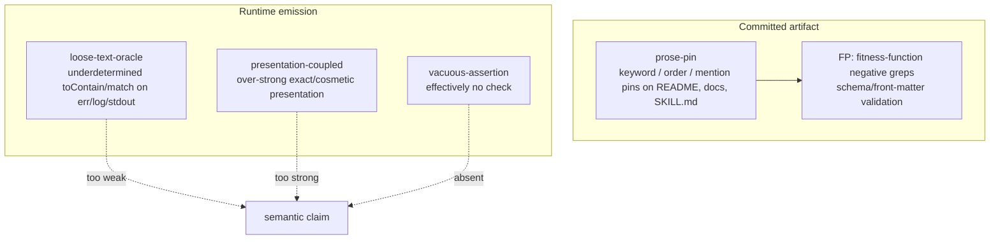

# Task: prose-pin and weak-text-oracle taxonomy smells

* Task ID: prose-pin-weak-text-oracle-smells
* Complexity: Level 3
* Type: feature (taxonomy extension)

Add two taxonomy smells — `prose-pin` (committed docs/skills as oracle) and `loose-text-oracle` (underdetermined substring/regex asserts on runtime-emitted text) — so a blind SLOBAC audit catches the stockroom corpus and the common error/log/stdout message-match shape, with coherent boundaries against `presentation-coupled` and `vacuous-assertion`.

## Pinned Info

### Oracle strength vs artifact kind

Why pinned: the whole feature is this two-axis split; every fixture and Related-mode edit must respect it.

```mermaid
flowchart TB
  subgraph committed [Committed artifact]
    PP["prose-pin<br/>keyword / order / mention pins on README, docs, SKILL.md"]
    PPFP["FP: fitness-function negative greps<br/>schema/front-matter validation"]
  end
  subgraph runtime [Runtime emission]
    LTO["loose-text-oracle<br/>underdetermined toContain/match on err/log/stdout"]
    PC["presentation-coupled<br/>over-strong exact/cosmetic presentation"]
    VA["vacuous-assertion<br/>effectively no check"]
  end
  PP --> PPFP
  LTO -.->|"too weak"| SEM[semantic claim]
  PC -.->|"too strong"| SEM
  VA -.->|"absent"| SEM
```

## Component Analysis

### Affected Components
- **Taxonomy entries** (`skills/slobac-audit/references/docs/taxonomy/`): add `prose-pin.md`, `loose-text-oracle.md`; update Related modes / boundary prose on `presentation-coupled.md`, `vacuous-assertion.md`, `conditional-logic.md`.
- **Generated index**: `taxonomy/README.md` + `skills/slobac-audit/SKILL.md` via `uv run python scripts/gen_taxonomy_index.py`.
- **Audit fixtures**: `tests/fixtures/audit/prose-pin/`, `tests/fixtures/audit/loose-text-oracle/` (+ `tests/fixtures/audit/README.md` rows).
- **Creative record**: `memory-bank/active/creative/creative-taxonomy-carve.md` (decision source).

### Cross-Module Dependencies
- New entry files ⇒ supported slugs automatically.
- `conditional-logic` After-example currently ends on `toThrow(/trailing/)` — must be hedged so build does not teach LTO as the happy path.
- Fixture `expected-findings.md` is the behavior spec for manual audit validation (project convention).

### Boundary Changes
- Published manifesto gains two pages; PC’s teaching stays “too strong,” with an explicit pointer to LTO for “too weak.”

### Invariants & Constraints
- Uniform CONTRIBUTING entry shape; Protect named qualities; polyglot notes required.
- Do not flag prose-as-SUT fixture suites (temp SKILL.md) as prose-pin.
- Preserve regression-detection guidance: delete only when mutants/behavior uncovered elsewhere; fitness-function greps may keep.

## Open Questions

- [x] **Taxonomy carve: cardinality, naming, and boundaries** → Resolved: two smells — `prose-pin` + `loose-text-oracle`; both High / per-test; PC unchanged in core claim (see `memory-bank/active/creative/creative-taxonomy-carve.md`)

## Test Plan (TDD)

SLOBAC does not execute fixture suites in CI. “Tests” here are **planted audit inputs + expected-findings specs**, validated manually per `tests/fixtures/audit/README.md`, plus mechanical gates (`properdocs build --strict`, index drift check).

### Behaviors to Verify

- **B1 prose-pin positive (keyword checklist):** test reads committed-style `docs/*.md` / `SKILL.md` path and `assert "phrase" in text` → audit flags `prose-pin` with delete-or-docs-lint remediation.
- **B2 prose-pin positive (feature-mention / order):** assert flag tokens present or A-before-B in skill prose → flags `prose-pin`.
- **B3 prose-pin negative (fitness-function):** forbidden-token scan with documented architectural rationale / negative-grep shape → must **not** flag (or findings note FP guard).
- **B4 prose-pin negative (prose-as-SUT):** test writes/reads temp skill fixture as product I/O → must **not** flag.
- **B5 loose-text-oracle positive (error message):** `raises(..., match="timeout")` / `err.message.includes("timeout")` as sole oracle for which failure occurred → flags `loose-text-oracle`; remediation prefers typed error/code.
- **B6 loose-text-oracle positive (log/stdout):** `assert "success" in caplog.text` / stdout contains ambiguous phrase → flags `loose-text-oracle`.
- **B7 loose-text-oracle negative (typed + optional datum):** `raises(NotFoundError)` / `errors.Is` / `err.code ===` with optional supplementary param-name match → must **not** flag.
- **B8 loose-text-oracle negative (text is product):** golden/full diagnostic snapshot where message *is* API → must **not** flag (PC/wrong-level tier may still apply elsewhere — out of scope for this fixture).
- **B9 boundary:** long cosmetic HTML `in`-chain remains `presentation-coupled` fixture territory — new LTO fixture must not duplicate that signal as LTO-only without underdetermination rationale.
- **B10 index:** after regen, both slugs appear in taxonomy README + SKILL sentinels; `properdocs build --strict` green.

### Test Infrastructure

- Framework: planted pytest-shaped fixtures (not collected); manual audit comparison to `expected-findings.md`
- Test location: `tests/fixtures/audit/<slug>/`
- Conventions: 2 positives + ≥1 negative control; expected-findings mirrors report template; comments mark planted smells
- New test files: `prose-pin/test_*.py`, `prose-pin/expected-findings.md`, `loose-text-oracle/test_*.py`, `loose-text-oracle/expected-findings.md`

### Integration Tests

- Manual: invoke `/slobac-audit` scoped to each new fixture directory; diff report vs expected-findings (operator or post-build QA).
- Mechanical: `uv run python scripts/gen_taxonomy_index.py` drift-clean; `uv run properdocs build --strict`.

## Implementation Plan

1. **Author `prose-pin.md`** (CONTRIBUTING shape; High; per-test; Protect Maintainable + Necessary + Independent of implementation)
    - Files: `skills/slobac-audit/references/docs/taxonomy/prose-pin.md`
    - Changes: full entry; stockroom-shaped examples; FP for fitness-function / schema / docs-as-tests / Vale tier
    - Creative ref: `creative-taxonomy-carve.md`
2. **Author `loose-text-oracle.md`** (High; per-test; Protect Maintainable + Independent of implementation)
    - Files: `skills/slobac-audit/references/docs/taxonomy/loose-text-oracle.md`
    - Changes: full entry; err/log/stdout examples; recommendation hierarchy typed → structured logs → behavior → golden; FP guards per creative
3. **Boundary edits on adjacent smells**
    - Files: `presentation-coupled.md`, `vacuous-assertion.md`, `conditional-logic.md`
    - Changes: Related modes links; PC description clarifies too-strong vs LTO too-weak; conditional-logic After example prefers type/code with `match=` only as supplementary datum
4. **Regenerate taxonomy index**
    - Files: `taxonomy/README.md`, `skills/slobac-audit/SKILL.md` (generated regions only)
    - Command: `uv run python scripts/gen_taxonomy_index.py`
5. **Fixture `prose-pin`**
    - Files: `tests/fixtures/audit/prose-pin/test_skill_docs.py` (or similar), `expected-findings.md`; tiny inline “committed” markdown strings or path constants simulating repo docs (no need to read real stockroom)
    - Changes: B1–B4 planted
6. **Fixture `loose-text-oracle`**
    - Files: `tests/fixtures/audit/loose-text-oracle/test_emitter_messages.py`, `expected-findings.md`
    - Changes: B5–B8 planted
7. **Fixtures README**
    - Files: `tests/fixtures/audit/README.md`
    - Changes: Phase/taxonomy-parity bullets for both scenarios
8. **Verification gates**
    - `uv run properdocs build --strict`
    - Diff expected-findings vs planted signals by hand (QA will re-check)

## Technology Validation

No new technology - validation not required

## Challenges & Mitigations

- **PC vs LTO confusion in fixtures:** Plant LTO with *ambiguous* phrases (`"timeout"`, `"success"`) and a one-line comment that the opposite meaning would also match; keep PC fixture as-is for long cosmetic chains.
- **prose-pin false positives on a16n-like suites:** Signals + expected-findings negative control must stress “repo’s own committed prose,” not temp product I/O.
- **conditional-logic example regression:** Hedge After-example carefully so the smell’s *conditional* fix (use throw matcher) remains, while not endorsing message-regex as the semantic oracle.
- **Fitness-function FP too loose:** Require documented architectural invariant (comment / `.because()`-style rationale) in the negative control, not merely `assert "uv run" not in text`.

## Pre-Mortem

- **Plan fails because auditors still dump all string asserts into presentation-coupled:** already covered by Challenge 1 + Related-mode edits + distinct fixture signals.
- **Plan fails because `prose-pin` name is rejected in review as non-academic:** creative accepted operator preference + research gap statement; aliases will include documentation-pin / change-detector-on-docs / prose-as-oracle for discoverability — no plan change.
- **Plan fails by skipping fixture negatives and QA catches over-trigger:** add explicit B3/B4/B7/B8 in fixture authoring step (already in Test Plan) — strengthen step 5–6 checklist in build to write negatives first.

## Status

- [x] Component analysis complete
- [x] Open questions resolved
- [x] Test planning complete (TDD)
- [x] Implementation plan complete
- [x] Technology validation complete
- [x] Pre-Mortem complete
- [ ] Preflight
- [ ] Build
- [ ] QA
