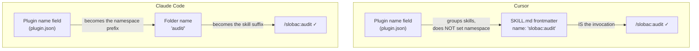

# Task: Expose SLOBAC as Cursor + Claude Code Plugin

* Task ID: slobac-plugin-distribution
* Complexity: Level 3
* Type: feature

Rename the four SLOBAC skill directories from the redundant `slobac-*` convention to short names (`audit`, `batch`, `scout`, `cross-suite`), update all internal cross-references and the SKILL.md `name` fields to the namespaced form `slobac:*`, rewrite the install docs for marketplace distribution, and add plugin manifests to `slobac` and marketplace catalogs to `txrk9-agent-plugins`.

The result: both Cursor and Claude Code users install from a marketplace and invoke the audit as `/slobac:audit`.

## Pinned Info

### Namespacing Architecture

How skill invocation names are resolved in each harness, and why both renames are needed:


```mermaid
flowchart TD
    subgraph "Cursor"
        C1["Plugin name field\n(plugin.json)"] -->|"groups skills,\ndoes NOT set namespace"| C2
        C2["SKILL.md frontmatter\nname: 'slobac:audit'"] -->|"IS the invocation"| C3["/slobac:audit ✓"]
    end
    subgraph "Claude Code"
        D1["Plugin name field\n(plugin.json)"] -->|"becomes the namespace prefix"| D2
        D2["Folder name\n'audit/'"] -->|"becomes the skill suffix"| D3["/slobac:audit ✓"]
    end
```

Both renames are required:
- Cursor: change `name` field in SKILL.md from `slobac-audit` → `slobac:audit`
- Claude Code: rename dir from `slobac-audit/` → `audit/` (folder name determines suffix)

## Component Analysis

### Affected Components

**`slobac` repo — skill renames (4 directories):**
- `skills/slobac-audit/` → `skills/audit/`: orchestrator; owns all shared `references/`
- `skills/slobac-batch/` → `skills/batch/`: per-test/per-file assessor subagent
- `skills/slobac-scout/` → `skills/scout/`: suite enumeration subagent
- `skills/slobac-cross-suite/` → `skills/cross-suite/`: cross-suite detection subagent

**`slobac` repo — SKILL.md edits (4 files):**
Each SKILL.md needs its `name` field updated and all `../slobac-audit/references/` paths updated to `../audit/references/`. `audit/SKILL.md` additionally needs the subagent invocation names changed from `slobac-scout`/`slobac-batch`/`slobac-cross-suite` → `slobac:scout`/`slobac:batch`/`slobac:cross-suite`.

**`slobac` repo — README.md edits (4 files + 1 doc page):**
- Each skill's `README.md`: update old dir names throughout
- `audit/references/docs/using-slobac.md`: replace symlink install instructions with marketplace install

**`slobac` repo — new manifests:**
- `.cursor-plugin/plugin.json`
- `.claude-plugin/plugin.json`

**`slobac` repo — memory bank:**
- `memory-bank/techContext.md`: update install section to reference marketplace

**`txrk9-agent-plugins` repo — new manifests:**
- `.cursor-plugin/marketplace.json`
- `.claude-plugin/marketplace.json`
- `README.md`: replace TODO with actual marketplace description

### Cross-Module Dependencies

- `batch/SKILL.md` → `../audit/references/behavior-summary-format.md`, `../audit/references/docs/taxonomy/<slug>.md`
- `scout/SKILL.md` → `../audit/references/suite-manifest-format.md`
- `cross-suite/SKILL.md` → `../audit/references/behavior-summary-format.md`, `../audit/references/docs/taxonomy/<slug>.md`
- `audit/SKILL.md` → spawns `slobac:scout`, `slobac:batch`, `slobac:cross-suite` subagents

### Boundary Changes

- Skill invocation names change: `slobac-audit` → `slobac:audit`, etc. (breaking for existing symlink installs — accepted; marketplace-only going forward)
- The `SPDX-PackageName` in `skills/audit/REUSE.toml` stays `slobac-audit` (licensing artifact, not runtime name)
- Report output filename stays `slobac-audit.md` (output artifact, not skill name)

## Open Questions

None — implementation approach is clear.

## Test Plan (TDD)

### Behaviors to Verify

- `properdocs build --strict` passes with no broken links after all renames and reference updates (CI gate)
- `reuse --root . lint` from `skills/audit/` passes with no REUSE errors
- Both `.cursor-plugin/plugin.json` and `.claude-plugin/plugin.json` are valid JSON with required fields
- Both marketplace manifests are valid JSON with required fields
- Operator smoke test: install slobac from txrk9-agent-plugins marketplace → invoke `/slobac:audit` → audit executes and subagents are found

### Test Infrastructure

- Framework: `properdocs build --strict` (existing CI gate — `validation.anchors: warn`)
- REUSE: `reuse --root . lint` from `skills/audit/` (existing; `--root .` flag is mandatory)
- JSON validation: manual review + `claude plugin validate .` if available
- New test files: none
- Smoke test: operator-executed post-build (not automated)

### Integration Tests

- Broken-link check: properdocs build transitively validates all cross-links in `references/docs/`; any missed `slobac-audit/` → `audit/` reference in docs will fail the build

## Implementation Plan


### Phase 0: Establish baselines (TDD — green-before-red)

0. **Establish green baselines** — before any changes, confirm the CI gates currently pass:
   - Run `properdocs build --strict` from `slobac/` → must pass
   - Run `reuse --root . lint` from `skills/audit/` (i.e., `skills/slobac-audit/` before rename) → must pass
   - Also run the pre-implementation grep to confirm complete scope: `grep -rl "slobac-audit\|slobac-batch\|slobac-scout\|slobac-cross-suite" --include="*.md" --include="*.yml" --include="*.yaml" --include="*.toml" .`

### Phase 1: Rename skill directories

1. **Rename `skills/slobac-audit/` → `skills/audit/`**
   - Files: directory rename (git mv)
   - Changes: directory name only; no file edits in this step
2. **Rename `skills/slobac-batch/` → `skills/batch/`**
   - Files: directory rename (git mv)
3. **Rename `skills/slobac-scout/` → `skills/scout/`**
   - Files: directory rename (git mv)
4. **Rename `skills/slobac-cross-suite/` → `skills/cross-suite/`**
   - Files: directory rename (git mv)

   > **TDD gate (expect RED):** Run `properdocs build --strict` — should now FAIL on broken `../slobac-audit/` cross-references in the sibling SKILL.md files and doc pages. This failure is expected and required to prove the tests are meaningful.

### Phase 2: Update SKILL.md files

5. **`skills/audit/SKILL.md`** — update `name` field and subagent references:
   - `name: slobac-audit` → `name: "slobac:audit"`
   - `slobac-scout` skill reference → `slobac:scout`
   - `slobac-batch` skill reference → `slobac:batch`
   - `slobac-cross-suite` skill reference → `slobac:cross-suite`
   - `../slobac-audit/references/` (×3 occurrences instructing subagents) → `../audit/references/`

6. **`skills/scout/SKILL.md`** — update `name` field and cross-references:
   - `name: slobac-scout` → `name: "slobac:scout"`
   - Description text: `slobac-audit` → `slobac:audit`
   - `../slobac-audit/SKILL.md` link → `../audit/SKILL.md`
   - `../slobac-audit/references/suite-manifest-format.md` (×2) → `../audit/references/...`

7. **`skills/batch/SKILL.md`** — update `name` field and cross-references:
   - `name: slobac-batch` → `name: "slobac:batch"`
   - Description text: `slobac-audit` → `slobac:audit`
   - `../slobac-audit/SKILL.md` link → `../audit/SKILL.md`
   - `../slobac-audit/references/behavior-summary-format.md` (×2) → `../audit/references/...`
   - `../slobac-audit/references/docs/taxonomy/<slug>.md` → `../audit/references/...`

8. **`skills/cross-suite/SKILL.md`** — update `name` field and cross-references:
   - `name: slobac-cross-suite` → `name: "slobac:cross-suite"`
   - Description text: `slobac-audit` → `slobac:audit`
   - `../slobac-audit/SKILL.md` link → `../audit/SKILL.md`
   - `../slobac-audit/references/behavior-summary-format.md` → `../audit/references/...`
   - `../slobac-audit/references/docs/taxonomy/<slug>.md` → `../audit/references/...`

### Phase 3: Update README.md files and properdocs config

9. **`skills/audit/README.md`** — update all `slobac-*` dir references to new names
10. **`skills/scout/README.md`** — update all `slobac-*` dir and skill name references
11. **`skills/batch/README.md`** — update all `slobac-*` dir and skill name references
12. **`skills/cross-suite/README.md`** — update all `slobac-*` dir and skill name references
13. **`properdocs.yml`** *(moved from Phase 4 — required before Phase 3 TDD gate)* — update two path references:
    - `docs_dir: skills/slobac-audit/references/docs` → `docs_dir: skills/audit/references/docs`
    - `edit_uri: edit/main/skills/slobac-audit/references/docs/` → `edit_uri: edit/main/skills/audit/references/docs/`

   > **TDD gate (expect GREEN):** Run `properdocs build --strict` — should pass now that all cross-references inside `skills/` are updated AND properdocs.yml points at the renamed directory. (Note: properdocs fails at startup before Step 13 is applied because `docs_dir` would point to a non-existent path.)

### Phase 4: Update doc pages + compliance + repo-root files

14. **`skills/audit/references/docs/using-slobac.md`** — replace the symlink Install section with marketplace install instructions for Cursor and Claude Code; keep "Other harnesses" section; update all `slobac-*` skill name references in prose
15. **`memory-bank/techContext.md`** — update ALL old-path references throughout the file (not just the harness discovery section): `skills/slobac-audit/` → `skills/audit/`, `slobac-scout` → `scout`, `slobac-batch` → `batch`, `slobac-cross-suite` → `cross-suite` in all prose and links; update install section to describe marketplace install; note symlink install is legacy
16. **`REUSE.toml`** (repo root) *(preflight-discovered missing step)* — update the CC-BY-SA-4.0 license path annotation:
    - `path = ["skills/slobac-audit/references/docs/**"]` → `path = ["skills/audit/references/docs/**"]`
17. **`CONTRIBUTING.md`** *(preflight-discovered missing step)* — update old-name references:
    - `skills/slobac-audit/references/docs/taxonomy/` (×2) → `skills/audit/references/docs/taxonomy/`
    - `slobac-batch` in detection-scope routing table → `batch`
    - `slobac-cross-suite` in detection-scope routing table → `cross-suite`
    - `skills/slobac-audit/references/docs/` in Site section → `skills/audit/references/docs/`
18. **`README.md`** *(preflight-discovered missing step)* — update old-name references:
    - Line 15: `skills/slobac-audit/` (×2) → `skills/audit/`
    - Line 30: `skills/slobac-audit/references/docs/` → `skills/audit/references/docs/`

   > **TDD gate (expect GREEN):** Run `properdocs build --strict` and `reuse --root . lint` from `skills/audit/` — both should pass.

### Phase 5: Add plugin manifests to slobac

19. **Create `.cursor-plugin/plugin.json`** *(was step 15)*:
    ```json
    {
      "name": "slobac",
      "displayName": "SLOBAC",
      "description": "Test-suite audit: find and fix smells in mature test suites.",
      "version": "0.1.0",
      "author": { "name": "Texarkanine" },
      "homepage": "https://github.com/Texarkanine/slobac",
      "repository": "https://github.com/Texarkanine/slobac",
      "license": "LicenseRef-PPL-S",
      "keywords": ["testing", "test-smells", "audit", "quality"],
      "category": "developer-tools",
      "skills": "./skills/"
    }
    ```

    > **TDD gate (stub → validate → fill):** Create the file as `{}` first, validate it fails JSON schema checks (fields missing), then fill with the full content above.

20. **Create `.claude-plugin/plugin.json`** *(was step 16)*:
    ```json
    {
      "name": "slobac",
      "description": "Test-suite audit: find and fix smells in mature test suites.",
      "version": "0.1.0",
      "author": { "name": "Texarkanine" },
      "homepage": "https://github.com/Texarkanine/slobac",
      "repository": "https://github.com/Texarkanine/slobac",
      "license": "LicenseRef-PPL-S",
      "keywords": ["testing", "test-smells", "audit", "quality"]
    }
    ```

### Phase 6: Add marketplace catalogs to txrk9-agent-plugins

21. **Create `txrk9-agent-plugins/.cursor-plugin/marketplace.json`** *(was step 17)*:
    ```json
    {
      "name": "txrk9-agent-plugins",
      "owner": { "name": "Texarkanine" },
      "metadata": { "description": "Agent plugins by Texarkanine." },
      "plugins": [
        {
          "name": "slobac",
          "source": { "source": "github", "repo": "Texarkanine/slobac" },
          "description": "Test-suite audit: find and fix smells in mature test suites."
        }
      ]
    }
    ```

22. **Create `txrk9-agent-plugins/.claude-plugin/marketplace.json`** *(was step 18)*:
    ```json
    {
      "name": "txrk9-agent-plugins",
      "owner": { "name": "Texarkanine" },
      "description": "Agent plugins by Texarkanine.",
      "plugins": [
        {
          "name": "slobac",
          "source": { "source": "github", "repo": "Texarkanine/slobac" },
          "description": "Test-suite audit: find and fix smells in mature test suites."
        }
      ]
    }
    ```

    > **TDD gate:** Validate JSON syntax of all four manifest files (both `.cursor-plugin/` and `.claude-plugin/` manifests in both repos).

23. **Update `txrk9-agent-plugins/README.md`** *(was step 19)* — replace TODO with actual description of the marketplace and the slobac plugin

### Phase 7: Final verification sweep

24. Run `properdocs build --strict` from `slobac/` — expect PASS
25. Run `reuse --root . lint` from `skills/audit/` — expect PASS
26. Run grep to confirm zero remaining old names: `grep -rl "slobac-audit\|slobac-batch\|slobac-scout\|slobac-cross-suite" --include="*.md" --include="*.yml" --include="*.yaml" --include="*.toml" .` — expect no hits outside `memory-bank/archive/` and `planning/`

## Technology Validation

No new technology — validation not required. Manifest formats are JSON and were researched against official docs during planning.

## Challenges & Mitigations

- **properdocs link validation**: Any `slobac-audit/` reference remaining in `references/docs/` after Phase 2-3 will fail the CI gate. Mitigation: grep for `slobac-audit\|slobac-batch\|slobac-scout\|slobac-cross-suite` across `skills/` after all edits before running properdocs.
- **Subagent dispatch names**: The harness must find `slobac:scout` etc. when the orchestrator spawns them. This is the operator's smoke test gate — flagged explicitly in the test plan.
- **REUSE.toml path annotations**: The `REUSE.toml` uses glob paths (`**/*`, `references/docs/**`) which are relative to the skill root; they survive the directory rename unmodified.

## Status

- [x] Component analysis complete
- [x] Open questions resolved
- [x] Test planning complete (TDD)
- [x] Implementation plan complete (amended by preflight — see findings below)
- [x] Technology validation complete
- [x] Preflight — PASS with ADVISORY (plan amended ×2; see findings; proceed to `/niko-build`)
- [x] Build — 2026-05-05: directory renames (`skills/{audit,scout,batch,cross-suite}`), `slobac:*` SKILL names + refs, docs/install/marketplace, plugin manifests (`.cursor-plugin/`, `.claude-plugin/`), `txrk9-agent-plugins` marketplace catalogs; gates: `uv run properdocs build --strict`, `reuse lint`, `reuse --root . lint` from `skills/audit/`
- [x] QA — 2026-05-05: **FAIL** (semantic review PASS w/ 1 trivial fix; operator smoke test FAIL — Cursor naming + subagent skill clutter). Routing to plan revision.
- [x] Plan (revision) — 2026-05-05: Single-skill architecture. Fold `scout/`, `batch/`, `cross-suite/` into `audit/references/subagents/`. One visible skill per harness. Name field: `slobac-audit` (Cursor) / folder `audit` (Claude Code → `slobac:audit`).
- [x] Preflight (revision) — 2026-05-05: PASS with ADVISORY. One FAIL found and fixed: TDD plan encoding — missing baseline + intermediate gates. Plan amended with Phase R0, RED gate after R3, GREEN gate after R4. Proceed to `/niko-build`.
- [x] Build (revision) — 2026-05-05: Single-skill architecture implemented. Folded scout/batch/cross-suite into `references/subagents/`. Name field `slobac-audit`. Orchestrator dispatches raw subagent prompts. All gates green (properdocs, reuse lint ×2, stale-ref grep clean).
- [ ] QA (re-run)

## Plan Revision: Single-Skill Architecture (2026-05-05)

### Root Cause (from QA + research)

1. **Cursor naming**: Colons in `name` field are normalized to hyphens; Cursor does NOT auto-prefix with plugin name. The `name` field IS the invocation (after normalization).
2. **Subagent skills pollute picker**: `scout`, `batch`, `cross-suite` are implementation details that appear alongside `audit` in both harnesses' command pickers — confusing UX.
3. **Dual-harness collision**: Folder names must stay short for Claude Code (`slobac:audit` = `plugin:folder`), but Cursor needs the full namespace in `name` (→ `slobac-audit`). With 4 skills, this creates 4 collision/UX problems.

### Solution: Fold subagent skills into `audit/references/subagents/`

Only `audit` is a registered skill. The three subagent workflows become reference documents that the orchestrator reads and uses as raw subagent prompts. This eliminates:
- All Cursor naming collisions (one skill = one `name` field = one picker entry)
- User-facing clutter (only `/slobac-audit` or `/slobac:audit` visible)
- Harness-specific subagent registration (raw prompts work in both Cursor's Task tool and Claude Code's Agent tool)

### Invocation Names (final)

| Harness | Mechanism | Invocation |
|---------|-----------|------------|
| Cursor | `name` field (colon→hyphen normalization) | `/slobac-audit` |
| Claude Code | `plugin-name:folder-name` | `/slobac:audit` |

Slight cosmetic difference (hyphen vs colon) is the best achievable given platform constraints. Both are discoverable by typing `/slob`.

### Affected Components

**Delete (content migrated):**
- `skills/scout/` → body becomes `skills/audit/references/subagents/scout.md`
- `skills/batch/` → body becomes `skills/audit/references/subagents/batch.md`
- `skills/cross-suite/` → body becomes `skills/audit/references/subagents/cross-suite.md`
- `skills/scout/references/exploration-commands.md` → moves to `skills/audit/references/subagents/exploration-commands.md`

**Modify:**
- `skills/audit/SKILL.md` — name field + subagent dispatch rewrite (skill refs → raw prompt dispatch)
- `skills/audit/README.md` — architecture section (reflects single-skill layout)
- `skills/audit/references/docs/using-slobac.md` — simplify install (one skill, not four)
- `CONTRIBUTING.md` — detection-scope routing table (no more skill names for subagents)
- `memory-bank/techContext.md` — update sibling skill references
- `memory-bank/systemPatterns.md` — update module boundary description

**No change needed:**
- `.cursor-plugin/plugin.json` — `"skills": "./skills/"` still works (discovers only `audit/`)
- `.claude-plugin/plugin.json` — unchanged
- `txrk9-agent-plugins/` — unchanged
- `properdocs.yml` — unchanged (docs_dir still `skills/audit/references/docs`)
- Root `REUSE.toml` — `skills/**` still covers `skills/audit/references/subagents/`
- `skills/audit/REUSE.toml` — subagent files are under skill root, covered by PPL-S

### Implementation Plan (Revision)

**Phase R0: Establish baselines (TDD — green-before-red)**

0. Before any changes, confirm the CI gates currently pass:
   - Run `uv run properdocs build --strict` from `slobac/` → must pass
   - Run `reuse --root . lint` from `skills/audit/` → must pass
   - Run stale-ref grep: `rg -l "slobac:scout|slobac:batch|slobac:cross-suite|skills/scout|skills/batch|skills/cross-suite" --glob '*.md' --glob '*.yml' --glob '*.toml' .` → document current hit list as inventory of files to touch

**Phase R1: Create subagent reference files**

1. Create `skills/audit/references/subagents/` directory
2. Move `skills/scout/SKILL.md` body (no frontmatter) → `skills/audit/references/subagents/scout.md`
   - Update internal path refs: `../audit/references/` → `../` (now inside `audit/references/subagents/`)
   - Add header explaining this is a subagent workflow dispatched by the orchestrator
3. Move `skills/scout/references/exploration-commands.md` → `skills/audit/references/subagents/exploration-commands.md`
4. Move `skills/batch/SKILL.md` body → `skills/audit/references/subagents/batch.md`
   - Update path refs: `../audit/references/` → `../`
5. Move `skills/cross-suite/SKILL.md` body → `skills/audit/references/subagents/cross-suite.md`
   - Update path refs: `../audit/references/` → `../`

**Phase R2: Rewrite orchestrator dispatch**

6. Update `skills/audit/SKILL.md`:
   - `name: "slobac:audit"` → `name: slobac-audit`
   - Steps 3, 5, 7: replace "Launch a readonly subagent with the `slobac:scout` skill" → "Read `references/subagents/scout.md`. Launch a readonly subagent whose task is the content of that file, supplemented with [context variables]."
   - Add instruction for the orchestrator to resolve its own `references/` absolute path and pass it to subagents so they can read taxonomy/format files
   - Path resolution contract: the orchestrator passes the absolute `references/` path as a context variable; subagent workflow files use relative paths (`../docs/taxonomy/<slug>.md`) for human readability but subagents use the orchestrator-supplied absolute path at runtime

**Phase R3: Delete sibling skill directories**

7. `git rm -r skills/scout/`
8. `git rm -r skills/batch/`
9. `git rm -r skills/cross-suite/`

   > **TDD gate (expect RED):** Run stale-ref grep — should find references in Phase R4 target files (`CONTRIBUTING.md`, `using-slobac.md`, `audit/README.md`, `techContext.md`, `systemPatterns.md`). Hits in files being deleted (sibling SKILL.md/README.md) are gone; hits in Phase R4 targets prove the grep is meaningful and Phase R4 is necessary.

**Phase R4: Update documentation**

10. `skills/audit/README.md` — rewrite architecture section:
    - Remove references to sibling skills as separate registered skills
    - Show new layout with `references/subagents/`
    - Update the "Cross-skill reference convention" section
11. `skills/audit/references/docs/using-slobac.md` — simplify:
    - Install section: "one skill" (not "four skills")
    - Remove references to subagent skills in user-facing text
    - Update Cursor/Claude Code install sections for single-skill invocation names
    - Update Legacy symlink section (one directory, not four)
    - Update "Other harnesses" section (one skill directory)
12. `CONTRIBUTING.md` — detection-scope routing table:
    - Remove `slobac:batch` / `slobac:cross-suite` skill name references
    - Replace with internal mechanism description (or just "batch assessor" / "cross-suite assessor")
13. `memory-bank/techContext.md` — update:
    - Remove sibling skill layout description
    - Add `references/subagents/` to the layout
14. `memory-bank/systemPatterns.md` — update:
    - Module boundary description (no longer "four skills", now "one skill with subagent workflows")
    - Reference flow (all content under `audit/`, no `../audit/` escapes)

   > **TDD gate (expect GREEN):** Run `uv run properdocs build --strict`, `reuse --root . lint` from `skills/audit/`, and stale-ref grep — all should pass. Grep should find no hits outside `memory-bank/active/` and `planning/`.

**Phase R5: Final verification sweep**

15. `uv run properdocs build --strict` — must pass
16. `reuse --root . lint` from `skills/audit/` — must pass
17. Grep for stale refs: `rg -l "slobac:scout|slobac:batch|slobac:cross-suite|skills/scout|skills/batch|skills/cross-suite" --glob '*.md' --glob '*.yml' --glob '*.toml' .` — expect no hits outside `memory-bank/active/` and `planning/`
18. Operator smoke test: install in Cursor + Claude Code → single entry, audit dispatches subagents correctly

### Test Plan

- CI: `properdocs build --strict` + `reuse --root . lint` from `skills/audit/`
- Cursor: install plugin → type `/slob` → single entry `/slobac-audit`, no duplicates
- Claude Code: install plugin → type `/slob` → single entry `/slobac:audit`
- Functional: invoke audit against `tests/fixtures/audit/deliverable-fossils/` → orchestrator reads `references/subagents/scout.md`, launches scout subagent, receives manifest, launches batch subagent, produces report

### Challenges & Mitigations

- **Subagent path resolution**: The orchestrator must pass an absolute path to `references/` so subagents can read taxonomy entries and format specs. Mitigation: the orchestrator knows its own skill root; it resolves the absolute path and includes it in the subagent launch prompt.
- **Subagent workflow reliability**: Raw-prompt subagents don't get the structured "you are running skill X" context. Mitigation: each `references/subagents/*.md` file begins with a clear role statement and self-contained instructions.
- **Invocation name cosmetic difference**: Cursor shows `/slobac-audit`, Claude Code shows `/slobac:audit`. Mitigation: both are discoverable by typing `/slob`; the difference is inherent to platform constraints.

## Preflight Findings (Run 1 — 2026-05-05)

**FAIL — TDD plan encoding:** All verification was deferred to Phase 7 (end-of-work). Amended plan adds explicit TDD gates: a baseline green-check before any changes (Step 0), a deliberate red-gate after Phase 1 renames (properdocs expected to fail), green re-check after Phase 3 reference updates, and stub-first → validate-fail → fill ordering for JSON manifest files (Steps 19-22).

**FAIL — `properdocs.yml` missing from plan:** After renaming `slobac-audit/` → `audit/`, both `docs_dir` and `edit_uri` in `properdocs.yml` would point at a non-existent directory, causing properdocs to error on startup — before it even validates links. Added as Step 13 in Phase 3 (moved from original Phase 4 Step 15 by Run 2 — see below).

**FAIL — Root `REUSE.toml` missing from plan:** The `path = ["skills/slobac-audit/references/docs/**"]` CC-BY-SA-4.0 annotation in the repo-root `REUSE.toml` targets the old path. After rename, `reuse lint` loses the match, breaking REUSE compliance (the plan's own Step 25 gate). Added as Step 16 in Phase 4.

**FAIL — `CONTRIBUTING.md` missing from plan:** Contains five stale references to old skill paths/names that are reader-visible. Added as Step 17 in Phase 4.

**FAIL — `README.md` missing from plan:** Contains three stale references to `skills/slobac-audit/` paths. Added as Step 18 in Phase 4.

**ADVISORY — `memory-bank/systemPatterns.md` stale post-rename:** Has many references to the old `skills/slobac-audit/`, `slobac-scout` etc. paths but is not a CI gate risk. Can be updated during or after build at operator discretion.

**ADVISORY — Radical Innovation (Step 0 scope verification):** Amended plan adds a pre-implementation grep as part of Step 0. Running `grep -rl "slobac-audit\|slobac-batch\|slobac-scout\|slobac-cross-suite"` before any changes gives the implementer a live inventory of all files to update — preventing mid-implementation discoveries like those that triggered this preflight failure.

## Preflight Findings (Run 2 — 2026-05-05)

**FAIL — Phase 3 TDD gate unreachable (sequencing):** After Phase 1 renames, `properdocs.yml`'s `docs_dir: skills/slobac-audit/references/docs` points to a non-existent directory — properdocs fails at startup before it can validate any links. In Run 1's plan, the `properdocs.yml` fix was Step 15 in Phase 4, but the Phase 3 GREEN gate ran properdocs before that fix was applied, making the gate permanently unreachable. Fixed by moving the properdocs.yml update to Step 13 in Phase 3 (as the last step before the Phase 3 gate). Phase 4 steps renumbered accordingly (14-18).

**ADVISORY — Project brief stale:** `projectbrief.md` still declares "Out of scope: Modifying any SKILL.md file in slobac" but Phase 2 (Steps 5-8) modifies four SKILL.md files. The scope expansion is correctly documented in `progress.md` from the plan phase, but the project brief was not updated. Recommend updating `projectbrief.md` before build.

**ADVISORY — Steps 20-22 missing per-unit stub gates:** Step 19 applies proper stub→RED→fill TDD to `.cursor-plugin/plugin.json`. Steps 20-22 create the remaining three manifest files without individual RED phases — only the Phase 6 collective gate validates them after the fact. The Phase 6 gate is a reasonable approximation but not per-unit TDD. Consider applying the stub-validate pattern to all four manifest files for consistency.

## Preflight Findings (Run 3 — Revision Plan — 2026-05-05)

**FAIL — TDD plan encoding: missing baselines and intermediate gates (fixed in-place).** The revision plan deferred all verification to Phase R5 (Steps 15-18) — the same anti-pattern that caused the Run 1 FAIL on the original plan. Amended plan adds: Phase R0 (establish baselines before changes), a RED gate after Phase R3 (stale-ref grep expected to find hits in Phase R4 target files, proving the test is meaningful), and a GREEN gate after Phase R4 (all verification commands pass before entering Phase R5 final sweep).

**ADVISORY — Subagent path resolution dual-mechanism.** The plan updates relative paths in migrated workflow files (Steps 2, 4, 5: `../audit/references/` → `../`) AND has the orchestrator pass an absolute `references/` path (Step 6). The intent is coherent — relative paths serve human readers navigating the files; the absolute path is what subagents use at runtime — but the plan should make this distinction explicit to prevent the implementer from being confused about which mechanism the subagent actually uses. Amended Step 6 with a "path resolution contract" clarification.

**ADVISORY — Project brief stale (carried forward from Run 2).** `projectbrief.md` still describes the original multi-skill architecture. The revision substantially changes the plan. Recommend updating before build, but this is an ephemeral file that will be archived with the task — not blocking.

**ADVISORY — Radical innovation: `references/subagents/README.md`.** A small (~15 line) README inside the new `subagents/` directory would document the dispatch contract for contributors: what these files are (raw workflow prompts, not registered skills), how the orchestrator uses them, and what context variables the orchestrator passes. Cost: trivial. Benefit: prevents future confusion about why these files aren't standard SKILL.md skills. Within current complexity level and scope — can be added during Phase R1.
