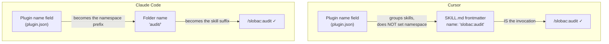

# Task: Expose SLOBAC as Cursor + Claude Code Plugin

* Task ID: slobac-plugin-distribution
* Complexity: Level 3
* Type: feature

Rename the four SLOBAC skill directories from the redundant `slobac-*` convention to short names (`audit`, `batch`, `scout`, `cross-suite`), update all internal cross-references and the SKILL.md `name` fields to the namespaced form `slobac:*`, rewrite the install docs for marketplace distribution, and add plugin manifests to `slobac` and marketplace catalogs to `txrk9-agent-plugins`.

The result: both Cursor and Claude Code users install from a marketplace and invoke the audit as `/slobac:audit`.

## Pinned Info

### Namespacing Architecture

How skill invocation names are resolved in each harness, and why both renames are needed:


```mermaid
flowchart TD
    subgraph "Cursor"
        C1["Plugin name field\n(plugin.json)"] -->|"groups skills,\ndoes NOT set namespace"| C2
        C2["SKILL.md frontmatter\nname: 'slobac:audit'"] -->|"IS the invocation"| C3["/slobac:audit ✓"]
    end
    subgraph "Claude Code"
        D1["Plugin name field\n(plugin.json)"] -->|"becomes the namespace prefix"| D2
        D2["Folder name\n'audit/'"] -->|"becomes the skill suffix"| D3["/slobac:audit ✓"]
    end
```

Both renames are required:
- Cursor: change `name` field in SKILL.md from `slobac-audit` → `slobac:audit`
- Claude Code: rename dir from `slobac-audit/` → `audit/` (folder name determines suffix)

## Component Analysis

### Affected Components

**`slobac` repo — skill renames (4 directories):**
- `skills/slobac-audit/` → `skills/audit/`: orchestrator; owns all shared `references/`
- `skills/slobac-batch/` → `skills/batch/`: per-test/per-file assessor subagent
- `skills/slobac-scout/` → `skills/scout/`: suite enumeration subagent
- `skills/slobac-cross-suite/` → `skills/cross-suite/`: cross-suite detection subagent

**`slobac` repo — SKILL.md edits (4 files):**
Each SKILL.md needs its `name` field updated and all `../slobac-audit/references/` paths updated to `../audit/references/`. `audit/SKILL.md` additionally needs the subagent invocation names changed from `slobac-scout`/`slobac-batch`/`slobac-cross-suite` → `slobac:scout`/`slobac:batch`/`slobac:cross-suite`.

**`slobac` repo — README.md edits (4 files + 1 doc page):**
- Each skill's `README.md`: update old dir names throughout
- `audit/references/docs/using-slobac.md`: replace symlink install instructions with marketplace install

**`slobac` repo — new manifests:**
- `.cursor-plugin/plugin.json`
- `.claude-plugin/plugin.json`

**`slobac` repo — memory bank:**
- `memory-bank/techContext.md`: update install section to reference marketplace

**`txrk9-agent-plugins` repo — new manifests:**
- `.cursor-plugin/marketplace.json`
- `.claude-plugin/marketplace.json`
- `README.md`: replace TODO with actual marketplace description

### Cross-Module Dependencies

- `batch/SKILL.md` → `../audit/references/behavior-summary-format.md`, `../audit/references/docs/taxonomy/<slug>.md`
- `scout/SKILL.md` → `../audit/references/suite-manifest-format.md`
- `cross-suite/SKILL.md` → `../audit/references/behavior-summary-format.md`, `../audit/references/docs/taxonomy/<slug>.md`
- `audit/SKILL.md` → spawns `slobac:scout`, `slobac:batch`, `slobac:cross-suite` subagents

### Boundary Changes

- Skill invocation names change: `slobac-audit` → `slobac:audit`, etc. (breaking for existing symlink installs — accepted; marketplace-only going forward)
- The `SPDX-PackageName` in `skills/audit/REUSE.toml` stays `slobac-audit` (licensing artifact, not runtime name)
- Report output filename stays `slobac-audit.md` (output artifact, not skill name)

## Open Questions

None — implementation approach is clear.

## Test Plan (TDD)

### Behaviors to Verify

- `properdocs build --strict` passes with no broken links after all renames and reference updates (CI gate)
- `reuse --root . lint` from `skills/audit/` passes with no REUSE errors
- Both `.cursor-plugin/plugin.json` and `.claude-plugin/plugin.json` are valid JSON with required fields
- Both marketplace manifests are valid JSON with required fields
- Operator smoke test: install slobac from txrk9-agent-plugins marketplace → invoke `/slobac:audit` → audit executes and subagents are found

### Test Infrastructure

- Framework: `properdocs build --strict` (existing CI gate — `validation.anchors: warn`)
- REUSE: `reuse --root . lint` from `skills/audit/` (existing; `--root .` flag is mandatory)
- JSON validation: manual review + `claude plugin validate .` if available
- New test files: none
- Smoke test: operator-executed post-build (not automated)

### Integration Tests

- Broken-link check: properdocs build transitively validates all cross-links in `references/docs/`; any missed `slobac-audit/` → `audit/` reference in docs will fail the build

## Implementation Plan

### Phase 1: Rename skill directories

1. **Rename `skills/slobac-audit/` → `skills/audit/`**
   - Files: directory rename (git mv)
   - Changes: directory name only; no file edits in this step
2. **Rename `skills/slobac-batch/` → `skills/batch/`**
   - Files: directory rename (git mv)
3. **Rename `skills/slobac-scout/` → `skills/scout/`**
   - Files: directory rename (git mv)
4. **Rename `skills/slobac-cross-suite/` → `skills/cross-suite/`**
   - Files: directory rename (git mv)

### Phase 2: Update SKILL.md files

5. **`skills/audit/SKILL.md`** — update `name` field and subagent references:
   - `name: slobac-audit` → `name: "slobac:audit"`
   - `slobac-scout` skill reference → `slobac:scout`
   - `slobac-batch` skill reference → `slobac:batch`
   - `slobac-cross-suite` skill reference → `slobac:cross-suite`
   - `../slobac-audit/references/` (×3 occurrences instructing subagents) → `../audit/references/`

6. **`skills/scout/SKILL.md`** — update `name` field and cross-references:
   - `name: slobac-scout` → `name: "slobac:scout"`
   - Description text: `slobac-audit` → `slobac:audit`
   - `../slobac-audit/SKILL.md` link → `../audit/SKILL.md`
   - `../slobac-audit/references/suite-manifest-format.md` (×2) → `../audit/references/...`

7. **`skills/batch/SKILL.md`** — update `name` field and cross-references:
   - `name: slobac-batch` → `name: "slobac:batch"`
   - Description text: `slobac-audit` → `slobac:audit`
   - `../slobac-audit/SKILL.md` link → `../audit/SKILL.md`
   - `../slobac-audit/references/behavior-summary-format.md` (×2) → `../audit/references/...`
   - `../slobac-audit/references/docs/taxonomy/<slug>.md` → `../audit/references/...`

8. **`skills/cross-suite/SKILL.md`** — update `name` field and cross-references:
   - `name: slobac-cross-suite` → `name: "slobac:cross-suite"`
   - Description text: `slobac-audit` → `slobac:audit`
   - `../slobac-audit/SKILL.md` link → `../audit/SKILL.md`
   - `../slobac-audit/references/behavior-summary-format.md` → `../audit/references/...`
   - `../slobac-audit/references/docs/taxonomy/<slug>.md` → `../audit/references/...`

### Phase 3: Update README.md files

9. **`skills/audit/README.md`** — update all `slobac-*` dir references to new names
10. **`skills/scout/README.md`** — update all `slobac-*` dir and skill name references
11. **`skills/batch/README.md`** — update all `slobac-*` dir and skill name references
12. **`skills/cross-suite/README.md`** — update all `slobac-*` dir and skill name references

### Phase 4: Update docs + memory bank

13. **`skills/audit/references/docs/using-slobac.md`** — replace the symlink Install section with marketplace install instructions for Cursor and Claude Code; keep "Other harnesses" section; update all `slobac-*` skill name references in prose
14. **`memory-bank/techContext.md`** — update harness discovery section to describe marketplace install; note symlink install is legacy

### Phase 5: Add plugin manifests to slobac

15. **Create `.cursor-plugin/plugin.json`**:
    ```json
    {
      "name": "slobac",
      "displayName": "SLOBAC",
      "description": "Test-suite audit: find and fix smells in mature test suites.",
      "version": "0.1.0",
      "author": { "name": "Texarkanine" },
      "homepage": "https://github.com/Texarkanine/slobac",
      "repository": "https://github.com/Texarkanine/slobac",
      "license": "LicenseRef-PPL-S",
      "keywords": ["testing", "test-smells", "audit", "quality"],
      "category": "developer-tools",
      "skills": "./skills/"
    }
    ```

16. **Create `.claude-plugin/plugin.json`**:
    ```json
    {
      "name": "slobac",
      "description": "Test-suite audit: find and fix smells in mature test suites.",
      "version": "0.1.0",
      "author": { "name": "Texarkanine" },
      "homepage": "https://github.com/Texarkanine/slobac",
      "repository": "https://github.com/Texarkanine/slobac",
      "license": "LicenseRef-PPL-S",
      "keywords": ["testing", "test-smells", "audit", "quality"]
    }
    ```
    *(Claude Code auto-discovers `skills/` so the `skills` field can be omitted; or included explicitly — plan to include for clarity.)*

### Phase 6: Add marketplace catalogs to txrk9-agent-plugins

17. **Create `txrk9-agent-plugins/.cursor-plugin/marketplace.json`**:
    ```json
    {
      "name": "txrk9-agent-plugins",
      "owner": { "name": "Texarkanine" },
      "metadata": { "description": "Agent plugins by Texarkanine." },
      "plugins": [
        {
          "name": "slobac",
          "source": { "source": "github", "repo": "Texarkanine/slobac" },
          "description": "Test-suite audit: find and fix smells in mature test suites."
        }
      ]
    }
    ```

18. **Create `txrk9-agent-plugins/.claude-plugin/marketplace.json`**:
    ```json
    {
      "name": "txrk9-agent-plugins",
      "owner": { "name": "Texarkanine" },
      "description": "Agent plugins by Texarkanine.",
      "plugins": [
        {
          "name": "slobac",
          "source": { "source": "github", "repo": "Texarkanine/slobac" },
          "description": "Test-suite audit: find and fix smells in mature test suites."
        }
      ]
    }
    ```

19. **Update `txrk9-agent-plugins/README.md`** — replace TODO with actual description of the marketplace and the slobac plugin

### Phase 7: Run verification

20. Run `properdocs build --strict` from `slobac/` to verify no broken doc links
21. Run `reuse --root . lint` from `skills/audit/` to verify REUSE compliance
22. Verify JSON syntax of all four manifest files

## Technology Validation

No new technology — validation not required. Manifest formats are JSON and were researched against official docs during planning.

## Challenges & Mitigations

- **properdocs link validation**: Any `slobac-audit/` reference remaining in `references/docs/` after Phase 2-3 will fail the CI gate. Mitigation: grep for `slobac-audit\|slobac-batch\|slobac-scout\|slobac-cross-suite` across `skills/` after all edits before running properdocs.
- **Subagent dispatch names**: The harness must find `slobac:scout` etc. when the orchestrator spawns them. This is the operator's smoke test gate — flagged explicitly in the test plan.
- **REUSE.toml path annotations**: The `REUSE.toml` uses glob paths (`**/*`, `references/docs/**`) which are relative to the skill root; they survive the directory rename unmodified.

## Status

- [x] Component analysis complete
- [x] Open questions resolved
- [x] Test planning complete (TDD)
- [x] Implementation plan complete
- [x] Technology validation complete
- [ ] Preflight
- [ ] Build
- [ ] QA
