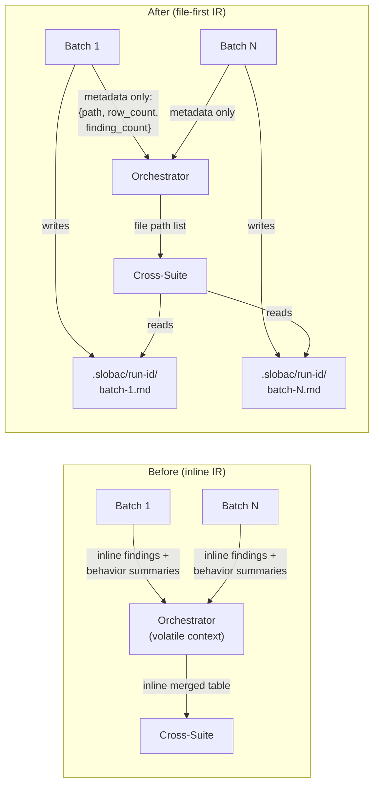

# Task: file-first-ir

* Task ID: file-first-ir
* Complexity: Level 3
* Type: bug fix (architectural data-flow change)

Make the slobac-audit skill's intermediate representation file-first: batch assessors write findings + behavior summaries to disk files, orchestrator works with file pointers, cross-suite assessor reads from disk. Eliminates the failure mode where orchestrator context compaction destroys inline batch results and the orchestrator confabulates replacements.

## Pinned Info

### Data Flow: Before vs After

The core architectural change is how batch results flow from batch assessors → orchestrator → cross-suite assessor.

```mermaid
flowchart LR
    subgraph Before["Before (inline IR)"]
        B1["Batch 1"] -->|"inline findings +<br>behavior summaries"| O1["Orchestrator<br>(volatile context)"]
        B2["Batch N"] -->|"inline findings +<br>behavior summaries"| O1
        O1 -->|"inline merged table"| CS1["Cross-Suite"]
    end

    subgraph After["After (file-first IR)"]
        B3["Batch 1"] -->|"writes"| F1[".slobac/run-id/<br>batch-1.md"]
        B4["Batch N"] -->|"writes"| F2[".slobac/run-id/<br>batch-N.md"]
        B3 -->|"metadata only:<br>{path, row_count,<br>finding_count}"| O2["Orchestrator"]
        B4 -->|"metadata only"| O2
        O2 -->|"file path list"| CS2["Cross-Suite"]
        CS2 -->|"reads"| F1
        CS2 -->|"reads"| F2
    end
```

## Component Analysis

### Affected Components

- **`SKILL.md` (orchestrator workflow)**: Central coordination — needs workdir setup (Step 3), fail-fast rescoping (Step 4), filesystem-write precondition (Step 5), pointer-based merge (Step 6), file-based integrity gate (Step 6.5), and confabulation guardrail (Constraints).
- **`references/subagents/batch.md`**: Output contract — currently emits inline findings + behavior summary table. Must write to disk and return metadata only.
- **`references/subagents/cross-suite.md`**: Input contract — currently receives inlined merged behavior summary table. Must receive file paths and read/merge itself.
- **`references/report-template.md`**: Report shape — optional workdir reference in Suite manifest line.
- **`references/behavior-summary-format.md`**: Merge Semantics section — currently describes orchestrator-side merge. Must describe cross-suite-side merge from files.

### Cross-Module Dependencies

- `batch.md` → `SKILL.md`: Batch output shape is consumed by orchestrator Steps 6 and 6.5. Changing batch output from inline to `{path, row_count, finding_count}` requires matching changes in the orchestrator's collection and integrity-gate logic.
- `SKILL.md` → `cross-suite.md`: Orchestrator passes input to cross-suite. Changing from inlined merged table to file path list requires matching input contract change.
- `behavior-summary-format.md` → both `batch.md` and `cross-suite.md`: Format spec is loaded by both subagents. The Merge Semantics section currently describes orchestrator-side merge — needs updating since the cross-suite assessor now owns merge.
- `report-template.md` ← `SKILL.md` Step 8: Orchestrator reads report template to synthesize final report. Workdir reference is additive (no breaking change).

### Boundary Changes

- **Batch assessor output contract**: breaking change — from inline sections to file write + metadata response.
- **Cross-suite assessor input contract**: breaking change — from inlined table to file path list.
- **Orchestrator Steps 6/6.5**: breaking change — from inline merge to pointer collection + file-based integrity.
- **Report template**: additive — optional workdir reference.
- **Behavior summary format**: clarification — merge moves from orchestrator to cross-suite.

### Invariants & Constraints

1. **Skill-root self-containment (invariant #11)**: `.slobac/` is a runtime artifact in the operator's cwd, not a skill-bundle resource. Does not violate self-containment.
2. **Batch assessor is the universal audit engine**: still true. 1 batch or N batches, same contract.
3. **Cross-suite findings require targeted source reads**: unchanged. Cross-suite still clusters → reads source → confirms.
4. **Behavior summary format spec remains the IR definition**: still true. The format doesn't change, only where it's written and who merges.
5. **Report shape stability**: the per-finding field names and top-level sections are unchanged. Workdir reference is additive.
6. **No inline-IR fallback path**: the new constraint. Commit fully to file-first.

## Open Questions

None — implementation approach is clear. The bug report's open questions were resolved in the intent clarification:
- Workdir cleanup: keep on both success and failure.
- Report synthesis: stays in orchestrator.
- Inline fallback: no — commit fully to file-first.
- Workdir path: `.slobac/<run-id>/`.

## Test Plan (TDD)

### Testing Reality

The files being modified are agent-facing markdown contract definitions, not executable code. There is no automated test infrastructure for skill workflow definitions. Validation of these changes is:

1. **Structural**: each modified file remains internally consistent (references resolve, contracts match across files).
2. **Cross-file consistency**: batch output contract matches what orchestrator Steps 6/6.5 expect; orchestrator's cross-suite input matches what cross-suite.md expects.
3. **Manual**: invoking the skill against an audit fixture after the changes are applied (out of scope for this task per the bug report).

### Behaviors to Verify (structural review)

- Batch assessor output contract specifies writing to `<workdir>/batch-<id>.md` and returning `{path, row_count, finding_count}` metadata.
- Cross-suite assessor input contract specifies receiving file paths and performing its own merge.
- SKILL.md Step 3 documents workdir convention (`.slobac/<run-id>/`).
- SKILL.md Step 4 fail-fast guards cross-suite's window, not orchestrator's.
- SKILL.md Step 5 includes filesystem-write precondition.
- SKILL.md Steps 6/6.5 describe pointer collection and per-file row-count integrity gate.
- SKILL.md Constraints section includes confabulation guardrail.
- Report template includes optional workdir reference.
- Behavior-summary-format.md Merge Semantics reflects cross-suite ownership of merge.

### Test Infrastructure

- Framework: N/A (markdown contract files)
- Manual validation: invoke audit skill against `tests/fixtures/audit/` scenarios post-change
- New test files: none

## Implementation Plan

1. **`references/subagents/batch.md` — rewrite output contract (Step 4)**
    - Files: `skills/slobac-audit/references/subagents/batch.md`
    - Changes:
        - Add new input: workdir path
        - Rewrite Step 4 to specify file-first output: write Findings + Behavior Summaries to `<workdir>/batch-<id>.md`, return metadata `{path, row_count, finding_count}` inline
        - Add constraint: batch assessor must have write access to workdir

2. **`references/subagents/cross-suite.md` — rewrite input contract**
    - Files: `skills/slobac-audit/references/subagents/cross-suite.md`
    - Changes:
        - Change Inputs: replace "Behavior summaries — the merged behavior summary table" with "Batch result file paths — list of paths to batch result files"
        - Add Step 1.5 or expand Step 2 preamble: cross-suite reads each batch file, extracts Behavior Summaries sections, merges and re-sorts per existing ordering rules
        - Update Step 2 clustering to reference the self-merged table

3. **`references/behavior-summary-format.md` — update Merge Semantics and Consumption sections**
    - Files: `skills/slobac-audit/references/behavior-summary-format.md`
    - Changes:
        - Merge Semantics: update to reflect that the cross-suite assessor (not the orchestrator) performs the merge by reading batch files from disk
        - Consumption by Cross-Suite Assessor: update to note input is file paths, not a pre-merged table

4. **`SKILL.md` — workdir convention (Step 3 area)**
    - Files: `skills/slobac-audit/SKILL.md`
    - Changes:
        - Add Step 3.5 (or a subsection after Step 3): establish workdir at `.slobac/<run-id>/` in operator's cwd
        - Document `--workdir` override
        - `run-id` generation convention (e.g., ISO-8601 timestamp or similar)

5. **`SKILL.md` — rescope fail-fast (Step 4)**
    - Files: `skills/slobac-audit/SKILL.md`
    - Changes:
        - Step 4 context budget: make explicit that the estimation now targets the cross-suite assessor's window (`tests × richness_chars < 0.6 × window`), not the orchestrator's

6. **`SKILL.md` — filesystem-write precondition (Step 5)**
    - Files: `skills/slobac-audit/SKILL.md`
    - Changes:
        - Add precondition note: subagents must have write access to workdir
        - If runtime can't guarantee write access, refuse and tell operator why
        - Pass workdir path to each batch assessor

7. **`SKILL.md` — rewrite Steps 6 + 6.5 (pointer collection + integrity gate)**
    - Files: `skills/slobac-audit/SKILL.md`
    - Changes:
        - Step 6: replace inline merge with pointer collection — collect `{path, row_count, finding_count}` metadata from each batch response
        - Step 6.5: replace merged-row count comparison with per-file row-count verification — sum `row_count` from metadata, compare against scout's expected test count. Same thresholds (≥95%, retry, halt)

8. **`SKILL.md` — confabulation guardrail + no-inline-fallback (Constraints)**
    - Files: `skills/slobac-audit/SKILL.md`
    - Changes:
        - Add constraint: orchestrator MUST NOT author behavior-summary rows
        - Add constraint: missing/unparseable batch files → re-launch batch, never reconstruct from memory or source
        - Add constraint: no inline-IR fallback path

9. **`references/report-template.md` — optional workdir reference**
    - Files: `skills/slobac-audit/references/report-template.md`
    - Changes:
        - Add optional `Workdir` field to the report header (or extend Suite manifest line)
        - Note that the workdir path enables tracing findings back to per-batch artifacts

10. **Cross-file consistency review**
    - Verify all cross-references between modified files are consistent
    - Verify no stale references to inline merge remain

## Technology Validation

No new technology — validation not required. All changes are to markdown contract files within the existing skill bundle.

## Challenges & Mitigations

- **Challenge: Batch assessor write access in readonly mode.** The batch assessor is currently launched as a readonly subagent (SKILL.md Step 5: "launch a readonly subagent"). File-first IR requires write access. **Mitigation:** The readonly constraint in the current batch.md refers to not modifying test code. Writing audit artifacts to a workdir is a different concern. Update batch.md and SKILL.md to clarify: "read-only with respect to the audited codebase; writes to the audit workdir are required."
- **Challenge: Cross-suite assessor context budget with large suites.** The cross-suite assessor now reads and merges all batch files in its own window. For very large suites, this could be tight. **Mitigation:** The fail-fast rescoping (Step 4) already guards this — `tests × richness_chars < 0.6 × cross-suite window`. The richness tier downgrades (full → standard → compact) are the existing mechanism.
- **Challenge: run-id collisions.** If two audits run simultaneously in the same cwd. **Mitigation:** Use ISO-8601 timestamp with seconds precision as run-id. Collision is practically impossible for human-driven invocations.

## Status

- [x] Component analysis complete
- [x] Open questions resolved
- [x] Test planning complete (TDD)
- [x] Implementation plan complete
- [x] Technology validation complete
- [ ] Preflight
- [ ] Build
- [ ] QA
