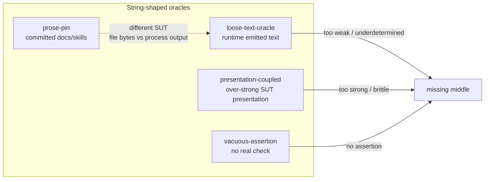

# TASK ARCHIVE: prose-pin and weak-text-oracle taxonomy smells

## SUMMARY

Added two High/per-test SLOBAC taxonomy smells — `prose-pin` (committed prose as oracle: README/docs/HTML/skills/…) and `loose-text-oracle` (underdetermined substring/regex asserts on runtime-emitted text) — so a blind `/slobac-audit` catches stockroom-style documentation pins and the common error/log/stdout message-match shape. Creative chose Option B (two smells) over collapsing into one or expanding `presentation-coupled`. Build delivered taxonomy entries, Related-mode boundary edits, audit fixtures with expected-findings, index regen, and count-agnostic wording in persistent docs. Preflight, build, and QA all passed; post-reflect operator polish tightened teaching examples and disposition hierarchy on both entries before archive.

## REQUIREMENTS

- Named taxonomy coverage for (a) tests asserting on committed documentation/agent prose and (b) weak string oracles on runtime-emitted text, without conflating the two without an explicit design decision.
- Prefer slug `prose-pin` for the committed-docs smell unless creative found a stronger coinage; settle cardinality, naming, severity, and PC/VA boundaries in creative.
- Full CONTRIBUTING-shaped entries; Related-mode updates on adjacent smells; regenerate taxonomy index; keep SKILL/README drift-clean.
- Audit fixtures + `expected-findings` per project convention; FP guards for fitness-function greps and prose-as-SUT; typed-error / structured-field remediation for runtime weak text.
- Out of scope: remediating stockroom’s own tests; apply-layer transforms.

## IMPLEMENTATION

**Creative (taxonomy carve):** Evaluated options A–D; selected Option B — `prose-pin` + `loose-text-oracle`. Axis: oracle strength on free text × artifact kind (committed file vs runtime emission). Keep `presentation-coupled` as too-strong presentation; fitness-function greps are FP of prose-pin, not a third smell. Both High / per-test.

**Preflight amendments:** TDD reorder — `expected-findings` → plant fixtures → author taxonomy; count-agnostic wording for hardcoded “15 entries”; prefer on-disk markdown in prose-pin fixture.

**Build (11 steps, no plan deviations):**
1. Spec + plant `tests/fixtures/audit/prose-pin/` (docs + skill on disk; keyword/order/mention positives; fitness-function + temp-SUT negatives).
2. Author `taxonomy/prose-pin.md`.
3. Spec + plant `tests/fixtures/audit/loose-text-oracle/` (ambiguous err/log positives; typed-error + text-is-product negatives).
4. Author `taxonomy/loose-text-oracle.md`.
5. Boundary edits: `presentation-coupled`, `vacuous-assertion`, `conditional-logic` (hedge After so `match=` is supplementary only).
6. `uv run python scripts/gen_taxonomy_index.py`; fixtures README rows; count-agnostic `systemPatterns.md` + docs README.

**QA residual:** `techContext.md` still had a “15” literal — same drift class; fixed to count-agnostic.

**Post-reflect polish (operator):**
- `loose-text-oracle`: unanchored proxy-for-meaning framing (not opposite-polarity-only); connection-token teaching example; footnotes; numbered disposition hierarchy; Related modes distinction-only; `rotten-green` link.
- `prose-pin`: committed prose generally (agent skills one class, not the definition); “never was behavioral” elevated to peer delete reason; disposition order; Related modes without foreign fix recipes.

**Key paths:** `skills/slobac-audit/references/docs/taxonomy/{prose-pin,loose-text-oracle,presentation-coupled,vacuous-assertion,conditional-logic}.md`, generated taxonomy README + SKILL sentinels, `tests/fixtures/audit/{prose-pin,loose-text-oracle}/`, `tests/fixtures/audit/README.md`, `memory-bank/{systemPatterns,techContext}.md`, manifesto docs README.

**Research grounding (deleted at archive, not fully inlined):** `memory-bank/active/change-detector-tests-markdown.md` and `runtime-text-tests-markdown.md` informed creative signals/FP guards; distilled decisions live in the creative inline below.

## TESTING

- **Preflight:** PASS with amendments (TDD reorder; count-literal touchups; on-disk fixture prose).
- **Build gates:** `uv run properdocs build --strict` green; index `--check` clean; hand-diff expected-findings vs planted signals (47 checks); `uv run pytest -q` → 24 passed.
- **QA:** PASS (trivial: techContext count-agnostic wording). Live `/slobac-audit` against new fixtures remains operator/manual per project convention — not a CI failure mode.
- **Post-reflect:** Taxonomy polish committed separately; no re-QA required for editorial teaching edits.

## LESSONS LEARNED

- **Technical:** Hardcoded taxonomy cardinality (“all 15 entries”) is a latent drift class across persistent docs (`systemPatterns`, `techContext`, manifesto README). When adding smells, grep for count literals project-wide — not only files named in a plan amendment. Teaching examples land harder when several distinct meanings share one token (connection trio) than when showing only opposite polarity.
- **Process:** For taxonomy-extension tasks, fixture-first TDD (`expected-findings` as failing spec) keeps Signals/Fix honest to planted evidence. Creative Option B’s two-axis diagram translated into taxonomy prose with almost no reinterpretation. Presence-of-wording pins were never a behavioral contract — delete is the primary disposition, not a parenthetical hedge.

## PROCESS IMPROVEMENTS

- Preflight amendments that touch “count / parity” docs should include a repo-wide grep for the literal, not an enumerated shortlist.
- Taxonomy teaching polish after reflect is valuable when operator review sharpens disposition hierarchy; treat it as editorial, not a re-plan trigger.

## TECHNICAL IMPROVEMENTS

- Optional: stronger automated check that `expected-findings.md` claims match planted signals (beyond hand-diff / QA).
- Auditors must learn the PC (too strong) vs LTO (too weak) split — fixture planting with opposite-meaning comments makes that claim auditable without running the suite.

## NEXT STEPS

None for this task. Memory bank is clean; initialize the next task with `/niko`.

---

## INLINED: Creative phase (`creative-taxonomy-carve.md`)

The following is the full creative phase document as retained at archive time.

# Architecture Decision: Taxonomy Carve for Prose Pins vs Weak Runtime Text Oracles

## Requirements & Constraints

**Functional**
- Blind audit must flag stockroom committed-doc/skill pins (keyword checklists, order pins, feature-mention pins; packaging/front-matter as weaker sibling).
- Blind audit must flag common runtime shapes: `err.message` / `toThrow(/…/)` / `pytest.raises(..., match=)` / log-line / stdout-stderr substring asserts that underdetermine meaning.
- Explicit FP / legitimate carve-out for architectural fitness-function greps on agent-facing prose (stockroom hygiene).
- Readers must distinguish these from existing `presentation-coupled` and `vacuous-assertion`.

**Quality attributes (ranked)**
1. **Discriminability** — auditor can tell which smell fires and why (not a muddled mega-smell).
2. **Actionability** — prescribed fix matches the surface (docs-lint / delete / fitness-function vs typed error / structured log).
3. **Fit with SLOBAC style** — punchy slug, semantic judgment, polyglot, uniform entry shape.
4. **Maintainability of taxonomy web** — Related modes stay coherent; don’t force `presentation-coupled` to mean two opposite failure modes.
5. **Simplicity** — fewest smells that preserve (1)–(4); resist a third smell for “order pins” etc.

**Technical constraints**
- One document per smell; slug = filename; index generated from headers.
- Prior art: neither surface has a canonical catalog name; nearest cousins are change-detector + Sensitive Equality (docs) and partial/weak oracle + “error strings are not API” (runtime).
- Operator preference: `prose-pin` is a strong candidate for the committed-docs smell.

**Out of scope**
- Remediating stockroom tests.
- Apply-layer transforms.
- Inventing academic citation where none exists.

## Components

Axis that matters: **oracle strength on free text** × **artifact kind (committed file vs runtime emission)**.

## Options Evaluated

- **Option A — One smell (`prose-pin`) covering both surfaces**: Stretch “prose” to mean any natural-language text (docs *and* error/log/UI strings). Single entry, shared “string standing in for meaning” story.
- **Option B — Two smells (`prose-pin` + runtime companion)**: Separate by artifact: committed documentation/agent prose vs runtime-emitted text. Different fixes and FP guards.
- **Option C — Expand `presentation-coupled` only + add `prose-pin`**: Docs get a new smell; runtime weak substrings absorbed into `presentation-coupled` by rewriting it to cover both over-strong and underdetermined text.
- **Option D — Three smells**: `prose-pin`, weak runtime text, and a separate “fitness-function grep” smell for hygiene-style negatives.

## Analysis

| Criterion | A One smell | B Two smells | C Expand PC + prose-pin | D Three smells |
|---|---|---|---|---|
| Discriminability | Poor — conflates file-bytes vs SUT output | Strong | Medium — PC becomes bipolar (too strong *and* too weak) | Strong but noisy |
| Actionability | Mixed fix list confuses auditors | Clean per-surface fixes | Runtime fix hierarchy fights PC’s “parse the DOM” story | Splits FP into its own smell unnecessarily |
| SLOBAC style | `prose-pin` overloaded | Matches split of tautology-theatre family | Rewrites a shipped Medium smell’s core claim | Over-partition |
| Simplicity | Simplest count | +1 smell, clear | +1 smell but mutates PC meaning | +2 smells |
| Risk if wrong | Audits miscategorize constantly | Can merge later if redundant | Breaks existing PC fixtures/readers | Taxonomy bloat |

Key insights:
- Research briefs agree: committed-doc pins and runtime weak-text oracles are **cousins sharing “string as semantic stand-in,”** not the same smell. Fix hierarchies diverge (docs-lint / delete / fitness-function vs typed errors / structured logs / golden presentation contracts).
- `presentation-coupled` today is explicitly the **converse of vacuous-assertion**: oracle too *strong* on presentation. Folding “too weak substring” into it would invert that teaching and scramble the presentation-coupled fixture (long cosmetic `in` chains ≠ single underdetermined meaning pin).
- Stockroom hygiene is an **FP of prose-pin**, not a third smell — same pattern as ArchUnit negative rules / Building Evolutionary Architectures fitness functions (called out in the change-detector research brief).
- `prose-pin` is an excellent slug: short, searchable, matches “pinning”/change-detector intuition, does not pretend to be a classic Meszaros name.

### Naming shortlist for the runtime companion (Option B)

| Candidate | Pros | Cons |
|---|---|---|
| `loose-text-oracle` | “Loose” contrasts PC’s over-tight presentation; “oracle” matches Barr/partial-oracle vocabulary; covers errors/logs/stdout | Slightly academic “oracle” |
| `weak-text-oracle` | Matches “weak assertion” practitioner language | “Weak” overlaps vacuous/pseudo-tested casually |
| `underdetermined-text` | Precisely names the false-confidence failure | Long; jargon-heavy for Aliases-first discoverability |
| `message-pin` | Parallel to `prose-pin` | Undersells logs/stdout/UI; sounds exception-only |

**Winner for companion slug:** `loose-text-oracle`.

## Decision

### Choice Pre-Mortem

- **Auditors flag every `pytest.raises(..., match=)` including Go-Wiki-legitimate “parameter name appears in message” checks:** mitigated by FP guard (dynamic datum / supplementary check alongside type-or-code primary oracle) — **checked** in design.
- **`prose-pin` over-triggers on prose-as-SUT suites (a16n convert/emit):** mitigated by signal requiring assert on **repo’s own committed** docs/skills (or packaging manifests read as prose), not temp fixtures — **checked** (same distinction as our peer-repo survey).
- **`loose-text-oracle` steals presentation-coupled findings:** mitigated by Related-modes boundary — PC = over-strong cosmetic/exact presentation; LTO = underdetermined meaning on free text — **checked**; fixture plants must demonstrate both.

**Selected**: Option B — two smells: **`prose-pin`** and **`loose-text-oracle`**.

**Rationale**: Maximizes discriminability and actionability (ranked #1–#2) while staying simple enough (+1 smell, not +2). Preserves `presentation-coupled`’s existing teaching. Honors operator’s `prose-pin` preference with a companion name that names the *loose oracle* failure, not merely “error messages.”

**Tradeoff**: Taxonomy grows; auditors must learn a finer split between PC and LTO. Accepted — the split is the product value.

**Implementation notes:**
- Both: Severity **High**, Detection Scope **per-test**, Protect Maintainable + Independent of implementation (prose-pin also Necessary — docs pins often kill no behavioral mutants).
- `prose-pin` FP: fitness-function negative greps on agent-facing prose; schema/manifest validation of front-matter; docs-as-tests/doctest; Vale/markdownlint tiers.
- `loose-text-oracle` FP: text *is* the product (compiler UI / CLI UX golden files); i18n key checks; supplementary dynamic-datum match beside type/code; structured assert after parse.
- Update `presentation-coupled` Related modes + Description one-liner clarifying the too-strong vs too-weak split.
- Hedge `conditional-logic` fix examples: prefer type/code; `match=` only as supplementary.
- Fixtures: `tests/fixtures/audit/prose-pin/` and `tests/fixtures/audit/loose-text-oracle/` with positives + negative controls + `expected-findings.md`.

## Implementation Plan

1. Author `taxonomy/prose-pin.md` and `taxonomy/loose-text-oracle.md` to CONTRIBUTING shape.
2. Patch Related modes / boundary sentences on `presentation-coupled`, `vacuous-assertion`, `conditional-logic`.
3. `uv run python scripts/gen_taxonomy_index.py`.
4. Add audit fixtures + fixtures README rows.
5. `properdocs build --strict`; manual fixture-vs-expected consistency check.

---

## INLINED: Reflection (`reflection-prose-pin-weak-text-oracle-smells.md`)

The following is the full reflection document as retained at archive time.

---
task_id: prose-pin-weak-text-oracle-smells
date: 2026-07-11
complexity_level: 3
---

# Reflection: prose-pin and weak-text-oracle taxonomy smells

## Summary

Delivered two High/per-test taxonomy smells — `prose-pin` (committed docs/skills as oracle) and `loose-text-oracle` (underdetermined runtime text oracles) — with fixtures, Related-mode boundary edits, and index/docs drift fixes. Build and QA both passed with no plan deviations; one residual count-literal in techContext was caught in QA.

## Requirements vs Outcome

All project-brief acceptance criteria landed: full CONTRIBUTING-shaped entries, stockroom-shaped signals and FP guards (fitness-function + prose-as-SUT; typed+supplementary + text-is-product), runtime weak-substring coverage, regenerated index, adjacent-smell Related modes (including hedged `conditional-logic` After), and fixtures with expected-findings. Nothing descoped; nothing added beyond the preflight amendments (TDD reorder, count-agnostic docs, on-disk fixture prose).

## Plan Accuracy

The amended 11-step plan was accurate end-to-end. Preflight's TDD reorder (expected-findings → plant → taxonomy) was the right encoding for this repo's fixture convention. Challenges that materialized were the ones predicted (PC vs LTO confusion, fitness-function framing) and were handled in fixture comments + taxonomy FP guards — no surprises from elsewhere. The only residual was a third "15" literal in `techContext.md` that preflight had scoped only to systemPatterns + docs README.

## Creative Phase Review

Option B (two smells) held up cleanly in authoring: discriminability and fix hierarchies diverged exactly as designed, and planting ambiguous tokens (`"timeout"`, `"success"`) vs PC's long cosmetic chains made the boundary tangible in fixtures. Naming (`prose-pin` + `loose-text-oracle`) needed no mid-build renegotiation. Fitness-function-as-FP (not a third smell) was the right call — the negative control writes naturally as ArchUnit-style rationale.

## Build & QA Observations

Build was mechanical once creative locked the carve: fixtures and entries wrote in one pass with no iteration. QA was clean on substance; the only finding was documentation count drift in techContext — same class of bug preflight already flagged elsewhere. Manual fixture-vs-expected hand-diff (47 checks) plus properdocs/index/pytest covered the mechanical gates; live `/slobac-audit` against the new fixtures remains operator/QA-manual per project convention (not a build failure mode).

## Cross-Phase Analysis

Creative → Build: the two-axis diagram (oracle strength × artifact kind) translated directly into Signals/FP/Related prose with almost no reinterpretation. Preflight → Build: TDD reorder and on-disk markdown preference prevented the usual "taxonomy first, fixtures as afterthought" skew. Preflight → QA: incomplete enumeration of count-literals left a techContext residue — preflight's amendment class was right, its file list was slightly short. No creative decision created a QA finding.

## Insights

### Technical
- Hardcoded taxonomy cardinality ("all 15 entries") is a latent drift class across persistent docs (`systemPatterns`, `techContext`, manifesto README). When adding smells, grep for count literals project-wide — not only the files named in the plan amendment.

### Process
- For taxonomy-extension tasks, fixture-first TDD (`expected-findings` as failing spec) keeps Signals/Fix honest to planted evidence; creative's Option B sketch was sufficient design detail that build did not need mid-flight redesign.

---

## INLINED: Task plan summary (`tasks.md`)

Level 3 feature: add `prose-pin` + `loose-text-oracle`. Behaviors B1–B10 (prose-pin positives/negatives, LTO positives/negatives, PC boundary, index drift). Amended 11-step TDD plan: expected-findings → plant → taxonomy for each smell; boundary edits; index regen; count-agnostic docs; fixtures README; verification gates. Challenges: PC vs LTO fixture confusion; prose-as-SUT FP; conditional-logic After hedge; fitness-function rationale requirement. Preflight PASS with amendments; Build DONE; QA PASS (techContext residual); Reflect DONE; post-reflect taxonomy polish before archive.

---

## INLINED: Project brief summary (`projectbrief.md`)

As a SLOBAC manifesto / audit maintainer, add named smells covering committed-prose pins and weak runtime text oracles so blind audit catches stockroom corpus cases and common error/log/stdout message-match shapes, with clear Related-mode boundaries against `presentation-coupled` / `vacuous-assertion` / `conditional-logic`. Constraints: do not collapse the two surfaces without design decision; preserve manifesto integrity; fitness-function greps need FP carve-out; stockroom remediation out of scope.
